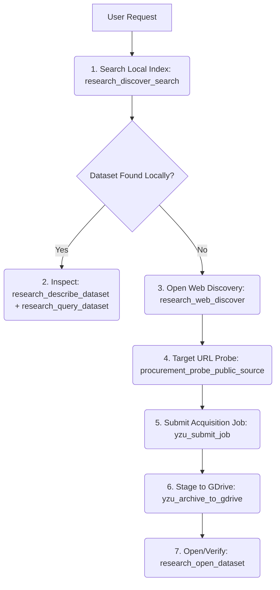

# Research Data Procurement Project Rules

This workspace serves as the **Research Data Procurement Platform** for the YZU Cluster. The Python backend operates strictly as passive, atomic MCP "equipment" (tools), leaving all orchestration, logic, planning, and decision-making to the LLM (Cursor Composer 2.5).

Do not re-engineer heuristic python execution planners. Follow the unified atomic workflow below.

---

## 1. Procurement MCP Playbook

When a user requests a dataset or asks a research question, follow this step-by-step acquisition ladder:

### Steps in Detail:
1. **Search Local Index**: Use `research_discover_search` or `collection_status` to check if the requested data or related data exists locally.
2. **Inspect Candidate**: If a match is found, call `research_describe_dataset` and `research_query_dataset` to see its schema, sample rows, and access tiers.
3. **Open Web Discovery**: If there's an index miss:
   - Run `research_web_discover(query)` to find public registries (Zenodo, OpenAlex, HuggingFace, etc.).
4. **Target URL Probe**: If you locate a downloadable landing URL, run `procurement_probe_public_source(url)` to classify the connector and automatically check if direct downloads are available.
5. **Submit Job**: Submit an acquisition job using `yzu_submit_job(plan_json, auto_approve=True)`.
   - For Zenodo/DataCite, use `datacite_collect_doi`.
   - For general HTTP lists, submit a plan with `job_type: "http_manifest"`.
   - For browser-based scrape targets, use `job_type: "scraper_run"`.
6. **GDrive Storage**: Push final files to the Google Drive archive using `yzu_archive_to_gdrive`.
7. **Verification**: Verify everything runs by opening the dataset using `research_open_dataset` and checking sample rows.

### Dataset synthesis (multi-source cluster panels)

When the professor asks to **merge, synthesize, or cluster** stablecoin (or similar) data across Skynet, Etherscan, community growth, security history, GDELT, DeFiLlama, Wikipedia, GitHub, or incidents:

1. `research_synthesis_list_profiles` — list profiles
2. `research_synthesis_run(profile_id="stablecoin_trust_engagement")` — full trust↔engagement panel (prefer `validate_existing: true` when v3 dataset exists)
3. Answer from the tool summary and panel samples — do not manually stitch scripts or file paths

For registry-only overlap (metadata join viability), use `research_synthesis_pair(left_id, right_id)`.

---

## 2. Behavioral Constraints

- **Passive Tools**: Python code must never intercept or automate collection loops. All steps must be requested and verified individually by the LLM.
- **Dry Runs**: Always check BigQuery queries with `bigquery_dry_run` before executing them with `bigquery_read_query`.
- **No Placeholders**: Never assume a data format or file path without checking the local index or running a probe first.
- **GDrive Archives**: Canonical storage is GDrive (`gdrive:Machine_Archive/molina_workbench/Sharpe-Renaissance-data`). Never assume files stay on the local controller disk indefinitely.
