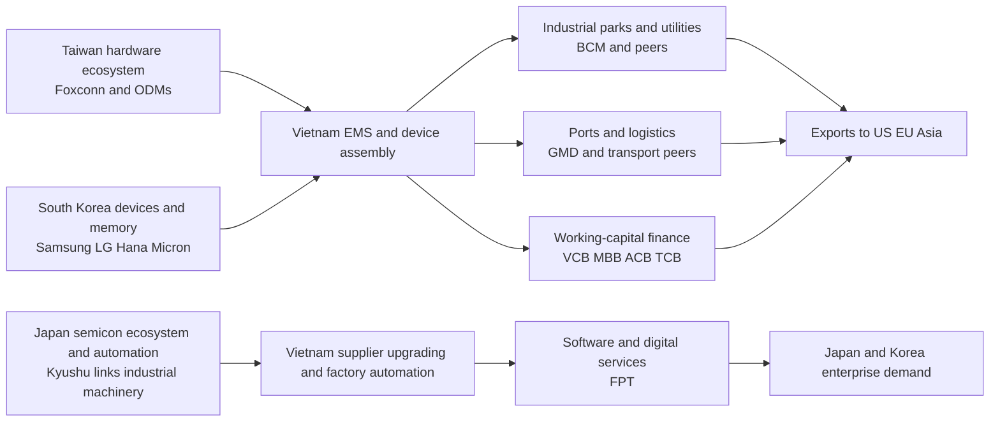

# Vietnam Deep Dive for the Asia Portfolio Synthesis

## Executive summary

Vietnam is attractive for this portfolio, but not as a new “core country” on the same footing as Taiwan, Korea, or Japan. It fits best as a **satellite growth sleeve** that adds three things your existing East Asia book does not fully capture: domestic-credit and consumption beta, industrial-park/logistics beta from China-plus-one manufacturing relocation, and a meaningful but imperfect beneficiary role in the Taiwan–Korea–Japan electronics chain. The case is helped by Vietnam’s pending FTSE Russell upgrade to Secondary Emerging status from September 2026, with phased index inclusion through 2027, which should improve visibility and potentially draw passive and active inflows. The case is constrained by heavy sector concentration, foreign-room frictions, market-access complexity, and the outsized weight of Vingroup-related names in benchmarks. On balance, I would treat Vietnam as a **measured diversifier with upside optionality**, not as a substitute for Taiwan or Korea semiconductor exposure. citeturn34view0turn34view1turn36search1turn42view0turn36search0

For a USD-based, long-only investor with a three-to-five-year horizon, a sensible **base allocation** is **2% to 4% of total portfolio assets**, with a **hard base cap of 5%**. For a more aggressive mandate, Vietnam can rise to **4% to 6%**, with an **aggressive hard cap of 8%**, but only if implementation is staggered and the sleeve is diversified away from pure property and single-conglomerate risk. Within an East Asia sleeve, that usually means Vietnam should sit around **10% to 15% of the sleeve in balanced portfolios** and **up to 15% to 20% only in aggressive versions**, funded mainly by trimming concentrated Taiwan/Korea semiconductor overweight rather than by cutting Japan’s more defensive banking and diversified industrial exposure. citeturn49search4turn46search8turn50search3turn45search1turn42view0

Macro conditions are constructive but not clean. Vietnam grew **8.0% in 2025**, while the World Bank expects **6.8% growth in 2026**; official data showed strong external momentum early in 2026, including **$344.17 billion** in total trade turnover in the first four months, up **24.2%** year over year, while average CPI in the first four months rose **3.99%**. Moody’s lifted Vietnam’s outlook to **positive** in May 2026, citing governance and reform progress. The main near-term macro risk is still external: U.S. trade-policy pressure, FX sensitivity, and the possibility that supply-chain relocation slows if export demand weakens. citeturn11search0turn12search6turn12search24turn10news42turn11news29

## Scope and assumptions

This report assumes an **unspecified non-Vietnam-resident investor domicile**, a **USD base currency**, a **long-only listed-equity mandate**, and **no special broker, tax treaty, or domestic Vietnamese legal entity** already in place. It also assumes **currency is unhedged unless otherwise stated**, because hedging policy was unspecified and VND exposure is part of the real portfolio question here. Time horizon is assumed to be **three to five years**, long enough for FTSE reclassification, supply-chain buildout, and earnings revisions to matter, but short enough that market-access friction and policy shocks still dominate implementation. These are explicit assumptions rather than facts about your current account structure. 

Where high-quality quantitative local-stock correlation data were not consistently available across public sources, I used **ETF and index proxies**: VanEck Vietnam ETF as a directional Vietnam proxy, Taiwan/Korea/Japan country ETFs as country proxies, and semiconductor ETF comparisons as an upper-bound proxy for tech-cycle linkage. That is useful for portfolio construction, but it is not a perfect one-for-one measure of single-stock co-movement with TSMC, Samsung, SK Hynix, or Japanese semicap names. Vietnam local equities also have meaningful benchmark concentration and foreign-room effects that ETF proxies smooth over. citeturn40search2turn49search4turn46search8turn50search3turn45search1

## Macro and political outlook

Vietnam’s political backdrop remains stable by regional emerging-market standards: it is still a one-party system with high policy continuity, but in 2025 and 2026 the leadership also pushed a more visible reform agenda tied to infrastructure expansion, administrative rationalization, and market-upgrade objectives. The administrative reform that reduced provinces to **34** and shifted local governance toward a two-tier model is especially relevant for investors because it signals a willingness to simplify state capacity and approvals, even if execution risk remains. Moody’s recent shift to a **positive** outlook reflects the same core point: governance and institutional quality are perceived to be improving, even if Vietnam is not yet institutionally comparable to developed Asia. citeturn10search9turn10news42

The growth story is still strong. Vietnam posted **8.0% GDP growth in 2025**, one of Asia’s strongest outcomes, while the World Bank expects **6.8%** in 2026. Official first-quarter 2026 releases showed continued positive momentum, and the April/four-month report showed trade turnover at **$344.17 billion**, up **24.2%** year over year. Inflation is not absent, but it has stayed broadly manageable: official statistics put average CPI for the first four months of 2026 at **3.99%**. That mix—still-strong real growth, externally supported industrial activity, and inflation below many frontier/emerging peers—is what makes Vietnam investable despite its market frictions. citeturn11search0turn12search6turn12search24

The policy mix is not one-directional, however. The State Bank of Vietnam has had to balance the growth push against worries over property leverage and asset bubbles. Reuters reported that the central bank cut the system credit-growth target for 2026 to around **15%** after more aggressive 2025 lending, underscoring that Vietnam’s equity market—especially banks, brokers, and property—still sits inside a partially managed credit cycle rather than a fully liberalized monetary system. That matters for position sizing: Vietnam is not only a growth story; it is a **credit-allocation story**. citeturn11search4

The main macro-political vulnerability is external trade. Vietnam remains deeply export-linked, and the U.S. continues to press Hanoi on trade arrangements and production patterns. At the same time, the government has reaffirmed efforts to finalize a bilateral arrangement with the United States. In practice, the thesis works best if Vietnam remains a preferred assembly/export platform rather than becoming a direct target of punitive trade measures. That is one of the clearest thesis-break conditions. citeturn11news29turn10news42

## Market structure, liquidity, and foreign access

The equity market is now meaningfully larger than it was even a few years ago. Official SSC data put **HOSE equity market capitalization at VND 8,726 trillion** at the end of April 2026, equal to **67.92% of 2025 GDP**. HNX’s 2025 annual report indicated average daily turnover across the market above **VND 26 trillion per session** for full-year 2025, while SSC market statistics showed December 2025 average daily trading value above **VND 23.6 trillion**. In other words, Vietnam is no longer “too small to matter,” but it is still small enough that country-level and single-stock flows can distort price formation, especially around index events. citeturn29search0turn15search2turn13search5

The accessibility story has clearly improved. Official Circular **08/2026/TT-BTC** allows non-resident foreign investors to place orders either directly through their securities trading accounts or through **representative international brokerage firms** using the investors’ **depository account numbers**. The same circular lays out operational rules for using the depository-account-number model and describes how clearing-margin accounts would work once CCP-based clearing is implemented. FTSE Russell’s March/April 2026 materials explicitly tied Vietnam’s reclassification to progress on this **global broker access model** and on the **non-prefunding framework**, while noting that full operational work still includes bilateral broker agreements and phased implementation through 2027. citeturn31view0turn31view1turn35view0turn34view0

That said, access is not frictionless. Reuters noted that foreign investors still face concerns over **foreign ownership caps**, a benchmark dominated by one conglomerate, and pricing distortion where international buyers may face a **20% to 30% premium** in constrained names. Foreign ownership in Vietnam’s market had also fallen to about **14.5%** after heavy outflows, with Reuters reporting record foreign equity outflows of about **$5.1 billion** in 2025 and another **$1.2 billion** in early 2026 before the upgrade catalyst improved sentiment. This is the crucial implementation point: the market is becoming more investable, but it is not yet cleanly investable in the way Japan, Taiwan, or Korea are. citeturn36search0turn36search1

Foreign-investor operational depth is improving but still limited in absolute terms. VSDC reported a total of **50,906 foreign trading codes** as of April 2026, and the VSDC statistics page shows a much larger domestic trading-account base overall. The implication is that foreign participation remains meaningful but structurally smaller than in more mature North Asian markets, which helps explain why local liquidity can still be swingy and why index-upgrade narratives matter so much. citeturn33search0turn33search1turn33search2

A simple way to think about foreign-access constraints is this. **Banks** are structurally limited by sector rules, and public companies must disclose their maximum foreign-ownership ratio under the SSC/VSDC framework. Companies where actual foreign ownership is at or near the disclosed limit can become functionally harder to access, regardless of index weight. For portfolio construction, that argues for keeping Vietnam at a lower hard cap than Taiwan or Japan until trading, custody, and room verification are live and repeatable with your chosen execution route. citeturn53view0turn54view0turn54view3

## Vietnam in the Taiwan–Korea–Japan supply chain

Vietnam’s role in East Asia is increasingly that of an **assembly, packaging, industrial-land, logistics, and software-services node**, rather than a front-end semiconductor fabrication center. Korean capital is central. Reuters reported that Samsung makes about **60% of the phones it sells globally in Vietnam**, and South Korean investment in Vietnam had reached roughly **$92 billion** by end-2024. Korea also matters in semiconductors beyond final assembly: Hana Micron is scaling packaging/testing in Vietnam, and Samsung has considered further semiconductor-related expansion there. This makes Vietnam partially linked to the Korea memory/device cycle, but still mostly on the downstream side of the value chain. citeturn9search2turn52search8turn37search1turn9search14

Taiwan’s role is different and more modular. Taiwan-linked EMS and electronics manufacturers—most visibly Foxconn—have been expanding in northern Vietnam. Reuters reported that Foxconn had invested more than **$3.2 billion** in Vietnam and was further expanding electronics output. This strengthens Vietnam’s relevance to Taiwan’s hardware ecosystem, especially in PCs, servers, peripherals, networking gear, chargers, and contract manufacturing. But again, Vietnam’s listed market captures this only indirectly—through industrial parks, logistics, banks, retail, and a few tech service names—rather than through listed pure-play foundry exposure. citeturn52news35

Japan’s connection is more concentrated in industrial upgrading, semiconductor ecosystem support, and services demand. Vietnam’s Ministry of Planning and Investment highlighted a **Vietnam–Japan Semiconductor Cooperation Programme**, reflecting formal efforts to connect Vietnam to Japanese semiconductor and supplier ecosystems. Japan also links to Vietnam through factory automation, materials, precision components, ports, and software outsourcing. FPT’s own international expansion, including technology work connected to Japan and Korea, is the most investable listed expression of that relationship on the Vietnam side. citeturn37search0turn37news25

The reason this matters for your existing East Asia sleeve is that Vietnam is **connected but not redundant**. It benefits from Taiwan/Korea/Japan capex and relocation, yet benchmark Vietnam remains much more exposed to **real estate, financials, consumer staples, and materials** than to information technology. MSCI’s Vietnam IMI Select 25-50 factsheet shows sector weights of **37.08% real estate**, **25.53% financials**, **10.18% consumer staples**, **9.29% industrials**, **8.97% materials**, and only **4.72% information technology** as of April 2026. That is exactly why Vietnam improves diversification in an East Asia book dominated by TSMC, Samsung, SK Hynix, semicap, and banks. citeturn42view0

**Market-cap / sector snapshot using the MSCI Vietnam IMI Select 25-50 index**

Real Estate      37.08%  ██████████████████  
Financials       25.53%  ████████████  
Consumer Staples 10.18%  █████  
Industrials       9.29%  ████  
Materials         8.97%  ████  
Information Tech  4.72%  ██  
Energy            1.75%  █  
Utilities         1.59%  █  
Consumer Disc.    0.89%  ▌  citeturn42view0

## Investable universe and implementation

The investable universe is large enough to build a usable local sleeve, but it is not ideal to chase benchmark weights blindly. Reuters highlighted the problem starkly: Vingroup’s swelling influence has exceeded **20%** of the market index, while MSCI’s capped Vietnam index still showed **Vingroup at 24.79%** of the benchmark and **Vinhomes at 3.82%**. That concentration is one reason I would prefer a more selective, equal-risk or capped implementation rather than a passive benchmark replication mindset for your portfolio. citeturn36search0turn42view0

The table below focuses on **20 investable Vietnamese names** that are large enough to matter institutionally or are important for expressing the country’s main listed themes. Market caps are approximate point-in-time figures from late-May-2026 stock-overview pages and will move. “Liquidity” is a portfolio-construction bucket rather than an exchange statistic: **High** means typically easy to scale relative to Vietnam, **Medium** means suitable but less efficient, and **Low** means use smaller size or only as a watchlist/alpha sleeve. Foreign-access notes reflect the general Vietnamese framework: there is **no meaningful ADR market** for these names, access is usually onshore or via offshore country funds, **bank foreign ownership is structurally capped**, and live foreign-room must be checked before trading. citeturn31view0turn31view1turn35view0turn36search0turn40search2

| Ticker | Company | Sector | Approx. market cap | Liquidity bucket | ADR / foreign-access note | Suggested max portfolio weight |
|---|---|---|---:|---|---|---:|
| VIC | Vingroup | Conglomerate / real estate / EV ecosystem | VND 1,623.5tn citeturn58search3 | High | Local-only; accessible but benchmark-concentration risk very high | 0.75% |
| VHM | Vinhomes | Residential property | VND 631.7tn citeturn22search2 | High | Local-only; property-cycle and Vingroup-linked governance/valuation risk | 0.75% |
| VCB | Vietcombank | Bank | VND 530.6tn citeturn22search1 | High | Bank; foreign ownership subject to sector cap | 1.25% |
| BID | BIDV | Bank | VND 313.0tn citeturn55search1 | High | Bank; foreign ownership subject to sector cap | 1.00% |
| CTG | VietinBank | Bank | VND 270.3tn citeturn55search2 | High | Bank; foreign ownership subject to sector cap | 1.00% |
| TCB | Techcombank | Bank | VND 228.2tn citeturn55search3 | High | Bank; foreign ownership subject to sector cap | 1.00% |
| VPB | VPBank | Bank / consumer finance | VND 212.6tn citeturn56search2 | High | Bank; foreign ownership subject to sector cap | 0.90% |
| GAS | PV Gas | Gas / energy infrastructure | VND 204.9tn citeturn57search0 | Medium | Local-only; cleaner energy/infrastructure expression than upstream oil | 0.90% |
| MBB | MB Bank | Bank | VND 198.6tn citeturn56search0 | High | Bank; foreign ownership subject to sector cap | 1.10% |
| HPG | Hoa Phat | Steel / materials / infrastructure | VND 183.9tn citeturn22search3 | High | Local-only; cyclical, linked to domestic capex and construction | 1.00% |
| STB | Sacombank | Bank | VND 134.2tn citeturn56search3 | High | Bank; restructuring legacy still relevant despite liquidity | 0.80% |
| FPT | FPT Corp | IT services / software / digital infra | VND 127.9tn citeturn22search0 | High | Local-only; foreign room can be a practical constraint, verify live | 1.25% |
| VNM | Vinamilk | Consumer staples / dairy | VND 124.4tn citeturn48search4 | Medium | Local-only; defensive anchor, often a preferred offshore proxy holding | 0.90% |
| MSN | Masan Group | Consumer / retail / branded staples | VND 118.0tn citeturn57search8 | Medium | Local-only; more restructuring and execution risk than pure staples | 0.80% |
| ACB | Asia Commercial Bank | Bank | VND 117.4tn citeturn56search1 | Medium-High | Bank; foreign ownership subject to sector cap | 1.00% |
| MWG | Mobile World | Consumer electronics / retail | VND 116.6tn citeturn57search3 | High | Local-only; domestic consumption recovery expression | 0.90% |
| VRE | Vincom Retail | Retail property | VND 72.0tn citeturn59search1 | Medium | Local-only; Vingroup-related but cleaner mall/retail property exposure | 0.70% |
| SSI | SSI Securities | Brokerage / capital markets | VND 68.6tn citeturn57search2 | High | Local-only; strong operational beta to upgrades and turnover | 0.80% |
| SAB | Sabeco | Consumer staples / beverages | VND 62.2tn citeturn59search2 | Medium | Local-only; defensive but slower-growth than consumer/retail names | 0.60% |
| BCM | Becamex IDC | Industrial parks / infrastructure | VND 56.0tn citeturn58search0 | Medium | Local-only; direct China-plus-one / industrial-park exposure | 0.75% |
| DGC | Duc Giang Chemicals | Chemicals / export materials | VND 18.4tn citeturn58search2 | Low-Medium | Local-only; useful alpha sleeve, size only modestly | 0.40% |

A practical **watchlist versus buy-list** split is more useful than trying to own all twenty names. My **buy list** under the stated assumptions is **FPT, MBB, ACB, HPG, GAS, MWG, VNM, and BCM**. FPT captures the software/AI/services angle rather than benchmark property beta; MBB and ACB provide cleaner private-bank exposure; HPG captures domestic industrialization and infrastructure; GAS is a steadier energy-infrastructure expression; MWG captures domestic demand recovery; VNM adds a defensive consumer stabilizer; BCM is one of the cleaner China-plus-one industrial-land beneficiaries. The **watch list** should include **VCB, BID, CTG, TCB, VPB, STB, SSI, MSN, SAB, VRE, VHM, VIC, and DGC**—all investable, but more sensitive to valuation, foreign-room, restructuring, or benchmark concentration issues. citeturn37news25turn42view0turn36search0

Implementation should be gradual. For a base portfolio, I would start with **0.50% starter positions** in buy-list names, add in **0.25% to 0.50% increments** on either earnings confirmation or policy/upgrade milestones, and avoid taking any single Vietnamese position to full size in one trade. A clean rule is to keep **single-name base caps at 1.25% for the most liquid names**, **1.0% for most other large caps**, and **0.4% to 0.7% for medium/low-liquidity names**. I would also cap **aggregate Vietnam financials at 40% of the Vietnam sleeve** and **aggregate Vingroup-linked exposure below 20% of the Vietnam sleeve**, even if benchmark weights are higher. Those are portfolio rules rather than market facts, but they directly address the main structural risks visible in official and benchmark data. citeturn42view0turn36search0

**Model liquidity histogram for the 20-name list**

High / Medium-High  12  ████████████  
Medium               6  ██████  
Low / Low-Medium     2  ██  

This model histogram lines up with official SSC market statistics showing that banks, brokers, and a handful of large industrial or benchmark-heavy names dominate trading activity in monthly top-traded tables. citeturn27search0turn26search2

## Correlation and allocation role

The cleanest quantitative answer uses **VNM ETF as an imperfect Vietnam proxy**. That ETF tracks a Vietnam-focused index and provides a usable public price series for co-movement analysis, even though it is not identical to the local market and can include offshore listings and ETF construction effects. Against **Taiwan**, a Taiwan ETF proxy shows low-to-low-medium correlation with Vietnam: one publicly available comparison showed **0.22 correlation over one year**, **0.26 over three years**, and **0.31 over five years**. Against **Korea**, Vietnam’s proxy has shown about **0.41** correlation in longer-run comparisons. Against a **Japan proxy**, VNM versus DXJ showed about **0.22 over one year** and roughly **0.34 to 0.36** over longer histories. Against a **semiconductor ETF proxy**, VNM versus SMH showed about **0.38** over ten years. Those figures all point the same way: Vietnam is linked to North Asia, but it is not tightly synchronized with it. citeturn40search2turn49search4turn46search8turn48search3turn45search1

That low-to-medium observed correlation is exactly what the benchmark composition suggests. Vietnam’s investable index remains dominated by **real estate and financials**, not tech hardware. So while the country is embedded in the Taiwan–Korea–Japan supply chain, the listed market monetizes that linkage through industrial land, trade finance, ports, utilities, domestic wages, and retail spending rather than through listed memory or foundry earnings. In portfolio terms, Vietnam is **not a semiconductor-beta clone**; it is a **downstream manufacturing and domestic-demand companion exposure**. citeturn42view0turn52news35turn52news8turn37search0

**Correlation buckets versus the existing East Asia sleeve**

| Existing sleeve exposure | Quantitative proxy | Bucket | Interpretation |
|---|---|---|---|
| Taiwan semis and Taiwan market | Vietnam proxy vs Taiwan ETF: 1Y 0.22, 3Y 0.26, 5Y 0.31 citeturn49search4 | Low to low-medium | Best diversifier among the three existing country blocks |
| Korea market and Korea tech | Vietnam proxy vs Korea ETF: ~0.41 longer-run citeturn46search8 | Low-medium | Shared export/Asia-beta, but Vietnam market composition is very different |
| Japan broad equities | Vietnam proxy vs DXJ: 1Y 0.22, 10Y 0.34, all-time 0.36 citeturn48search3 | Low | Good diversifier relative to Japan broad/currency-hedged equity exposure |
| Global semicap factor | Vietnam proxy vs SMH: 10Y ~0.38 citeturn45search1 | Low-medium | Higher than Japan banks, lower than direct semiconductor peers |
| Japan banks | No robust public single-name series used | Low | Different dominant drivers: domestic credit/property in Vietnam vs rates/capital markets in Japan |
| TSMC / Samsung / SK Hynix single names | No robust public single-name local correlation series used | Medium at the company-chain level, low-medium at index level | Supply-chain linkage exists, but Vietnam index remains real-estate/financials heavy |

On allocation role, the most important conclusion is that Vietnam should be funded **primarily from concentrated Taiwan/Korea semiconductor beta**, not from Japan banks. Japan banks contribute a different return stream—rates, capital return, global credit—and Vietnam does not replace that well. Vietnam is more useful as a way to dilute the cluster risk created by TSMC/Samsung/SK Hynix and Japanese semicap cyclicality, while still staying inside the East Asia industrial system. citeturn49search4turn46search8turn45search1turn42view0

**Recommended allocation scenarios**

| Scenario | Vietnam as % of total portfolio | Hard cap | Vietnam as % of East Asia sleeve | Suggested East Asia sleeve mix |
|---|---:|---:|---:|---|
| Conservative | 1.0%–2.5% | 3.0% | 5%–10% | Taiwan 40%–45%, Korea 20%–25%, Japan 30%–35%, Vietnam 5%–10% |
| Balanced | 2.5%–4.5% | 5.0% | 10%–15% | Taiwan 35%–40%, Korea 20%–25%, Japan 25%–30%, Vietnam 10%–15% |
| Aggressive | 4.5%–7.0% | 8.0% | 15%–20% | Taiwan 30%–35%, Korea 18%–23%, Japan 22%–28%, Vietnam 15%–20% |

This framework also fits the FTSE upgrade reality. FTSE’s own FAQ shows projected post-reclassification weights that are **important but not huge**—roughly **0.192% in FTSE Emerging** and **0.020% in FTSE All-World** based on March 2026 data. So the upgrade is a real catalyst, but not one that justifies an outsized strategic overweight by itself. It improves access and visibility; it does not abolish foreign-room, concentration, or governance risk. citeturn34view1

## Risks, thesis-break conditions, and limitations

The main risks are straightforward. First, **benchmark concentration**: Vingroup and related property names can overwhelm country performance and distort passive holdings. Second, **foreign-access friction**: room availability, local-custody mechanics, and execution through the depository-account/global-broker model are improving but still operationally heavier than in North Asia. Third, **external vulnerability**: Vietnam’s export-heavy model is exposed to U.S. trade politics and global demand. Fourth, **credit/property sensitivity**: because financials and real estate still dominate the local market, any domestic policy tightening or renewed stress in property financing can hit the index harder than headline GDP would imply. citeturn36search0turn31view0turn35view0turn42view0

My core **thesis-break conditions** would be these. If U.S.–Vietnam trade negotiations deteriorate into punitive tariff outcomes, the assembly-and-relocation thesis weakens materially. If foreign-room reform stalls and the global-broker model fails to become operational at scale, then the FTSE-upgrade benefit becomes mostly symbolic. If Vietnam’s index remains dominated by one conglomerate while domestic banks and property turn down together, then the diversification value relative to Taiwan/Korea/Japan falls. And if the January-2026 signal of tighter credit discipline turns into broad credit stress rather than moderation, the best risk/reward shifts from Vietnam back toward Japan and away from Southeast Asia. citeturn11news29turn34view0turn34view1turn11search4turn36search0

A final implementation caution: do not buy Vietnam purely for the upgrade headline. Reuters reported possible **$6 billion** in total inflows after the FTSE decision, including roughly **$1.5 billion** of passive inflows staged over time, but that is still small relative to local market concentration and sentiment swings. The right way to own Vietnam is to combine **upgrade optionality** with **fundamental selection**—especially software/services, cleaner private banks, infrastructure/materials, industrial parks, logistics, and defensive consumer names. citeturn36search1turn34view1

**Open questions and limitations**

A few items remain deliberately conservative in this report. I did **not** verify live foreign-room availability ticker by ticker on the exact date of trading, and that must be checked with the executing broker or VSDC-linked data before implementation. Point-in-time market-cap figures in the ticker table come from late-May-2026 public stock-overview pages and will change with price. Quantitative correlations use ETF/country proxies because a clean, public, consistent daily dataset for all local Vietnamese names versus your exact existing holdings was not available from the sources reviewed. Those limitations do not change the core conclusion: Vietnam is investable and useful, but it belongs in the portfolio as a **disciplined satellite allocation with tight caps and staged execution**, not as a new core anchor alongside Taiwan, Korea, and Japan.