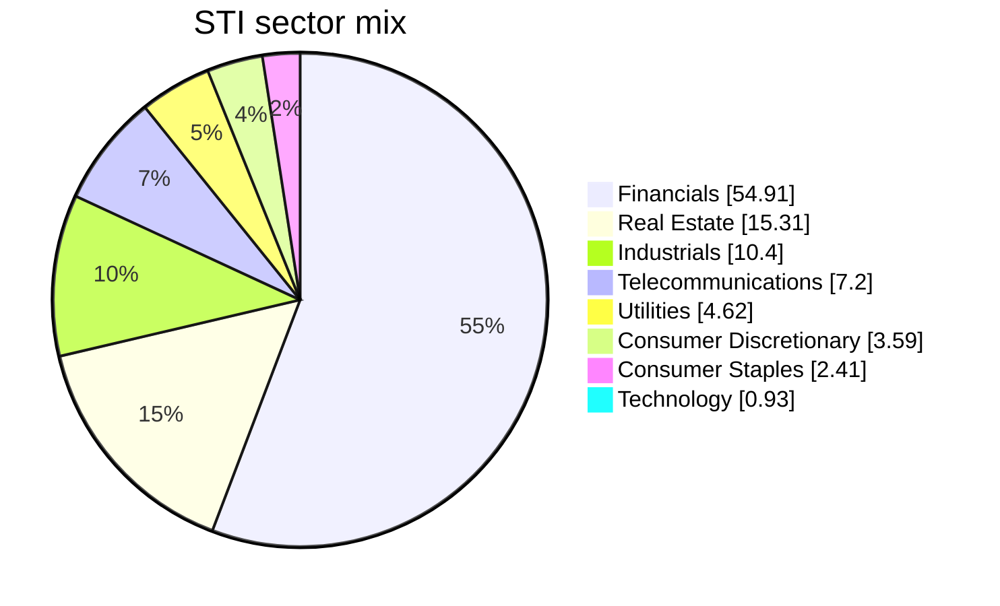
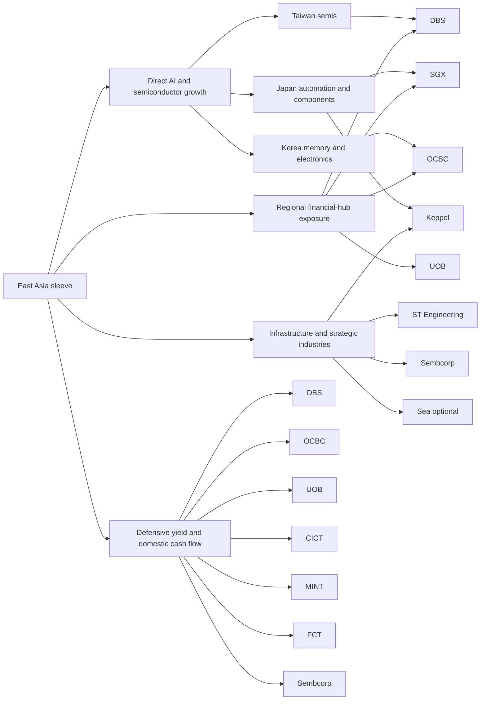

# Singapore for the East Asia Investment Synthesis

## Executive summary

Singapore is the strongest candidate in this synthesis for **defensive yield**, **domestic consumption exposure**, and **regional financial-hub exposure**. It is not the market to buy for pure semiconductor torque. In the Straits Times Index, **Financials are 54.91%**, **Real Estate 15.31%**, and **Technology only 0.93%**; the three local banks alone account for **51.06%** of index weight. In other words, Singapore does not compete with Taiwan or Korea as a direct chip market. It complements them by owning the **banking, capital-markets, balance-sheet, REIT, FX, and data-center “plumbing”** around Asian growth. citeturn9view0

The macro backdrop is still favorable for that role. Singapore’s economy grew **6.0% year-on-year in 1Q26**, and MTI kept full-year **2026 GDP growth at 2.0% to 4.0%**. At the same time, April 2026 inflation remained moderate at **1.4% core** and **1.8% headline**, even after MAS tightened policy in April by slightly increasing the appreciation slope of the S$NEER band. Fiscal policy remains supportive but disciplined, with the FY2026 budget still projecting an **S$8.5 billion surplus**, and the government added a further support package in April to cushion energy-shock effects. citeturn15news26turn15news25turn15search8turn14search1turn14news16

Structurally, Singapore remains a regional capital-market and wealth hub. MAS said Singapore’s asset-management industry **exceeded S$6 trillion of AUM**, and MAS’s wealth-management materials note that **88% of Singapore AUM is invested outside Singapore**. In May 2026 MAS also moved to streamline private-bank account opening to preserve the city’s competitiveness as a wealth center. SGX, meanwhile, reported record earnings, rising derivatives and OTC FX activity, and a stronger IPO pipeline; its FY2025 OTC FX headline ADV reached **US$143 billion**. citeturn13search7turn13search2turn12news30turn30search2turn38news20turn38news19

For portfolio construction, the highest-conviction Singapore core is: **DBS, OCBC, UOB, SGX, CICT, MINT, and FCT**, with **Keppel, Sembcorp, and ST Engineering** as infrastructure/quality compounder extensions. **Sea** is relevant only as a **small satellite** for ASEAN digital consumption; it is not part of the defensive-yield core. My recommended **Singapore allocation is 6% to 10% of total portfolio**, with a hard **country cap of 10%** and meaningful single-name caps because the market is concentrated and bank-heavy.

## Macro outlook, FX sensitivity, and Singapore’s regional role

Singapore’s near-term macro picture is better than a casual “slow developed market” label suggests. Reuters reported that 1Q26 GDP rose **6.0% year-on-year** and **1.0% quarter-on-quarter**, led by **wholesale trade, manufacturing, and finance and insurance**, with officials explicitly naming **AI-related demand** as a support factor. Enterprise Singapore’s export data also showed the electronics cycle turning up again, with March and April NODX supported by **ICs, PCs, and disk media products**, and April 2026 NODX growth of **24.5%**, helped by robust AI-related demand. That matters because it means Singapore is not a dead-weight market; it is participating in the regional AI capex cycle through trade, re-exports, wholesale activity, and services rather than through listed foundries. citeturn15news26turn37search9turn37search3

Inflation is not the main macro problem at present, but MAS is still alert to external shocks. April 2026 core inflation printed at **1.4%** and headline at **1.8%**, both below expectations, yet MAS had already tightened in April and lifted its 2026 inflation forecasts to **1.5%–2.5%** for both core and headline inflation. Singapore’s monetary regime is different from most countries: MAS manages the **trade-weighted Singapore dollar nominal effective exchange rate** rather than setting a policy rate directly, and MAS explicitly states that domestic interest rates such as **SORA generally track global rates, notably U.S. dollar interest rates**. That makes Singapore valuable in a regional multi-country portfolio: you get a currency regime that actively leans against imported inflation, but you also keep exposure to the global-rate cycle through banks and REIT funding costs. citeturn15search1turn15search4turn16search0turn16search4turn15search8turn15news25

Fiscal policy remains a genuine asset. The FY2026 budget projects an **overall surplus of S$8.5 billion, or 1% of GDP**, after an even larger FY2025 surplus. At the same time, the government has shown willingness to cushion shocks: in April 2026 it announced a roughly **S$1 billion** package to offset the fallout from the Middle East conflict and rising energy prices, while still emphasizing long-term AI and defense investment. That combination of **surplus + shock-absorption capacity** is a major reason Singapore equities often trade as “safe Asia” during volatile periods. citeturn14search1turn14search9turn14news15turn14news16

Foreign flows are best understood through Singapore’s financial-center role, not only through equity ETF flows. MAS highlighted that AUM in Singapore rose **12.2% year-on-year to above S$6 trillion**, while its wealth-management materials emphasize that the industry is mostly deploying capital outside Singapore. In parallel, MAS and the private-banking industry are now trying to shorten onboarding timelines for wealthy clients, precisely because account-opening frictions had become a competitive issue after post-scandal AML tightening. That tells you something important for a country allocation decision: Singapore is not just a domestic market; it is a **booking center for pan-Asian money, businesses, and families**. citeturn13search7turn13search2turn12news30turn12news31

SGX’s capital-markets franchise reinforces that role. Its FY2025 results showed **net revenue of S$1.298 billion** and **net profit of S$610 million**, with strong growth in derivatives and OTC FX; its FY2025 presentation reported **OTC FX ADV of US$143 billion**. Reuters later reported record half-year profit in FY2026, a stronger listing pipeline, work with MAS on market reforms, and plans to deepen Asian risk products, including **Asian government bond futures**. SGX’s April 2026 market report also showed an active bond-listing venue, with **941 listed fixed-income securities**, **126 new bond listings in April**, and a market dominated by **foreign issuers and non-SGD issuance**. That is exactly the kind of market infrastructure exposure that Taiwan, Korea, and Japan do not give you in the same way. citeturn30search2turn38search2turn38news20turn38search3turn3search6

## Market structure, sector weights, REITs, and access

The Singapore equity market is concentrated by design. The **STI tracks 30 stocks**, and the top three—**DBS, OCBC, and UOB**—carry a combined weight of **51.06%**. SGX itself is another 3.85%, and the top ten holdings together are roughly **77.84%** of the index. For a portfolio builder, that concentration is not a bug; it is the point. Buying Singapore means consciously buying an index dominated by **banks, yield, and infrastructure-like cash flows**. citeturn9view0

The resulting sector mix is clear:

The chart above is based on the April 2026 STI factsheet. The implication is straightforward: country-level Singapore exposure is **not** the cleanest way to add direct AI/semiconductor beta, because the technology weight is tiny. But it **is** one of the cleanest ways in Asia to add a **yield-heavy, bank-heavy, real-estate-heavy market** with relatively strong institutions and currency management. citeturn9view0

Singapore’s REIT complex remains one of the most important reasons to own the country. SGX’s 2026 REIT market updates highlighted improving liquidity, acquisition activity, and the investor demand for income-plus-property exposure. SGX’s April 2026 S-REIT symposium materials noted an average daily traded value above **S$240 million** in 2H25, and SGX research in May 2026 said the first four months of 2026 saw **11 acquisition transactions totaling more than S$6.3 billion** across the S-REIT market. The SGX also continues to push products such as the Lion-OCBC Singapore Low Carbon ETF, which tracks Singapore-affiliated names with a decarbonization tilt. citeturn7search12turn7search4turn35search14turn35search17

For market access, local and international options are adequate. On SGX, the primary broad beta vehicle is the **State Street SPDR Straits Times Index ETF (ES3)**, which closely replicates the STI. In the U.S., the most direct country ETF is the **iShares MSCI Singapore ETF (EWS)**. For a different local flavor, Singapore also has the **Lion-OCBC Securities Singapore Low Carbon ETF**. On the depository-receipt side, **DBS has a sponsored Level I ADR (DBSDY) on OTC**, while **Sea trades in New York as ADSs on the NYSE**. SGX itself also has OTC and European secondary lines, but for most investors the liquid access points are still **SGX ordinary shares, ES3, EWS, DBSDY, and SE**. citeturn9view0turn34search0turn34search18turn34search7turn35search14

## Company analysis and valuation snapshot

The most useful way to read Singapore tickers is by **portfolio role**: banks and REITs fill the defensive-yield and domestic-consumption gaps, SGX fills the financial-hub gap, and Keppel/Sembcorp/ST Engineering add higher-quality infrastructure and strategic-industry exposure. Sea is optional and belongs in a separate growth/satellite bucket.

| Ticker | Portfolio role | Business summary and main revenue drivers | Regional supply-chain / East Asia link | Valuation snapshot | Thesis-break conditions | Key sources |
|---|---|---|---|---|---|---|
| **DBS** | Core financial-hub anchor | One of Asia’s leading banks; FY2025 net profit **S$11.0b**. Revenue mix spans institutional banking, consumer banking/wealth, and markets. In 1Q26, wealth led fee growth and DBS reported **S$10b net new money**. | Direct beneficiary of Asian trade, treasury, payments, and wealth flows across Greater China, Southeast Asia, and South Asia. Useful indirect exposure to Taiwan/Korea/Japan activity because DBS finances the regional ecosystem rather than one industry. | **P/E ~16x** (approx. from market cap / FY25 net profit), **P/B 2.54x**, **yield 4.08%**. | Sharp wealth-flow slowdown, large credit losses from a regional shock, or a structurally weaker fee franchise. | citeturn31view0turn25search3turn42search3turn42search11 |
| **OCBC** | Core financial-hub anchor | Integrated banking, wealth, insurance, and asset management group. OCBC’s strategy explicitly targets **ASEAN–Greater China trade, investment, and wealth flows** and uses **Singapore–Hong Kong twin wealth hubs**. 1Q26 net profit rose **5%** to **S$1.97b**. | Particularly strong fit for cross-border wealth and family-office flows; also exposed to commercial and corporate banking across ASEAN and Greater China. | **P/E ~14x** (approx. from market cap / FY25 net profit), **P/B 1.68x**, **yield 3.56%**. | Wealth-hub execution fails, insurance drag worsens, or banking margins/provisions deteriorate faster than fees grow. | citeturn32search6turn32search13turn32search10turn32search14turn41search11 |
| **UOB** | Core ASEAN trade-finance bank | ASEAN-focused universal bank. FY25 operating profit was **S$7.7b** and net profit **S$4.7b**. UOB has also emphasized cross-border growth as companies reconfigure supply chains; it wants to **double wealth income by 2030**. | Best pure-play Singapore bank for the “ASEAN factory and supply-chain rerouting” theme. This is the bank most naturally linked to Taiwanese, Korean, and Japanese companies moving or financing production across Southeast Asia. | **P/E not cleanly surfaced in the Reuters snapshot used here**, **P/B 1.22x**, **yield 4.14%**. | ASEAN loan growth disappoints, cross-border fee momentum cools, or wealth scaling misses target. | citeturn32search5turn32search4turn25news42turn11search6 |
| **SGX** | Market-plumbing / capital-markets exposure | Securities and derivatives market infrastructure company. FY2025 net revenue was **S$1.298b** and net profit **S$610m**, with growth in fixed income, currencies, commodities, and derivatives. | Indirect way to own Asian volatility, hedging demand, bond issuance, and listing reform. Also linked to semiconductor-adjacent capital-raising and regional bond/FX market deepening. | **P/E 37.02x**, **P/B ~10.9x**, **yield 1.94%**. | Reform disappoints, listing pipeline fades, or volatility/hedging activity normalizes without offsetting growth in recurring data/platform revenue. | citeturn42search2turn41search12turn30search2turn38news20turn38search3 |
| **CICT** | Domestic consumption + office/core REIT | Singapore commercial REIT with retail, office, and integrated developments, predominantly in Singapore. Recent portfolio actions include the sale of Asia Square Tower 2 and the Paragon acquisition. | Best link to **Singapore domestic footfall + prime office + urban consumption**, with some cross-border office exposure. Lower direct AI beta than MINT, but better domestic-cash-flow quality. | **P/E 18.21x**, **P/B ~1.12x**, **yield 4.64%**. | Singapore office or retail rents weaken materially, acquisitions destroy value, or refinancing costs stay high without rental support. | citeturn19view0turn20search0turn40search4turn18search16 |
| **Mapletree Industrial Trust** | Yield + data-center / AI-adjacent REIT | Industrial REIT focused on Singapore industrial assets plus global data centers; portfolio spans **Singapore, North America, and Japan**. | Best Singapore REIT for **AI/data-center overlap**. It is not a chipmaker, but it sits near the digital-infrastructure side of the AI stack and links Singapore to U.S./Japan data-center demand. | **P/E 26.21x**, **P/B ~1.05x**, **yield 5.72%**. | Data-center leasing softens, valuations compress on rates, or overseas data-center economics disappoint. | citeturn20search1turn40search9turn40search18 |
| **Frasers Centrepoint Trust** | Pure domestic consumption REIT | Retail REIT built around suburban Singapore malls such as Causeway Point, Northpoint City North Wing, and Tampines 1. | Cleanest listed Singapore vehicle for **household spending and daily-need retail**. Correlates more with Singapore wage/consumption resilience than with global semis. | **P/E 20.56x**, **P/B ~0.97x**, **yield 4.51%**. | Domestic retail softens, tenant sales deteriorate, or suburban-rent resilience weakens. | citeturn20search2turn40search6 |
| **Keppel** | Infrastructure, asset-management, digital-infra bridge | Global asset manager/operator focused on infrastructure, real estate, and connectivity. FY2025 profit rose **29%**; connectivity and data centers benefited from AI and digital-infrastructure demand. 1Q26 business update said infrastructure and connectivity offset weaker real estate. | One of the most useful Singapore names for tying together **data centers, energy transition, and regional capital deployment**. More overlap with Japan/ASEAN decarbonization and digital infra than with direct semiconductors. | **P/E 18.0x**, **P/B ~1.75x**, **yield 3.24%**. | Asset monetization stalls, data-center returns disappoint, or the M1 situation becomes a bigger operational drag than expected. | citeturn24search0turn41search6turn28search4turn28search2turn28search6turn23news35 |
| **Sembcorp Industries** | Power, renewables, energy-transition compounder | Utility/energy-transition platform with gas, renewables, and urban solutions. FY2025 underlying net profit was **S$1.0b**, with renewables and integrated-urban-solutions helping offset pressure in gas and related services. | Best fit for a **power-and-renewables** bucket that complements Korea/Japan/Taiwan AI demand by owning the energy side of digitalization, plus regional renewable build-out. | **P/E 11.36x**, **P/B ~2.00x**, **yield 4.03%**. | Renewables returns weaken, gas margins compress harder than expected, or leverage/capex discipline slips. | citeturn29search4turn29search1turn42search8turn24search1 |
| **ST Engineering** | Quality industrial / defense / aerospace | Global technology, defense, and engineering group across commercial aerospace, urban solutions/satcom, and defense/public security. Official materials describe it as a global platform with broad overseas reach. | Good low-correlation complement to Taiwan/Korea chip exposure: aerospace, defense electronics, cybersecurity, and urban systems. It is not a semiconductor stock, but it does add strategic-tech and industrial depth. | **P/E 76.06x**, **P/B ~13.7x**, **yield 1.60%**. | Order momentum disappoints, aviation cycle weakens, or the premium multiple de-rates sharply. | citeturn27search11turn27search1turn27search12turn20search3turn40search7turn18search7 |
| **Sea** | Optional growth satellite only | NYSE-listed Singapore digital platform built around **Shopee, Garena, and SeaMoney**. Relevant if the objective is ASEAN internet and consumer growth, not income. | Adds **regional digital consumption** and e-commerce/fintech exposure. Correlation is higher to ASEAN/China internet sentiment than to Singapore yield sectors. | **P/E 34.45x**, **P/B ~4.31x**, **yield 0%**. | E-commerce profitability slips, gaming cash flow weakens, or fintech credit costs rise. | citeturn34search1turn42search9turn25search6turn34search7 |

A note on valuations: where Reuters/LSEG did **not** surface a direct P/B ratio in the snapshot, the P/B shown above is an **approximation** calculated from **Reuters market cap divided by year-end equity** from Reuters balance-sheet data. That mainly affects **SGX, CICT, MINT, FCT, Keppel, Sembcorp, ST Engineering, and Sea**. The figures are good enough for portfolio ranking, but they should be treated as **screening-level valuation inputs**, not model-grade precision. citeturn42search2turn41search12turn40search4turn40search9turn40search6turn41search6turn42search8turn40search7turn42search9

The scenario ranges below are **my judgment-based 5-year total ROI estimates**, built from the current operating profile, yield, and valuation backdrop above. They are **not** consensus forecasts.

| Ticker | Bull case | Base case | Bear case | Read-through |
|---|---:|---:|---:|---|
| DBS | **+70% to +95%** | **+40% to +60%** | **-10% to +10%** | Best mix of quality, regional wealth, and balance-sheet strength |
| OCBC | **+65% to +90%** | **+35% to +55%** | **-10% to +5%** | Slightly cheaper than DBS, with stronger insurance/wealth optionality |
| UOB | **+60% to +85%** | **+30% to +50%** | **-15% to +5%** | ASEAN supply-chain rerouting and wealth growth are the key upside |
| SGX | **+45% to +70%** | **+20% to +35%** | **-20% to +5%** | Best if listing reform, derivatives, and bond/FX growth persist |
| CICT | **+45% to +60%** | **+25% to +40%** | **-15% to +10%** | Stable income plus modest rerating if rates ease |
| MINT | **+50% to +75%** | **+20% to +40%** | **-20% to +5%** | Better if AI/data-center demand keeps cap rates tight |
| FCT | **+40% to +55%** | **+20% to +35%** | **-15% to +5%** | Domestic retail cash flow is resilient but unlikely to turn explosive |
| Keppel | **+65% to +100%** | **+35% to +55%** | **-20% to +10%** | Asset-light execution + monetization + data-center demand |
| Sembcorp | **+60% to +90%** | **+25% to +45%** | **-20% to +5%** | Works if power/renewables earnings stay durable |
| ST Engineering | **+40% to +60%** | **+15% to +30%** | **-25% to 0%** | Great company; main risk is starting from a high premium multiple |
| Sea | **+120% to +180%** | **+40% to +80%** | **-50% to 0%** | Pure growth satellite; very different risk profile from the rest |

## Supply-chain and correlation links with Taiwan, Korea, and Japan

The cleanest way to think about Singapore relative to Taiwan, Korea, and Japan is to separate **direct production exposure** from **ecosystem exposure**. Taiwan and Korea are the listed-market leaders for semiconductors and memory. Japan is stronger in industrials, automation, and selected component/systems franchises. Singapore, by contrast, is where you own the **balance sheet, trade finance, wealth flows, FX, bond issuance, REIT income, and data-center infrastructure** around that ecosystem. Recent macro data supports that framing: Singapore’s electronics exports have been accelerating on **AI-related demand**, especially **integrated circuits, PCs, and disk media products**, but the local stock market still expresses that theme mainly through banks, infrastructure, and REITs rather than listed chip fabrication. citeturn37search9turn37search3turn15news26turn9view0

That creates a very useful portfolio correlation pattern. Relative to **Taiwan**, Singapore offers lower direct chipset risk and more **currency, financial-services, and yield exposure**. Relative to **Korea**, Singapore has less memory and manufacturing cyclicality, but stronger **wealth-hub and real-asset income** characteristics. Relative to **Japan**, Singapore has fewer industrial deep-value opportunities, but more **pure financial-center and REIT carry**. In a combined Asia sleeve, Singapore therefore works best as the **stabilizer and monetizer** of regional growth rather than the primary growth engine.

A practical qualitative correlation map is below:

| Singapore bucket | Main names | Strongest link to Taiwan / Korea / Japan | Expected portfolio behavior |
|---|---|---|---|
| **Defensive yield** | DBS, OCBC, UOB, CICT, FCT, MINT | Indirect link only; income comes from banking spreads, fees, rents, and distributions rather than chip prices | Lower beta than Taiwan/Korea; more rates-sensitive |
| **Regional capital markets** | SGX, DBS, OCBC, UOB | Links to all three through listings, hedging, treasury, wealth, and trade finance | Benefits from volatility, issuance, and cross-border capital movement |
| **AI-adjacent infrastructure** | MINT, Keppel, ST Engineering, Sembcorp | Taiwan/Korea demand shows up via data centers, higher power demand, logistics, and enterprise digitization | Moderate cyclical upside without full semiconductor drawdown risk |
| **Domestic consumption** | FCT, CICT, Sea | Weakest direct link to Taiwan/Korea/Japan; most driven by Singapore and ASEAN consumers | Best diversifier against semiconductor drawdowns |
| **High-beta regional growth** | Sea | More tied to ASEAN internet and e-commerce sentiment than to East Asian industrials | Highest volatility; keep small |

This is also why **Sea is optional** rather than core. It fills the **regional digital-consumption** slot, not the defensive-yield or financial-hub slot. For the specific portfolio gaps identified earlier, **banks + REITs + SGX** matter more than Sea.

## Recommended allocation, risk caps, and watchlist

For a portfolio that already owns **Taiwan/Korea/Japan** as its higher-octane Asian growth engines, Singapore should be sized as a **complementary sleeve**, not a dominant thesis. My recommended range is **6% to 10% of total portfolio**, split as follows:

| Bucket | Preferred names | Target allocation range | Risk cap |
|---|---|---:|---:|
| **Financial-hub core** | DBS, OCBC, UOB | **2.8% to 4.5%** | **Single bank max 2.0%** |
| **REIT / defensive-yield core** | CICT, MINT, FCT | **1.2% to 2.0%** | **Single REIT max 0.7%; total REITs max 2.0%** |
| **Capital-markets infrastructure** | SGX | **0.5% to 1.0%** | **1.0% max** |
| **Infra / strategic industry extension** | Keppel, Sembcorp, ST Engineering | **1.0% to 2.0%** | **Single name max 0.8%** |
| **Optional satellite growth** | Sea | **0% to 0.75%** | **0.75% max** |
| **Total Singapore sleeve** | — | **6.0% to 10.0%** | **10.0% country cap** |

If the objective is specifically to fill the three earlier gaps, the most efficient Singapore basket is:

- **Defensive yield:** DBS + OCBC/UOB + CICT/FCT/MINT  
- **Domestic consumption:** FCT first, then CICT, with Sea only as a risk-on extension  
- **Financial hub exposure:** DBS + OCBC + UOB + SGX  

My **highest-conviction order** for a new Singapore sleeve is: **DBS, OCBC, SGX, CICT, MINT, UOB, Keppel, FCT, Sembcorp, ST Engineering, Sea**.

A concise watchlist for this country sleeve:

- **MAS and inflation path:** whether core CPI stays near the low end of the **1.5%–2.5%** forecast range and whether MAS holds or tightens again. citeturn15news25turn15search8
- **AI/electronics-through-services transmission:** NODX, wholesale trade, and manufacturing, especially whether AI-related electronics shipments keep supporting GDP. citeturn37search3turn37search9turn15news26
- **Bank earnings mix:** whether wealth flows continue offsetting NIM normalization, as seen in recent DBS, OCBC, and UOB results. citeturn25search3turn32search10turn25news42
- **REIT refinancing and acquisitions:** whether S-REIT funding costs improve and acquisition activity remains constructive. citeturn7search4turn7search12
- **SGX reform traction:** listing pipeline, derivatives growth, SDR expansion, and uptake of new products such as Asian government bond futures. citeturn38news20turn38news19turn38search3
- **Keppel / infrastructure execution:** especially the outcome of the M1 sale overhang and pace of asset monetization. citeturn23news35turn28search6

The bottom line is that Singapore is not the country to buy if the only objective is direct AI or semiconductor upside. It **is** the country to buy if the portfolio needs a serious **stability layer** inside Asia: banks with strong capital returns, REITs with domestic and data-center exposure, a real exchange/infrastructure franchise, and companies tied to regional wealth, trade, power, and digital infrastructure. In an East Asia sleeve, that role is valuable precisely because it is different from Taiwan, Korea, and Japan.

## Open questions and limitations

A few points are worth keeping explicit. First, some valuation fields—especially **P/B** for SGX, several REITs, Keppel, Sembcorp, ST Engineering, and Sea—were approximated from Reuters market-cap and balance-sheet snapshots because Reuters did not surface a direct P/B field in every case. Those figures are suitable for **relative ranking**, but I would still re-check them before execution. citeturn42search2turn41search12turn40search4turn40search9turn40search6turn41search6turn42search8turn40search7turn42search9

Second, the **UOB P/E ratio** was not cleanly surfaced in the source snapshot used here, so the valuation table leans more heavily on its official profit data, business updates, and Reuters P/B/yield fields than on a precisely cited current P/E print. Third, the supply-chain and correlation map in this report is **qualitative**, not a historical beta/correlation regression. The qualitative mapping is high confidence; a full quantitative correlation matrix would need a separate price-history exercise.