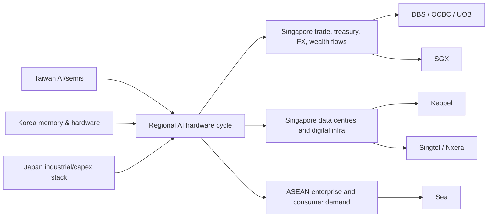
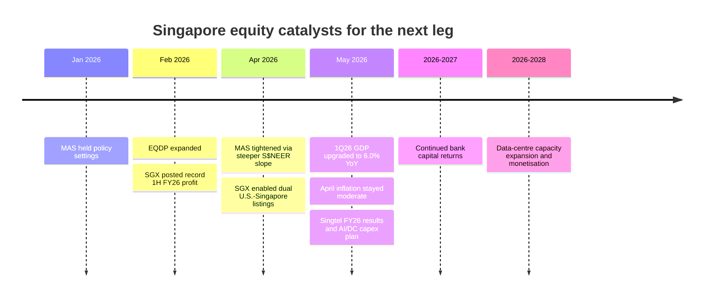

# Singapore Investment Report

## Executive Summary

Singapore is the most useful next addition to an East Asia sleeve if the goal is not to add more semiconductor beta, but to add **lower-beta Asian equity exposure, stronger income, financial-market infrastructure, and an ASEAN monetization layer**. The macro picture is still constructive: Singapore’s economy grew **6.0% year on year in 1Q26**, MTI kept its **2026 GDP forecast at 2.0%–4.0%**, April inflation remained contained at **1.8% headline / 1.4% core**, and MAS still tightened policy in April by **slightly increasing the slope of the S$NEER band** to guard against imported inflation. Fiscal policy is also supportive rather than restrictive: the government projects a **FY2026 surplus of S$8.5 billion**, after a **FY2025 surplus of S$15.1 billion**. citeturn24news19turn24news18turn24search0turn6view2turn27search14

For portfolio construction, Singapore is attractive because its investable market is **structurally different** from Taiwan, Korea, and Japan. Taiwan is still overwhelmingly a tech/AI hardware market, Korea remains a high-volatility semiconductor-and-cyclicals market, and Japan is a broader industrials/financials/governance-reform story. By contrast, Singapore’s most investable proxies are dominated by **banks, market infrastructure, telecom/digital infrastructure, and select industrials**. EWS, the main U.S.-listed Singapore ETF, had **51.2% in financials** and **22.1% in industrials** at March 31, 2026, while its 3-year beta was only **0.47**, far below Taiwan’s **0.96** and Korea’s **1.41**. citeturn40view0turn41view0turn42view0turn47view4

The most important conclusion is this: **Singapore should not replace Taiwan/Korea/Japan in your East Asia sleeve; it should stabilize and complete it.** The cleanest role is as an **8%–15% country weight within the East Asia sleeve**, centered on **DBS, OCBC, UOB, and SGX**, with Keppel, Singtel, ST Engineering, and a small optional Sea position as satellites. For a conservative or dividend-focused Asia sleeve, Singapore can plausibly be pushed toward the high end of that range. citeturn40view0turn43search4turn19search3turn19search7

## Macro Outlook

Singapore enters mid-2026 from a position of relative macro strength, but with a very external-risk-sensitive economy. MTI reported that the economy grew **6.0% YoY in 1Q26**, helped by **wholesale trade, manufacturing, and finance & insurance**, and kept its full-year forecast at **2.0%–4.0%** even as downside risks rose because of geopolitical disruptions and trade frictions. Singapore is a highly open economy: **trade was 322% of GDP in 2024** according to World Bank data. citeturn24news19turn27search5turn27search14

Inflation is not the core problem it was in 2022–2023, but MAS is not complacent. April 2026 inflation came in at **1.8% headline** and **1.4% core**, below consensus, yet MAS had already tightened in April by **slightly increasing the rate of appreciation of the S$NEER band**, while keeping the width and midpoint unchanged. Reuters’ explainer and MAS’s statement summary both reinforce the same point: Singapore still uses the exchange rate, not a policy rate, as its main inflation-control instrument. citeturn24news18turn6view1turn24search0turn24search3turn24search7

The external engine is also more supportive than it looked a few months ago. In **1Q26**, non-oil domestic exports rose **9.6%**, with **electronics exports up 57.8%**, and Enterprise Singapore later said April NODX rose **24.5%**, still driven by AI-related electronics demand. Enterprise Singapore upgraded its **2026 NODX growth forecast to 3.0%–5.0%**. This is useful for equity investors because it means Singapore is no longer just a passive service hub in the AI cycle; it is also participating through electronics trade, logistics, treasury flows, and data-center demand. citeturn26news19turn26search2

Fiscal policy is a clear positive. Singapore Budget 2026 projects a **basic balance surplus of S$8.5 billion, or 1.0% of GDP**, after a **FY2025 overall budget surplus of S$15.1 billion, or 1.9% of GDP**. That gives the state room to cushion shocks without degrading sovereign credibility. citeturn6view2

| Macro metric | Current snapshot |
|---|---|
| Growth | 1Q26 GDP **+6.0% YoY**; 2026 MTI forecast **2.0%–4.0%** |
| Inflation | Apr-26 CPI **+1.8% YoY**; MAS core **+1.4% YoY** |
| Monetary stance | MAS **tightened** in Apr-26 via a steeper S$NEER slope |
| Fiscal stance | FY2025 surplus **S$15.1b (1.9% GDP)**; FY2026 surplus **S$8.5b (1.0% GDP)** |
| External sector | Trade **322% of GDP** in 2024; 1Q26 NODX **+9.6%**, electronics **+57.8%** |

The table above is compiled from MTI, MAS/MTI, Singapore Budget, World Bank, Enterprise Singapore, and Reuters coverage. citeturn24news19turn24news18turn24search0turn6view2turn27search5turn26news19turn26search2

## Market Structure and Access

Singapore’s main weakness is also its defining feature: **concentration**. The STI tracks the **top 30 companies listed on SGX**, and as of April 30, 2026 the **largest constituent was 25.96%** of the index while the **top 10 holdings were 78.33%**. In the SPDR STI ETF, the three local banks alone accounted for roughly **DBS 26.17%**, **OCBC 15.99%**, and **UOB 9.63%** as of May 22, 2026. This means any Singapore allocation should be treated as an intentional overweight to financials unless you deliberately dilute it with non-bank names. citeturn43search1turn43search0turn43search4

That bank heaviness shows up in the cleaner U.S.-listed country proxy as well. EWS had **51.21% in financials**, **22.08% in industrials**, and only modest weights in real estate, utilities, communication services, and consumer sectors. Its top holdings were **DBS 21.42%**, **OCBC 19.66%**, **SGX 4.90%**, **ST Engineering 4.85%**, **Sembcorp 4.75%**, **Singtel 4.60%**, and **UOB 4.27%**. citeturn40view0

Access for international investors is better than many people assume. The cleanest routes are: direct SGX local shares; the U.S.-listed **iShares MSCI Singapore ETF (EWS)** on NYSE Arca; and limited OTC ADR access for some local banks, including **DBS (DBSDY)** and **UOB (UOVEY)**. Sea is different: **Sea Limited is Singapore-founded but NYSE-listed**, so it is not a Singapore-exchange access route; it is a separate U.S.-listed ASEAN growth stock. citeturn11search0turn11search11turn29search9turn29search11turn13search3

Market reform is a meaningful incremental positive. MAS’s equity-market initiatives include a **S$5 billion Equity Market Development Programme**, with **S$3.95 billion already allocated across nine fund managers** by January 2026, followed by a February 2026 expansion. SGX and regulators also moved ahead with **dual U.S.-Singapore listing rules** in 2026. On the flow side, SGX noted that ex-REIT SMIDs saw **close to S$470 million of net institutional inflow in 1Q26**, while ETF AUM hit a **record S$19.1 billion** in January 2026. citeturn17search4turn17search0turn17search10turn16news44turn16search11turn10search0turn10search18

SGX itself also matters as regional market plumbing. SGX describes itself as an international multi-asset venue, and one structural datapoint from its market materials remains telling: **about 40% of listed companies and over 80% of listed bonds originate outside Singapore**. It is also a real hedge venue for the rest of your East Asia sleeve: SGX markets the **FTSE Taiwan contract as the leading USD-denominated Taiwan futures contract**, and its China A50 futures remain the **world’s most liquid international futures for Chinese equities**. citeturn23search4turn23search0turn23search9turn23search12turn23search11

Official visuals and downloadable tables used below are available here: [Excel workbook](sandbox:/mnt/data/Singapore_East_Asia_Tables.xlsx), [ticker table CSV](sandbox:/mnt/data/singapore_key_tickers.csv), [allocation CSV](sandbox:/mnt/data/singapore_allocation_ranges.csv), [scenario CSV](sandbox:/mnt/data/singapore_scenario_cases.csv), and [correlation matrix CSV](sandbox:/mnt/data/singapore_peer_correlation_matrix.csv).

## Strategic Role in the East Asia Sleeve

The cleanest way to understand Singapore is to compare its **sector DNA** with Taiwan, Korea, and Japan. Taiwan’s country ETF was **69.39% information technology**, led by **TSMC at 21.67%**. Korea’s proxy was **44.91% information technology**, led by **Samsung Electronics at 22.35%** and **SK Hynix at 18.78%**. Japan’s proxy was much broader, with **26.00% industrials**, **17.49% financials**, and **15.46% consumer discretionary**. Singapore, by contrast, was **51.21% financials** and **22.08% industrials**. That is why Singapore is best treated as the **income / financial-plumbing / infrastructure leg** of an East Asia portfolio, not as another growth-tech leg. citeturn41view0turn42view0turn41view2turn40view0

That lower-beta role is visible in the ETF statistics. EWS showed a **3-year beta of 0.47** and **3-year standard deviation of 12.86%**, versus **0.96 / 17.44%** for Taiwan and **1.41 / 34.38%** for Korea. Japan’s EWJ proxy was also moderate at **0.70 beta** and **13.13% standard deviation**, but Singapore is still the more direct dividend-and-banking stabilizer. citeturn40view0turn41view0turn42view0turn47view4

The chart above uses sector weights from BlackRock’s March 31, 2026 country ETF factsheets for EWS, EWT, EWY, and EWJ. citeturn40view0turn41view0turn42view0turn41view2

The supply-chain connection to your existing East Asia sleeve is best thought of as **second-order monetization**. Taiwan and Korea supply chips and AI hardware. Japan supplies capital goods, automation, and broader industrial capacity. Singapore monetizes the regional cycle through **trade and treasury flows, wealth booking, FX and derivatives, data-center buildout, and ASEAN distribution**. DBS explicitly describes itself as a Singapore-headquartered bank with a presence in **19 markets** across Greater China, Southeast Asia, and South Asia. Keppel is scaling data-center capacity toward **1.2 GW**, while Singtel’s Nxera has already opened an **AI-ready** data center in Singapore and is building a broader regional footprint. citeturn47view3turn22search0turn22search12turn22search1turn22search13

On correlation, Singapore does not give you zero overlap, but it does give you a **different earnings engine**. Using ETF NAV calendar-year returns for **2021–2025**, the correlation of Singapore with Taiwan was about **0.63**, with Korea about **0.69**, and with Japan about **0.77**. The important caveat is that this is only a **five-year calendar sample**, so it is useful for direction, not for precision. The sector evidence is stronger than the short-run correlation evidence: Singapore is still the least semiconductor-dependent market of the four. citeturn40view0turn41view0turn42view0turn41view2

| Illustrative ETF NAV return correlation | Singapore | Taiwan | Korea | Japan |
|---|---:|---:|---:|---:|
| Singapore | 1.00 | 0.63 | 0.69 | 0.77 |
| Taiwan | 0.63 | 1.00 | 0.51 | 0.84 |
| Korea | 0.69 | 0.51 | 1.00 | 0.80 |
| Japan | 0.77 | 0.84 | 0.80 | 1.00 |

The matrix above is an author calculation from calendar-year NAV returns reported in the March 31, 2026 BlackRock factsheets for EWS, EWT, EWY, and EWJ. citeturn40view0turn41view0turn42view0turn41view2

## Key Tickers and Why They Matter

The three local banks are still the center of gravity. **DBS** is the highest-quality flagship, with **FY2025 income of S$22.9 billion, net profit of S$11.0 billion, and ROE of 16.2%**; Reuters also reported that the bank plans to continue capital-return dividends in **FY2026 and FY2027**, barring unforeseen circumstances. **OCBC** offers the strongest wealth/insurance mix, with **FY2025 net profit of S$7.42 billion**, **wealth-management income of S$5.6 billion** equal to **38% of total income**, **CET1 at 15.1%**, and a **99-cent total FY25 dividend** including a special payout. **UOB** is the cleaner ASEAN-commercial-bank play, with **FY25 operating profit of S$7.7 billion**, **record fee income of S$2.6 billion**, and a stated ambition to **double wealth income by 2030**. citeturn18view0turn19search4turn16search0turn13search13turn19search12turn16search1turn14search6turn16search6turn16search2

**SGX** is the best non-bank way to own Singapore’s role as a market hub. It reported **1H FY2026 net profit of S$357.1 million**, **net revenue of S$695.4 million**, and **1H dividends of 21.75 cents per share**. Reuters also noted record half-year profit and the exchange’s role in the new dual-listing pipeline. citeturn19search3turn19search7turn16search7turn16search11

Among the satellites, **Keppel** and **Singtel** matter most for the AI and digital-infrastructure link. Keppel ended 2025 with **S$95 billion of FUM**, **S$189 million of asset-management net profit**, and a plan to push data-center capacity toward **1.2 GW**. Singtel reported **FY2026 underlying net profit of S$2.77 billion** and is planning **S$3 billion of FY2027 capex**, including **S$1.2 billion for data centers and AI**. **ST Engineering** is useful for diversification because it gives you industrial, aerospace, defense, and digital-systems exposure, with **FY2025 revenue of S$12.35 billion** and **23 cents total dividend**. citeturn20search4turn20search7turn22search0turn22search12turn21search1turn16news38turn22search14turn20search0

**Sea** belongs in a different category. It is a **Singapore-founded, NYSE-listed** technology company, not a Singapore-market proxy. The strategic case is real—Sea said Shopee served around **400 million active buyers**, Monee added **over 20 million unique first-time borrowers**, and Garena connected with **more than 100 million daily players** through 2025—but it behaves like a high-beta ASEAN internet stock, not like a Singapore financial hub stock. That makes it useful only as a **satellite**. citeturn13search3turn13search7turn13search11turn44finance0

| Ticker | Role | Why it matters | Portfolio view |
|---|---|---|---|
| DBS | Core bank | Best quality / capital return / flagship franchise | **Core Buy** |
| OCBC | Core bank | Wealth + insurance mix, strong capital, attractive payout | **Core Buy** |
| UOB | Core bank | Clean ASEAN commercial and wealth exposure | **Buy / Hold** |
| SGX | Market infrastructure | Exchange + clearing + Asia hedging toll road | **Buy** |
| Keppel | Digital / infrastructure | Asset management + data-center monetization | **Buy / Watch** |
| Singtel | Digital infrastructure | Telecom cash flow + Nxera optionality | **Watch / Buy on weakness** |
| ST Engineering | Industrial / defense tech | Order book diversification away from banks | **Watch / Buy** |
| Sea | ASEAN internet growth | Separate NYSE-listed satellite, not SGX core | **Satellite only** |

The official company datapoints underlying this table come from DBS, OCBC, UOB, SGX, Keppel, Singtel, ST Engineering, Sea, and Reuters materials cited above. citeturn18view0turn19search4turn16search0turn13search13turn19search12turn16search1turn14search6turn16search6turn16search2turn19search3turn19search7turn20search4turn20search7turn21search1turn16news38turn22search14turn20search0turn13search11

## Portfolio Construction

The cleanest country-level role is to size Singapore at **8%–15% of an East Asia sleeve**, with a **hard cap near 20%** unless the mandate is explicitly income-oriented. That sizing reflects three things: lower beta than Taiwan/Korea, stronger dividend support than Japan’s broad market, and clear diversification away from concentrated AI-hardware earnings streams. citeturn40view0turn41view0turn42view0turn47view4

Inside the Singapore bucket, the most coherent structure is to concentrate the majority in the **banking + exchange complex**, then add a smaller **digital-infrastructure / industrial diversification sleeve**. If you want a very efficient build, **DBS + OCBC + UOB + SGX** can reasonably make up **70%–85%** of the Singapore bucket. If you want more cycle sensitivity to regional AI capex, Keppel and Singtel are the natural additions. ST Engineering helps if you want less direct rate sensitivity. Sea should remain explicitly capped because it changes the risk profile of the sleeve. citeturn40view0turn43search4turn19search3turn20search4turn21search1turn22search14

| Sleeve or name | Suggested range | Hard cap | Comment |
|---|---:|---:|---|
| Singapore within East Asia sleeve | **8%–15%** | **20%** | Higher only if the mandate is more defensive/income-heavy |
| DBS | 22%–28% of SG bucket | 30% | Anchor position |
| OCBC | 15%–22% | 25% | Strong second core |
| UOB | 10%–16% | 18% | Use for deeper ASEAN exposure |
| SGX | 10%–14% | 18% | Adds non-bank market infrastructure |
| Keppel | 8%–12% | 15% | AI infrastructure / asset-management link |
| Singtel | 6%–10% | 12% | Nxera optionality |
| ST Engineering | 6%–10% | 12% | Industrial/defense diversification |
| Sea | 0%–5% | 5% | Satellite only |

On implementation, my **buy / watch / avoid** ranking is straightforward. **Buy:** DBS, OCBC, SGX, and usually UOB. **Watch:** Singtel, ST Engineering, and Keppel if you want better entry discipline after sharp runs. **Avoid / underweight:** highly leveraged property developers, lower-quality rate-sensitive S-REITs, and microcaps whose investment case depends mainly on liquidity initiatives rather than durable earnings power. The first four names fit the strategic role of Singapore best; the last group does not.

For self-directed risk control, I would use **thesis-based exits**, not purely price-based exits. For the banks, a thesis break would be two consecutive quarters of clearly worse-than-guided NIM compression, rising credit costs, or a material pullback in capital returns. For SGX, it would be a visible loss of trading-volume momentum plus reform disappointment. For Keppel and Singtel, it would be delayed monetization or data-center execution slippage. For Sea, the best control is position size first—**half-size or less** relative to core names—then a wider review band because of normal volatility. A practical rule set is: **15%–18% review bands** for core Singapore names, **12%–15%** for SGX after a profitable run, and **20%–25%** for Sea only if the position is already very small.

## Scenarios, Risks, and Catalysts

The scenario framework below is not a price target sheet. It is a **3–5 year total-return range** based on current business mix, balance-sheet quality, dividends, and plausible valuation paths. The base case assumes Singapore remains a stable, moderately growing, surplus-running economy, the SGD remains a reasonable inflation shield, and regional trade/AI infrastructure spending stay positive. The bear case assumes global growth shocks, higher oil, and worse earnings delivery. The bull case assumes successful market reforms, better regional capital deployment, and durable data-center / wealth expansion. The ranges below are analytical estimates built on the company fundamentals discussed above. citeturn24news19turn24search0turn6view2turn20search4turn21search1turn19search4turn13search13turn14search6turn19search3

| Ticker | Bull total ROI over 3–5y | Base total ROI over 3–5y | Bear total ROI over 3–5y |
|---|---:|---:|---:|
| DBS | +55% to +90% | +25% to +45% | -20% to +5% |
| OCBC | +50% to +80% | +22% to +40% | -18% to +5% |
| UOB | +45% to +75% | +18% to +35% | -20% to 0% |
| SGX | +35% to +60% | +20% to +35% | -15% to +5% |
| Keppel | +45% to +80% | +20% to +45% | -20% to +5% |
| Singtel | +35% to +65% | +15% to +30% | -20% to +5% |
| ST Engineering | +40% to +70% | +18% to +35% | -15% to +5% |
| Sea | +80% to +160% | +25% to +70% | -45% to -5% |

The main upside catalysts are now fairly visible: continued bank capital returns; MAS / SGX equity-market reform effects; the dual-listing pipeline; stronger SGX derivatives and listing activity; further Keppel data-center monetization; and Singtel/Nxera execution on AI-ready digital infrastructure. The main downside risks are just as clear: another oil and shipping shock, imported inflation that hurts growth, sharper regional risk-off flows, and a prolonged stagnation in Singapore’s domestic equity-market revitalization. citeturn16search0turn17search0turn16search11turn19search7turn20search4turn22search1turn24search0turn24news20

## Open Questions and Limitations

The biggest analytical limitation in this report is the **correlation matrix**: it is intentionally shown as **illustrative**, because it is built from the calendar-year ETF NAV returns available in current BlackRock factsheets for **2021–2025**, which is a short sample. It is still useful directionally, but not statistically robust enough to over-interpret. citeturn40view0turn41view0turn42view0turn41view2

A second limitation is that some MAS pages were intermittently unavailable during retrieval, so the report relies partly on **Reuters’ contemporaneous reporting of MAS decisions** and on official Singapore government and company materials that were accessible. Where that happened, I preferred transparent summaries over forced precision. citeturn24search0turn24search3turn24search7

The highest-confidence portfolio conclusion, despite those limitations, is still strong: **Singapore is worth adding now, but as a complementary stabilizer and monetization layer, not as another pure growth engine.** If Taiwan and Korea are your AI hardware torque, and Japan is your broad industrial/reform core, then Singapore is your **regional banking, market-infrastructure, digital-infrastructure, and dividend ballast**.