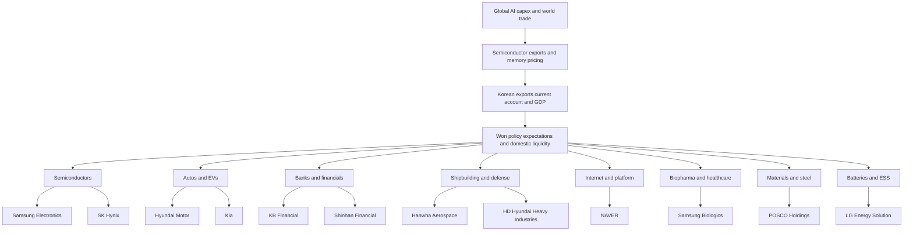

# South Korea Investment Landscape for Macro-to-Ticker Conviction

## Executive summary

South Korea is one of the clearest “macro-to-ticker” markets in Asia because the country’s cycle transmits into listed equities unusually fast and visibly. When global AI capex and memory pricing rise, shipments, exports, GDP, the won, policy expectations, and the earnings of a small group of very large listed companies all move together. In 2026 that transmission has been obvious: real GDP rose 1.7% quarter-on-quarter and 3.6% year-on-year in the first quarter, helped heavily by booming semiconductor exports; March’s current-account surplus widened to $37.33 billion; foreign reserves stood at $427.9 billion at end-April; and April exports rose 48.0% year-on-year with semiconductor exports up 173%. citeturn15search0turn9view1turn12view0turn17search6

That strength comes with a cost: Korea is a highly concentrated market. Samsung Electronics and SK Hynix alone accounted for roughly 44% of KOSPI market value in May 2026, and a close proxy for broad Korea exposure, the MSCI Korea 20/35 Index, had 53.8% in information technology and 64.4% in its top ten constituents as of April 30, 2026. In practice, a Korea allocation is not a generic country bet. It is a levered bet on AI memory, export manufacturing, and the country’s ability to narrow the “Korea discount” through governance and market-access reform. citeturn6search1turn34view0

The policy backdrop is supportive but not fully “developed-market clean.” The Bank of Korea kept the base rate at 2.50% in April 2026, while warning that Middle East energy shocks could slow growth and push inflation higher. April CPI accelerated to 2.6% year-on-year, the highest in nearly two years. Korea has resumed short selling, MSCI has acknowledged that short-selling accessibility improved, and Seoul is rolling out 24-hour dollar-won spot trading from July 6, 2026. But Korea remains an MSCI Emerging Market because FX access, investor registration, account setup, clearing/settlement frictions, and product availability still lag developed-market norms. citeturn9view4turn9view2turn16search1turn26search1turn24search1turn24news21turn24news25

For an investor who wants “safe and crucial” Korean exposure, the answer is not “buy the whole market blindly.” The best Korea sleeve is barbelled. The core should still include Samsung Electronics and SK Hynix because they are systemically important to Korea’s earnings power and export machine. But because that semiconductor exposure already dominates the country, the sleeve should intentionally diversify into autos, banks, defense, shipbuilding, and one quality platform name. In this report, the highest-conviction **core** names are Samsung Electronics, SK Hynix, Hyundai Motor, Kia, KB Financial, Shinhan Financial, and NAVER. The best **watch** names are Samsung Biologics, Hanwha Aerospace, HD Hyundai Heavy Industries, LG Energy Solution, and POSCO Holdings. citeturn38search0turn38search1turn38search13turn38search6turn45view0turn45view1turn40search10turn39search14turn39news39turn40search0turn40search13turn41search11

For a diversified global equity portfolio, a reasonable **country weight** is **5%–8% of equities for conservative investors, 8%–12% for balanced investors, and 12%–18% for aggressive investors**. For investors who already own Taiwan or global semiconductor funds, Korea should be sized toward the lower end of those bands unless the Korea sleeve is deliberately diversified away from memory. Based on the current macro, valuation, and reform mix, a reasonable **probability-weighted expected return for a diversified Korea sleeve is about 45%–50% cumulative over 3–5 years**, equivalent to roughly **8%–10% annualized**, with very wide dispersion because of the memory cycle and geopolitics. This is an inference built from the current earnings surge, elevated trailing valuation, low forward valuation, ongoing market reform, and Korea’s export sensitivity. citeturn32search3turn34view0turn19view2turn17search6turn38search0turn38search1

## Macro backdrop and policy regime

South Korea entered 2026 with a mixed but investable macro picture. The Bank of Korea’s February 2026 outlook projected 2.0% real GDP growth for 2026 after 1.0% in 2025, reflecting the semiconductor upcycle and a recovery in domestic demand. That view was partly validated by the first-quarter GDP report, which showed 1.7% quarter-on-quarter growth and 3.6% year-on-year growth, far above the stagnation that had worried markets in 2025. The important point for investors is that Korea’s 2026 rebound has not been demand-led in the classic domestic-consumption sense; it has been export- and semiconductor-led. citeturn10search1turn15search1turn15search0turn13search2

The BOK’s problem is that growth improved while inflation stopped behaving. The bank kept the base rate at 2.50% on April 10, 2026, but at the same time warned that energy-supply shocks from the Middle East were weakening the growth outlook and adding upside pressure to CPI. April consumer inflation then printed 2.6% year-on-year, up from 2.2% in March and the highest since July 2024. That combination matters for equities: banks benefit from “higher for longer” rates, exporters can tolerate mild won weakness, but rate-sensitive domestic growth sectors do not get a clean easing tailwind. citeturn9view4turn10search5turn9view2turn16search1turn16search6

The won remains a key risk variable. The BOK explicitly said in January 2026 that USD/KRW weakness in the won was being driven by U.S. dollar strength, yen weakness, and domestic outward investment demand. A weaker won helps exporters’ translated earnings and often flatters headline profits at Samsung, SK Hynix, Hyundai, and Kia, but it also raises imported inflation and can delay rate cuts. Korea is therefore one of those markets where strong exports and a weak currency can coexist, but not costlessly. citeturn18search13turn38search0turn17search6

On the balance-of-payments side, Korea still looks fundamentally solid. The current account posted a $37.33 billion surplus in March 2026, and official foreign reserves were $427.9 billion at end-April, ranking 12th globally at end-March. Those numbers matter because they reduce the probability of a classic emerging-market funding problem even if the won stays volatile. Korea does not look like a balance-sheet crisis story; it looks like a cyclical, concentrated export market with policy frictions. citeturn9view1turn12view0

The fiscal backdrop is supportive rather than transformational. The BOK noted that a supplementary budget was one of the factors cushioning the economy against the external shock from the Middle East, but this was not the main engine of growth. For equity investors, the more relevant public-policy story is not fiscal stimulus alone, but the combination of industry policy, FX/capital-market reform, and “value-up” governance reform intended to shrink the Korea discount. citeturn9view2turn19view2

On regulation and market structure, the key facts are straightforward. Korea fully lifted its market-wide short-selling ban on March 31, 2025. MSCI said in June 2025 that short-selling accessibility had improved, but Korea still fell short on FX access and operational market accessibility. Seoul has continued to respond by extending securities-settlement hours, simplifying access procedures, and launching 24-hour dollar-won spot trading from July 6, 2026, following a trial from June 29. MSCI announced that its 2026 accessibility and classification reviews would be released in June 2026, so Korea remains “reform in motion,” not “mission accomplished.” citeturn26search1turn24search1turn24news24turn24news21turn24news25turn24search11turn24search13

Foreign access is meaningfully better than it used to be, but not fully frictionless. BOK guidance still describes foreign investors as needing registration with the Financial Supervisory Service under real names, and non-resident investors are encouraged to use a standing proxy for account opening, settlement, dividend collection, and administration. At the same time, the government is explicitly trying to simplify account opening and settlement while widening FX trading access. That is progress, but it remains a structural difference versus buying U.S. or Japanese equities. citeturn21view1turn21view3turn22view0turn19view2

Sector-specific foreign ownership restrictions remain in parts of the economy, but they are not the main issue for the priority names in this report. Invest Korea states that foreigners can generally invest without restraint except where regulations apply; its 2024/2025 guide says foreign investment is prohibited in a small set of businesses and restricted in around 30 categories. Examples include telecom and broadcasting caps such as 49% ceilings in several communications and media activities. That matters for some Korean equities, but not for the report’s main semiconductor, auto, bank, defense, shipbuilding, biotech, and internet picks. citeturn27search1turn30view4turn30view1turn30view3

## Market structure and foreign investor access

Korea’s listed equity market is large, liquid, and unusually top-heavy. MSCI describes the broad MSCI Korea Index as covering about 85% of the Korean equity universe, with a trailing P/E of 23.63, forward P/E of 7.51, and dividend yield of 0.89% as of April 30, 2026. A close tradable proxy, the MSCI Korea 20/35 Index, had 80 constituents and about $2.18 trillion of index market capitalization, with Samsung Electronics and SK Hynix together accounting for 46.2% of the index. Its sector mix was 53.8% information technology, 20.4% industrials, 9.2% financials, and 6.2% consumer discretionary. Because that is a capped index, the uncapped opportunity set is, if anything, even more concentrated. citeturn32search3turn34view0

Reuters’ market reporting reinforces the same point from a local-market angle: Samsung Electronics and SK Hynix together accounted for roughly 44% of KOSPI market value in May 2026. That single fact should drive portfolio construction. If an investor already owns Taiwan, TSMC, SOXX/SMH, or AI hardware winners globally, then a passive Korea position adds a lot of correlated semiconductor beta. Korea is therefore best accessed either through a broad ETF for convenience or through a deliberately diversified hand-built sleeve. citeturn6search1turn44search8turn44search0

For U.S. investors, the cleanest listed broad-market vehicle is the **iShares MSCI South Korea ETF (EWY)**, which tracks a South Korean equities index and held 81 names as of mid-May 2026. BlackRock described it as targeted exposure to large- and mid-sized Korean companies, with a 0.59% expense ratio, a P/E of 26.62, a P/B of 3.00, and a trailing yield of 1.29% at that time. For European investors, the **Amundi MSCI Korea UCITS ETF** tracks the MSCI Korea 20/35 Index in a UCITS wrapper. These are the best “no-friction” entry points if direct KRX access is unavailable or operationally cumbersome. citeturn44search8turn44search0turn44search3turn44search7

For single stocks, direct KRX access is the preferred route for most of the priority companies. Samsung Electronics’ original shares trade on KRX under 005930/005935, while its GDRs trade on the London Stock Exchange as SMSN and SMSEL. KB Financial and Shinhan both maintain ADR access, and POSCO Holdings trades in ADR form as PKX. For most of the other priority names in this report, major Western ADR/GDR access was not clearly identified in the reviewed official sources, which means direct Korea access or ETF exposure is usually the cleaner institutional route. citeturn43search7turn36view0turn45view0turn45view1turn36view1turn40search11

Settlement and operational access are still part of the investment case. Korea’s FX reforms matter not because they are a side story, but because they shape foreign participation, valuation, and whether Korea can eventually become more investable on developed-market terms. MOEF explicitly frames 24-hour FX trading, offshore won settlement, and simpler account-opening/settlement processes as tools to increase long-term capital inflows and improve Korea’s market standing. If that reform path continues, Korea’s valuation discount can narrow even if the memory cycle cools. If reforms stall, Korea can remain structurally cheap even when earnings are good. citeturn19view2turn19view3turn24news21turn24news25

### Macro to sector to ticker transmission

The chart below summarizes how the country’s macro shocks typically transmit into listed earnings.

The evidence backing that transmission in 2026 is strong: BOK GDP data, BOK current-account data, MOTIE export data, and company earnings all moved in the same direction as the semiconductor upcycle intensified. citeturn15search0turn9view1turn17search0turn17search6turn38search0turn38search1

### Top 30 listed companies

The table below uses a May 2026 market-cap snapshot from CompaniesMarketCap and aligns the names with Korea’s sector structure seen in MSCI Korea. Market caps update daily, so use these as approximate ranking anchors rather than exact execution values. citeturn35view0turn36view0turn36view1turn34view0

| Rank | Company | Ticker | Approx. market cap | Broad sector |
|---|---|---:|---:|---|
| 1 | Samsung Electronics | 005930.KS | $1.267T | Information technology |
| 2 | SK Hynix | 000660.KS | $909B | Information technology |
| 3 | Hyundai Motor | 005380.KS | $113B | Consumer discretionary |
| 4 | SK Square | 402340.KS | $103B | Industrials / investment |
| 5 | LG Energy Solution | 373220.KS | $62B | Batteries |
| 6 | HD Hyundai Heavy Industries | 329180.KS | $47B | Industrials / shipbuilding |
| 7 | Doosan Enerbility | 034020.KS | $47B | Industrials / power |
| 8 | Samsung C&T | 028260.KS | $45B | Industrials / holding |
| 9 | Samsung Biologics | 207940.KS | $43B | Health care |
| 10 | Samsung Life | 032830.KS | $43B | Financials |
| 11 | Hanwha Aerospace | 012450.KS | $43B | Industrials / defense |
| 12 | Kia | 000270.KS | $42B | Consumer discretionary |
| 13 | Hyundai Mobis | 012330.KS | $38B | Consumer discretionary / parts |
| 14 | KB Financial | KB | $37B | Financials |
| 15 | Shinhan Financial | SHG | $30B | Financials |
| 16 | Celltrion | 068270.KS | $29B | Health care |
| 17 | LG Electronics | 066570.KS | $28B | Consumer / electronics |
| 18 | HD Hyundai Electric | 267260.KS | $28B | Industrials / electrical |
| 19 | LS Electric | 010120.KS | $28B | Industrials / electrical |
| 20 | Hanwha Ocean | 042660.KS | $25B | Industrials / shipbuilding |
| 21 | Hyosung Heavy Industries | 298040.KS | $25B | Industrials |
| 22 | SK Inc. | 034730.KS | $23B | Industrials / holding |
| 23 | Samsung Electro-Mechanics | 009155.KS | $23B | Information technology |
| 24 | POSCO Holdings | PKX | $23B | Materials |
| 25 | Hana Financial | 086790.KS | $22B | Financials |
| 26 | Hanmi Semiconductor | 042700.KS | $20B | Information technology |
| 27 | NAVER | 035420.KS | $20B | Communication services / internet |
| 28 | HD Korea Shipbuilding & Offshore Engineering | 009540.KS | $20B | Industrials |
| 29 | LG Chem | 051910.KS | $18B | Materials / batteries |
| 30 | Doosan | 000150.KS | $18B | Industrials |

### ETF and ADR access routes

| Route | Market / venue | What it gives you | Notes |
|---|---|---|---|
| EWY | U.S. ETF | Broad Korea large/mid-cap exposure | Most practical U.S. retail/institutional Korea route; 81 holdings; targeted South Korea exposure. citeturn44search8turn44search0 |
| Amundi MSCI Korea UCITS ETF | Europe UCITS | Broad Korea large/mid-cap exposure | Tracks MSCI Korea 20/35; suitable for many EU/UK brokers that support UCITS ETFs. citeturn44search3turn44search7 |
| Samsung Electronics GDRs | London Stock Exchange | Samsung-only exposure without KRX | Official GDR route: SMSN / SMSEL. citeturn43search7 |
| KB ADR | U.S. ADR | KB Financial single-stock access | Useful for investors without KRX cash-equity access. citeturn36view0turn45view0 |
| SHG ADR | U.S. ADR | Shinhan Financial single-stock access | Official IR site explicitly maintains an overseas ADR quote page. citeturn36view0turn45view1 |
| PKX ADR | U.S. ADR | POSCO Holdings single-stock access | One of the easier Korean non-bank ADR routes. citeturn36view1turn40search11 |

Operationally, direct KRX buying is best done through a broker or custodian that explicitly offers Korean cash-equity access. The official Korean process still centers on investor registration, local or omnibus account setup, and custody/settlement support, though Seoul is trying to simplify those steps. If a broker does not support Korea directly, the clean fallback is broad ETF exposure first, then ADR/GDR routes where available. citeturn21view1turn21view3turn19view2

## Sector maps and conviction logic

### Semiconductors, memory, and HBM

This is the heart of the Korea story. In March 2026 Korea’s semiconductor exports hit a record $32.8 billion, up 151.4% year-on-year, and in April semiconductor exports rose 173% year-on-year. Samsung projected an eightfold jump in first-quarter operating profit, while SK Hynix delivered record quarterly earnings and said AI-memory demand would continue to exceed manufacturing capacity. This is why semiconductors matter not just as a sector but as the country’s dominant macro transmission channel. citeturn17search0turn17search6turn38search0turn38search1

The key risk is overexposure. The same cycle that powers Korea’s earnings also dominates the country index, the won narrative, and foreign flows. Investors who already own Taiwan, AI hardware names, or broad semiconductor ETFs should not let Korea become a second unintentional all-semiconductor sleeve. Korea semis should be treated as the growth engine inside a broader Korea basket, not the entire basket. citeturn6search1turn34view0turn32search3

### Autos and EVs

Hyundai and Kia are Korea’s best non-chip structural franchises. They benefit from a weaker won, scale manufacturing, rising hybrid demand, and a still-improving product mix, but face tariff risk in the United States, weaker conventional EV demand, and an intensifying Chinese price war in Europe. Hyundai’s first-quarter operating profit fell 30.8% despite revenue growth, while Kia still posted record first-quarter revenue and healthy 7.5% operating margin. These are better seen as disciplined global manufacturers with quality capital returns than as pure EV momentum stories. citeturn38search13turn38search2turn38search6turn38search14

### Batteries

Batteries are where Korea’s strategic importance collides with cyclicality. LG Energy Solution posted a first-quarter operating loss on weak EV demand, yet simultaneously highlighted more than 100 GWh of new 46-series cylindrical battery orders, North American ESS build-out, and backlog above 440 GWh. Reuters also reported a U.S.-confirmed $4.3 billion Tesla-LGES deal tied to Megapack LFP supply. The conclusion is that Korea batteries remain strategically critical, but not currently “safe compounders” in the same way that banks or autos are. citeturn40search1turn40search13turn40news43

### Shipbuilding and defense

South Korea has become one of the best listed ways to express a world of rearmament, naval recapitalization, LNG and energy shipping, and industrial bottlenecks. Hanwha Aerospace’s defense export machine keeps winning business in Europe, while HD Hyundai Heavy Industries is tied to commercial shipbuilding, naval exports, and even long-tail optionality around nuclear and advanced vessels. This is one of the most attractive diversifying clusters inside Korea because it reduces portfolio dependence on memory pricing. It is also one of the most valuation-sensitive clusters because the rerating has already been extreme. citeturn39news39turn39news41turn40search0turn42search4turn42search9

### Banks and financials

Korean banks are central to any “Korea discount narrowing” thesis. KB and Shinhan are diversified financial groups rather than narrow lenders, with banking, cards, securities, insurance, and asset management. Both explicitly market value-up and shareholder-return programs, and Shinhan highlighted a 40.2% total shareholder return for 2024. These names benefit from steady rates, improving payouts, governance reform, and their role as liquid domestic blue chips that are less tied to AI memory than most of the index. citeturn45view0turn45view1turn19view2

### Internet platforms

NAVER is Korea’s best large-cap domestic platform diversifier. Its first-quarter 2026 release showed revenue growth of 16.3% year-on-year and operating profit growth of 7.2%, with platform revenue supported by advertising tools and commerce services. AI accounted for more than half of advertising growth in the period, which means NAVER gives investors some AI upside without adding more semiconductor hardware concentration. That said, it remains a domestic-regulatory and execution story, not a global megaplatform on U.S. valuation terms. citeturn40search10

### Biopharma

Samsung Biologics is Korea’s most important large-cap biopharma/CDMO name. It reported first-quarter 2026 revenue of KRW 1,257 billion and operating profit of KRW 581 billion, driven by full utilization across the existing plants. This is one of the few Korean names that offers high-quality structural growth with relatively limited direct linkage to the memory cycle. The main near-term risk is labor disruption, as Reuters reported strike-related losses during the spring. citeturn39search14turn39search10turn39search2

### Materials and steel

POSCO Holdings is the classic Korea cyclical with optionality. Reuters describes it as a steel-focused holding company, while its own IR archive shows continued investor messaging around quarterly earnings and corporate value-up implementation. The steel business is exposed to China and the global industrial cycle, but the group also offers battery-materials leverage that can matter if EV demand stabilizes. It is investable, but it is not a “set-and-forget” core holding in the same way the banks, autos, or semis are today. citeturn40search11turn41search11

### Catalyst timeline

| Timing | Catalyst | Why it matters |
|---|---|---|
| May 28, 2026 | BOK policy decision | Confirms whether inflation risk forces a more hawkish path than equities want. citeturn16search1turn9view4 |
| June 18, 2026 | MSCI 2026 accessibility review | Korea’s reform progress is judged against developed-market standards. citeturn24search11turn24search13 |
| June 23, 2026 | MSCI market classification review | Watch-list or status signals affect foreign-flow narrative. citeturn24search11turn24search13 |
| June 29 to July 6, 2026 | Trial then launch of 24-hour USD/KRW spot trading | Most visible operational reform for foreign investors in 2026. citeturn24news21turn24news25 |
| Rolling through 2026 | Governance/value-up reforms and Commercial Act changes | Determines whether the Korea discount narrows outside semiconductors. citeturn19view2 |
| Rolling through 2026 | AI memory pricing and HBM supply tightness | Dominant driver of index-level earnings. citeturn38search0turn38search1 |

## Ticker conviction map

The valuation views below are **qualitative** rather than point-estimate target prices. Current Korean market caps and broad index multiples were sourced in May 2026, but precise single-stock multiples move quickly. Where exact company-level valuation history was not directly available from the reviewed official sources, the comparison versus history and peers is an informed inference from the current cycle, market rerating, and sector structure. citeturn35view0turn36view0turn36view1turn32search3turn34view0

| Ticker | Business model and revenue exposure | Margin / balance sheet / FCF trend | Ownership / liquidity / access | Valuation view vs history and peers | Main 6–24 month catalysts | Main downside scenarios | Final rating |
|---|---|---|---|---|---|---|---|
| **Samsung Electronics** 005930 | Korea’s systemically important tech champion: memory, foundry/logic, mobile, consumer electronics. Q1 2026 was driven by memory strength and AI-related demand; the DS division posted KRW 81.7T revenue and KRW 53.7T operating profit. citeturn41search16turn38search0 | Financial quality remains fortress-like; historically large cash generation and clear shareholder-return policy through 2026. Logic/foundry still dilutes pure-memory margins. citeturn43search2turn38search0 | Deepest local liquidity; KRX common and preferred shares; official LSE GDR route exists. Governance is improved but still shaped by Samsung-group affiliation. citeturn43search7turn43search3 | Still cheaper in quality terms than many global AI hardware winners because investors discount foundry/logic execution risk and conglomerate complexity. | HBM4/Nvidia qualification, continued memory tightness, capital return, FX reform, Korea discount narrowing. citeturn38search0turn19view2 | Memory cycle rollover, strike/labor disruption, export-control escalation, foundry losses persisting. citeturn13news15turn38search0 | **Core** |
| **SK Hynix** 000660 | Purest listed Korea vehicle for HBM and AI memory. Q1 2026 revenue KRW 52.6T and operating profit KRW 37.6T were record highs; demand still exceeds supply. citeturn41search13turn38search1 | Margin expansion is the strongest in Korea; strong cash flow supports capital return including treasury-share cancellation. Balance sheet is much improved versus past cycles. citeturn41news39turn38search1 | Very liquid; huge local market cap; no clearly superior Western ADR route identified in reviewed official sources, so KRX access is best. | Richer than Samsung because HBM leadership is clearer; still not obviously expensive if AI memory tightness persists, but the stock has already massively rerated. citeturn38search16turn41news39 | Additional HBM pricing upside, sustained Nvidia/AI ecosystem demand, shareholder returns. citeturn38search1turn41news39 | AI capex slowdown, Samsung share gains in HBM, demand normalization, geopolitical restrictions. citeturn38search1turn41news39 | **Core** |
| **Hyundai Motor** 005380 | Global auto OEM with strong hybrid mix, premiumization, finance support, and North American scale. Q1 2026 revenue hit KRW 45.94T; operating profit fell 30.8% on tariff and cost pressure. citeturn38search13turn38search2 | Cash generation and capital returns remain solid; quarterly dividend continues. Margin has compressed but remains resilient for a global OEM under current conditions. citeturn38search13 | Very liquid local blue chip. No major sponsored ADR route was identified in the reviewed official sources; direct Korea access is cleaner. | Still screens more like a cheap global OEM than a high-growth tech company; that discount is justified partly by tariffs and cyclicality, but it may be too wide given hybrid strength. | New model launches, continued HEV demand, favorable won, broader Korea re-rating. citeturn38search13turn18search13 | U.S. tariff escalation, oil-price shock, Middle East demand weakness, Chinese competition. citeturn38search2 | **Core** |
| **Kia** 000270 | Global auto OEM with stronger retail share gains and cleaner margin profile than many peers. Q1 2026 revenue was KRW 29.5T with 7.5% operating margin and record 4.1% global market share. citeturn38search6 | Excellent execution and still strong FCF profile for an automaker; margin better than Hyundai’s in the current cycle. | Highly liquid locally. Direct Korea route preferred. | Still priced more like a cyclical auto than a compounder; attractive relative value if margins hold. | Hybrid mix, SUV model cycle, share gains in key markets, buybacks/dividends via Korea value-up. citeturn38search6turn19view2 | European EV price war, tariff headwinds, macro slowdown. citeturn38search14 | **Core** |
| **KB Financial** KB / 105560 | Diversified financial holding company spanning bank, securities, insurance, card, asset management. Value-up and payout story is central. citeturn45view0 | Banks benefit from still-positive rates; diversified fee income reduces pure NIM dependence. Capital-return focus improves FCF-to-equity. | Easy access via ADR and official ADR/foreign ownership pages; high liquidity as a major financial. citeturn45view0 | Korean banks still tend to trade below global-quality peers because of the Korea discount; that gap can narrow if reform credibility improves. | Higher payouts, buybacks, governance reform, stable credit costs. citeturn45view0turn19view2 | Property/credit deterioration, policy-rate cuts reducing NIM faster than payouts rise. | **Core** |
| **Shinhan Financial** SHG / 055550 | Best-in-class diversified financial group with bank, card, securities, insurance, and more. Management explicitly emphasizes shareholder-return consistency. citeturn45view1 | Balanced earnings mix and conservative capital profile; better diversification than a pure bank. | Good local liquidity and ADR route; official IR site maintains overseas ADR quote linkage. citeturn45view1 | Similar to KB: still structurally discounted relative to global diversified financials, but less cyclical than Korean semis or steel. | Shareholder-return policy, continued value-up reform, domestic liquidity rotation into financials. citeturn45view1turn19view2 | Credit-cycle deterioration, policy volatility, less torque than semis during risk-on surges. | **Core** |
| **Samsung Biologics** 207940 | Large-scale CDMO / biopharma manufacturing franchise. Q1 2026 revenue KRW 1,257B and operating profit KRW 581B on full plant utilization. citeturn39search14 | High-quality growth and operating leverage; structurally stronger margin profile than most Korean industrials. Capital intensity remains meaningful but is linked to visible capacity monetization. | Liquid large cap. Direct Korea access preferred. Strategic affiliation with Samsung supports credibility but can keep governance questions alive. | Premium-rated versus the Korean market and many domestic peers; quality deserves a premium, but it is not cheap after the rerating. | New capacity monetization, contract wins, global biologics outsourcing demand. | Labor disruption, valuation compression, customer concentration / project-schedule slippage. citeturn39search10turn39search2 | **Watch** |
| **Hanwha Aerospace** 012450 | Korea’s flagship listed defense exporter. Q1 2026 operating profit rose to about KRW 639B; order backlog reportedly hit record levels. Norway and wider Europe continue to matter. citeturn39search11turn39news39turn39search15 | Earnings momentum is strong and backlog visibility is excellent; but capital allocation has become more controversial because global expansion may require funding. | Large, increasingly liquid defense name; direct Korea route preferred. Chaebol governance and dilution sensitivity matter. | Rerated sharply; likely expensive versus own history, but global defense scarcity still supports a premium. | Additional European/Middle East contracts, backlog growth, JV/factory expansion. citeturn39news39turn39news41 | Share-sale dilution, contract timing slippage, political/export-license risk. citeturn39news43turn39news41 | **Watch** |
| **HD Hyundai Heavy Industries** 329180 | Commercial shipbuilding, naval ships, offshore, and special-situations optionality around nuclear and advanced vessels. Q1 2026 operating profit rose 108.8% year-on-year to KRW 905B. citeturn40search0 | Strong cyclical margin recovery as higher-priced backlog is recognized. Balance-sheet quality is better than the old ship-cycle stereotype, but still cyclical. | Large and liquid by Korean industrial standards; direct Korea access preferred. | Cheap versus long-cycle monopoly-like franchises, but not obviously cheap versus its own historical ship-cycle valuations after the rerating. | High-price backlog roll-in, U.S. naval opportunity, TerraPower/Natrium supply-chain optionality, ammonia and special-ship projects. citeturn42search4turn42search9 | Freight/order-cycle reversal, steel/input costs, project execution delays. | **Watch** |
| **LG Energy Solution** 373220 | Korea’s leading listed EV-battery producer with growing ESS and LFP optionality. Q1 2026 operating loss was KRW 207.8B, but order intake and North American ESS build-out remained strong. citeturn40search13turn40search1 | Near-term earnings are weak and capital intensity is high; FCF is hostage to the EV cycle. Strategic position remains strong. | Very liquid local large cap; direct Korea access preferred. | De-rated dramatically versus its listing-era narrative; valuation is lower than history but still needs earnings repair. | EV stabilization, ESS scale-up, Tesla/LFP execution, U.S. localization benefits. citeturn40news43turn40search13 | EV slowdown persists, customers delay orders, margins stay negative longer. citeturn40search1 | **Watch** |
| **NAVER** 035420 | Korea’s dominant internet/platform name with ads, commerce, membership, and AI-enabled monetization. Q1 2026 revenue was KRW 3.241T and operating profit KRW 541.8B. citeturn40search10 | Quality earnings and sound operating leverage; less capital-intensive than Korea industrial champions. | Highly liquid local large cap; direct Korea access preferred. | Still below U.S. megaplatform quality multiples; attractive if AI and commerce monetization keep improving. | AI-assisted advertising, commerce ecosystem, margin discipline, domestic digital monetization. citeturn40search10 | Competition, domestic regulation, weaker consumer demand. | **Core** |
| **POSCO Holdings** PKX / 005490 | Steel, infrastructure, and battery-materials optionality. 1Q 2026 investor communications emphasized improving operating trends and value-up follow-through. citeturn41search11turn40search11 | Cyclical margins; balance sheet linked to capex and commodity cycle. Less predictable FCF than banks or internet. | ADR access available; local and ADR routes both workable. | Classic low-multiple cyclical with embedded battery-materials option; attractive on value, but not low-risk. | Steel margin recovery, lithium/battery-materials progress, governance/value-up. | China slowdown, steel oversupply, capex drag, commodity volatility. | **Watch** |

## ROI scenarios and portfolio construction

### Bull, base, and bear cases

The scenario ranges below refer to a **diversified Korea sleeve**, not a single name. They are model-based judgments grounded in Korea’s current earnings surge, high market concentration, reform progress, and residual accessibility discount.

| Scenario | Probability | Macro and market conditions | 3–5 year cumulative ROI | Comment |
|---|---:|---|---:|---|
| **Bull** | 25% | AI memory demand remains tighter for longer; won stabilizes; FX/access reforms draw sustained foreign inflows; governance reforms narrow the Korea discount beyond semis. | **+80% to +130%** | Korea works as both a cyclical winner and a reform story. Supported by current export momentum and government reform push. citeturn17search6turn19view2turn24news21 |
| **Base** | 50% | Memory supercycle cools but does not collapse; autos, banks, defense, and shipbuilding offset part of the normalization; Korea remains MSCI EM but more accessible. | **+30% to +60%** | Most likely path: returns come from earnings, selective multiple support, and better payouts rather than another 2025-style melt-up. citeturn32search3turn34view0turn45view0turn45view1 |
| **Bear** | 25% | Memory prices roll over hard; China and global manufacturing weaken; geopolitics or export controls intensify; governance reform disappoints. | **-30% to +10%** | Korea’s concentration means index drawdowns can be severe when semis and exporters stumble together. citeturn6search1turn38search0turn38search1 |

Using the midpoint of those ranges, the **probability-weighted expected return is roughly +46% cumulative over 3–5 years**, which implies about **8%–10% annualized**. This is a reasonable base-case expectation for a diversified Korea sleeve today: attractive, but not cheap enough to justify reckless sizing after the 2025–2026 rerating. citeturn32search3turn34view0turn17search6turn38search0turn38search1

### Country-allocation bands

These are suggested **weights in a diversified global equity portfolio**.

| Risk style | Suggested Korea weight |
|---|---:|
| Conservative | **5%–8%** |
| Balanced | **8%–12%** |
| Aggressive | **12%–18%** |

If Korea is being funded partly out of a Taiwan or global-semiconductor allocation, use the **lower half** of the range unless the Korea sleeve is intentionally diversified away from memory. Korea’s passive benchmarks already contain a very large semiconductor bet. citeturn6search1turn34view0

### Recommended Korea sleeve

The table below is a **balanced** Korea sleeve designed to preserve Korea’s macro power while limiting semiconductor concentration. Conservative investors can shift 3%–5% from Hanwha/HD Hyundai/LGES into banks and Samsung; aggressive investors can shift 5%–7% from banks into SK Hynix, Hanwha, and HD Hyundai Heavy Industries.

| Ticker | Balanced target weight | Role in sleeve |
|---|---:|---|
| Samsung Electronics | **18%** | Foundational Korea core; deepest liquidity and national earnings anchor |
| SK Hynix | **14%** | Highest-torque AI memory exposure |
| Hyundai Motor | **8%** | Global industrial moat; won and hybrid beneficiary |
| Kia | **8%** | Better-margin auto exposure |
| KB Financial | **8%** | Value-up, payout, and domestic stabilizer |
| Shinhan Financial | **6%** | Diversified financial stabilizer |
| NAVER | **7%** | Digital/AI diversifier without more hardware concentration |
| Hanwha Aerospace | **8%** | Defense growth and geopolitical hedge |
| HD Hyundai Heavy Industries | **6%** | Shipbuilding/naval/nuclear optionality |
| Samsung Biologics | **6%** | Structural growth outside the macro cycle |
| POSCO Holdings | **6%** | Value/cyclical plus battery-materials option |
| LG Energy Solution | **5%** | Strategic battery exposure with controlled risk |
| **Total** | **100%** | |

This construction leaves semiconductors at **32%** of the sleeve instead of letting them dominate the portfolio the way they dominate the index. For investors who already own Taiwan or global semiconductor funds, that is the key improvement versus simply buying EWY and forgetting about it. citeturn6search1turn34view0turn44search8

### Staging plan

A staged approach is preferable because Korea is both cyclical and event-driven.

| Stage | Allocation | What to buy |
|---|---:|---|
| Initial entry | **40%** | Samsung, SK Hynix, Hyundai/Kia, one bank, or EWY if direct access is not ready |
| Second tranche | **35%** | Add after either BOK/event volatility, a semiconductor pullback, or confirmation that 24-hour FX reform is rolling smoothly |
| Final tranche | **25%** | Add into laggards or diversifiers: Hanwha, HD Hyundai Heavy, NAVER, Samsung Biologics, POSCO, LGES |

The logic for staging is simple: Korea can swing hard on BOK rate expectations, FX reform headlines, memory-price news, and geopolitical shocks. Those swings should be used, not feared. citeturn16search1turn24news21turn38search0turn38search1

### Overlap with Taiwan and global semiconductors

A Taiwan allocation is often a foundry-and-AI-compute bet. A Korea allocation is, today, primarily a **memory-and-export-manufacturing bet**. Those are not identical, but they are highly correlated when AI capex is the dominant market driver. If an investor already owns Taiwan, then Samsung plus SK Hynix should not be allowed to turn Korea into “Taiwan by another route.” The right way to use Korea alongside Taiwan is to let Korea add **banks, autos, defense, shipbuilding, and one platform name** rather than doubling down on semis alone. citeturn6search1turn34view0turn38search0turn38search1

### Key geopolitical and regulatory risks

The first risk is **China**, in two senses. China is both a major demand center for Korean exports and a strategic competitor in memory, batteries, steel, and EV supply chains. Reuters reported that China’s CXMT expects surging memory revenue in 2026 as AI memory demand rises, which is a direct long-run challenge to Korea’s memory oligopoly. Korea’s China export leverage is still large enough that Chinese industrial weakness feeds straight back into Korean earnings. citeturn17search6turn38news38

The second risk is **U.S. policy**. Korea benefits from AI infrastructure demand and industrial cooperation with the United States, but it is also exposed to U.S. tariffs, export controls, and industrial-policy shifts. Hyundai and Kia already feel tariff pressure; LGES’s fortunes are partly tied to North American battery policy; and Samsung/SK Hynix remain exposed to technology-policy changes around advanced semiconductors. citeturn38search2turn38search14turn40search13turn38search0turn38search1

The third risk is **chaebol governance**. MOEF is openly trying to change the narrative through Commercial Act reforms, shareholder-protection measures, and dividend-tax changes. That is positive, but investors should treat governance improvement as an upside scenario, not a completed fact. Chaebol affiliations still matter for Samsung, Hyundai-group companies, Hanwha, HD Hyundai, LG, and POSCO-adjacent industrial governance. citeturn19view2turn43search8turn43search9

## Open questions and limitations

This report has high confidence on the macro backdrop, reform direction, sector transmission, and the priority-ticker ranking. It is less complete on three items.

First, **single-stock valuation history** was not available in a uniform, official, up-to-the-minute form across all twelve priority names, so the relative valuation judgments are qualitative rather than precise target-multiple calls. The country-level valuation inputs are current and official through MSCI and ETF sources. citeturn32search3turn34view0turn44search0

Second, **tax and custody details** vary materially by investor residency, treaty status, ADR versus local-share route, and broker setup. The operational direction is clear from BOK/MOEF, but exact withholding, reclaim, and settlement treatment should be confirmed with the executing broker or custodian at trade time. citeturn21view1turn19view2

Third, **ADR/GDR coverage** is uneven. Samsung, KB, Shinhan, and POSCO have clearly identifiable offshore routes in the reviewed sources. For several other priority names, the reviewed official materials did not provide a comparably clean foreign listing route, so direct KRX access or ETF exposure remains the most reliable assumption. citeturn43search7turn45view0turn45view1turn40search11