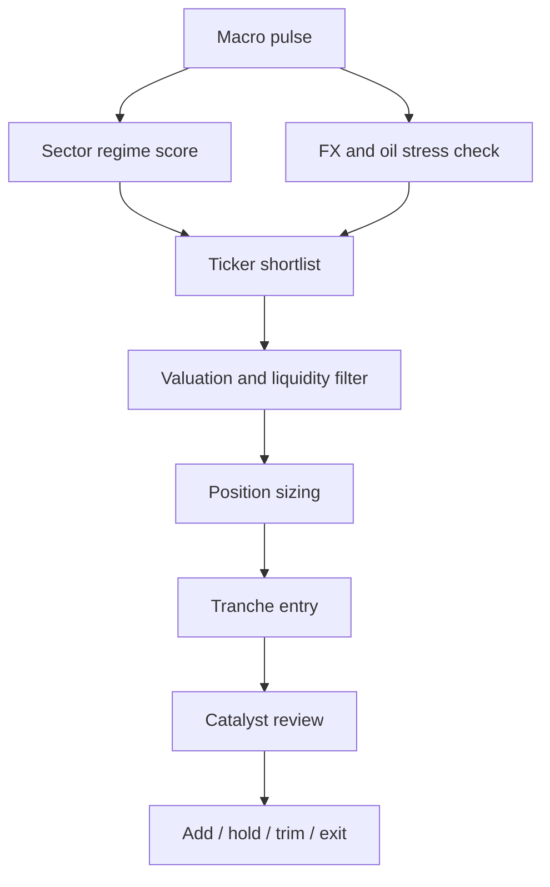

# Japan Investment Landscape

## Executive summary

Japan remains one of the more compelling developed-market equity cases in Asia, but the case is not “Japan up, buy everything.” The investable story is specific: mild but real monetary normalization, a genuine inflation-and-wage regime change, continued Tokyo Stock Exchange pressure on boards to address cost of capital and low valuations, and a market structure full of globally important industrial, financial, and semiconductor franchises. Against that, the main macro risks are now clearer too: higher oil, a weak yen, rising JGB yields, and fiscal slippage around extra-budget spending. The best risk/reward is in banks, trading houses, selected exporters/industrial champions, insurers, and a selective—not indiscriminate—allocation to semicap equipment and automation. citeturn61view0turn57view0turn63view0turn70news4turn41view0turn16news0

The macro backdrop is unusual by Japanese standards. The BOJ kept the policy rate at 0.75% in late April 2026, but dissent within the board has grown, with several members arguing for 1.0%, while the BOJ’s April outlook now sees FY2026 growth slowing as oil hurts terms of trade and household real income, even as core CPI is expected to run 2.5%–3.0% in FY2026 before easing. At the same time, the Statistics Bureau’s latest indicators show population at about 122.81 million, headline CPI at 1.4% y/y in April 2026, and unemployment at 2.7%, which means the actual inflation impulse is being partly masked by government energy support while labor remains tight. citeturn61view0turn57view0turn66view0turn67view0

For portfolio use, I would treat Japan as a medium-conviction overweight only if you want exposure to governance reform plus global industrial/AI supply-chain winners without paying U.S.-style multiples. In a global portfolio, that translates to roughly **5%–8% Japan** for conservative investors, **8%–12%** for balanced investors, and **12%–18%** for aggressive investors. Inside a Japan sleeve, I would build around **core banks, trading houses, Toyota/Hitachi-type exporters, selective semicap equipment, one or two insurers, a defensive telecom/pharma anchor, and a small REIT income sleeve**. What I would *not* do is let Japan become an accidental one-theme bet on AI hardware; Tokyo Electron and Advantest are excellent companies, but they are not the whole country. citeturn31view0turn55news4turn41view0turn16news0

## Macro backdrop

Japan’s macro picture in May 2026 is best understood as **normalized inflation, still-low policy rates, and rising external-cost risk**. The BOJ held the overnight call rate at **0.75%** on April 28, 2026. Its own April outlook says FY2026 growth should decelerate because higher crude oil prices are squeezing corporate profits and household real income, while FY2026 CPI ex-fresh food is likely to run **2.5%–3.0%**, with underlying inflation moving toward a level consistent with the 2% target between the second half of FY2026 and FY2027. That combination is good for banks and insurers, mixed for domestic cyclicals, and manageable for exporters if the yen stays weak. citeturn61view0turn57view0

A practical read of the latest data is that **headline inflation understates underlying pressure**. The Statistics Bureau shows April CPI at **1.4% y/y**, but BOJ speeches and statements repeatedly note that government energy support has temporarily pulled measured inflation lower even while services inflation, wage pass-through, and import-price pressure remain live. BOJ Board Member Koeda also highlighted that import-price inflation widened sharply in April and that firms’ willingness to pass through higher costs remains elevated. citeturn66view0turn58view0turn67view0

Fiscal policy is still loose. The Ministry of Finance’s FY2026 initial budget sets **general-account expenditure at ¥122.3 trillion**, with **¥29.6 trillion** of government bond issuance, **¥13.1 trillion** of interest payments, and more than **¥10 trillion of public support for semiconductors by FY2030** embedded in the policy framework. Reuters also reports the government is weighing an additional **~¥3 trillion supplementary budget**, including utility subsidies, in response to the Middle East shock. This helps domestic demand in the near term, but it also adds upward pressure to yields and complicates the BOJ’s normalization path. citeturn63view0turn63view3turn62view0turn70news4

Trade is still supportive, but now with a geopolitical sting. April 2026 exports rose **14.8% y/y**, imports **9.7%**, and Japan recorded a **¥301.9 billion trade surplus**, supported by strong semiconductor-related demand. The problem is composition: Reuters also reported a collapse in auto exports to the Middle East because of Hormuz-related disruption, and another Reuters report says China has effectively cut Japan off from several heavy rare earth inputs, which matters for electronics, magnets, and some industrial supply chains. citeturn37news0turn37news2turn37news3

The yen is still a key swing factor. Reuters reported the BOJ has explicitly signaled it is watching FX closely as yen weakness feeds more directly into prices; the yen moved past **160/USD** in late March, while fiscal concerns and oil have also pushed JGB yields to multi-decade highs. For a USD-based investor, this means Japan can be fundamentally right and still disappoint in base-currency returns if the currency moves the wrong way. citeturn35news6turn35news1turn35news8

### Macro snapshot

| Variable | Latest read | Why it matters for equities |
|---|---:|---|
| BOJ policy rate | 0.75% | Positive for banks/insurers; still not restrictive for equities |
| Headline CPI | 1.4% y/y, Apr-26 | Understates underlying inflation because of subsidies |
| Population | 122.81m, May-26 | Long-run drag on domestic volume growth; supports labor scarcity / automation |
| Unemployment | 2.7%, Mar-26 | Tight labor market supports wage pass-through |
| April trade | Exports +14.8%, imports +9.7%, surplus ¥301.9bn | Good for exporters/semicap, but geopolitics now matters |
| FY2026 budget | ¥122.3tn | Fiscal support plus higher debt-service sensitivity |
| BOJ FY2026 CPI view | 2.5%–3.0% ex-fresh food | Still favorable for financials; mixed for long-duration growth |

Source note: BOJ policy/outlook, Statistics Bureau indicators, MOF budget, and Reuters trade reporting. citeturn61view0turn57view0turn66view0turn63view0turn37news0

## Market structure

The Tokyo market is large, liquid, and less concentrated than many Asian benchmarks, but concentration is still real where it matters. The TSE had about **3,935 listings** in February 2026 and market capitalization around **¥1,372 trillion**. TOPIX itself had **1,650 constituents**, a trailing **P/E of about 20.15x**, **P/B of about 1.84x**, **dividend yield of about 1.84%**, and the **top 10 names accounted for about 22.28%** of market cap. That is concentrated enough that large-cap Japan can behave like a basket of banks, exporters, semicap, telecom, and trading houses, but still diversified enough that sector selection matters more than single-name heroics. citeturn70search12turn2search1turn27view0

Large-cap Japan today is dominated by exactly the sectors you would expect from the macro regime: Toyota and Honda in autos/exporters; MUFG, SMFG, and Mizuho in banks; Tokyo Electron and Advantest in semicap; Hitachi, Mitsubishi Heavy, Keyence, and Mitsubishi Electric in industrial automation and infrastructure; Mitsubishi, Mitsui, and Itochu in trading houses; Tokio Marine in insurance; NTT and Sony in telecom/technology/media; and Fast Retailing in consumer growth. That is why the country-level thesis is really a set of sector theses living inside one market. citeturn31view0turn41view0

### Largest listed companies

The table below combines the **24 largest companies whose current market caps were visible in the public large-cap screen** and then adds the **next large-cap tier most relevant for portfolio construction**. The first 24 are exact screen values; the final six are the next large-cap tier rather than a hard ranked order. citeturn31view0

| Rank band | Company | Ticker | Market cap / status |
|---|---|---:|---:|
| 1 | Toyota Motor | 7203 | ¥38.9t |
| 2 | SoftBank Group | 9984 | ¥38.5t |
| 3 | Mitsubishi UFJ FG | 8306 | ¥34.9t |
| 4 | Kioxia Holdings | 285A | ¥31.3t |
| 5 | Fast Retailing | 9983 | ¥23.2t |
| 6 | Sumitomo Mitsui FG | 8316 | ¥22.9t |
| 7 | Tokyo Electron | 8035 | ¥22.5t |
| 8 | Hitachi | 6501 | ¥22.5t |
| 9 | Sony Group | 6758 | ¥20.8t |
| 10 | Mitsubishi Corp | 8058 | ¥19.9t |
| 11 | Advantest | 6857 | ¥19.5t |
| 12 | Keyence | 6861 | ¥19.2t |
| 13 | Mizuho FG | 8411 | ¥18.2t |
| 14 | Mitsui & Co | 8031 | ¥15.8t |
| 15 | Tokio Marine | 8766 | ¥13.8t |
| 16 | ITOCHU | 8001 | ¥13.6t |
| 17 | Recruit | 6098 | ¥13.6t |
| 18 | Mitsubishi Heavy | 7011 | ¥13.3t |
| 19 | Chugai Pharma | 4519 | ¥13.3t |
| 20 | Shin-Etsu Chemical | 4063 | ¥13.1t |
| 21 | Murata Manufacturing | 6981 | ¥13.0t |
| 22 | Mitsubishi Electric | 6503 | ¥12.9t |
| 23 | NTT | 9432 | ¥12.4t |
| 24 | Japan Post Bank | 7182 | ¥11.1t |
| Next tier | Nintendo | 7974 | Large-cap next tier |
| Next tier | Daiichi Sankyo | 4568 | Large-cap next tier |
| Next tier | Hoya | 7741 | Large-cap next tier |
| Next tier | SoftBank Corp | 9434 | Large-cap next tier |
| Next tier | KDDI | 9433 | Large-cap next tier |
| Next tier | Orix | 8591 | Large-cap next tier |

What matters from a portfolio perspective is not the exact rank ordering below the top 20, but that Japan’s leadership cohort is still dominated by **financials + industrials + semis + global brands**, not by fragile early-stage growth. That is a feature, not a flaw, if you are building for durability. citeturn31view0turn41view0

## Sector maps

Japan’s banks are probably the cleanest macro expression of the current regime. BOJ normalization is shallow enough not to crush the economy, but real enough to widen local lending margins and revive fee pools tied to capex, M&A, and cross-shareholding unwinds. Reuters reported strong profit momentum at SMFG and Mizuho, with Mizuho also expanding buybacks. Banks are still best analyzed on **P/B, earnings power, buybacks, CET1, and rate sensitivity**, not EV/EBITDA. This is why the megabanks belong in a Japan core sleeve. citeturn47news1turn52news2turn52news3turn31view0

Exporters and autos remain investable, but no longer as a pure “weak-yen trade.” Toyota is still massively profitable and globally dominant in hybrids, but Reuters has shown how exposed it is to tariff policy, logistics disruption, and the Middle East shipping route. The right answer here is selectivity: Toyota and maybe Honda or Komatsu, not a blanket auto overweight. citeturn48view0turn47news4turn37news2

Semiconductors and semiconductor equipment are where Japan has some of its best structural assets, but also where valuation risk is highest. Tokyo Electron and Advantest are world-class and directly leveraged to AI capex, yet public screens show them on much richer multiples than banks or autos. This is the part of Japan where you should scale in slowly, keep weights disciplined, and avoid mistaking cyclical strength for permanent immunity. Deep value Japan this is not. citeturn31view0turn55news4turn70news0

Robotics and automation are a high-quality medium-term allocation because Japan’s domestic labor scarcity is real and global manufacturing still needs productivity tools. The BOJ itself expects labor shortages to stay strong, and that usually supports labor-saving capex, sensors, factory automation, and precision controls. Keyence, Fanuc, Yaskawa, SMC, and Daifuku belong in a sleeve, but I would own them as quality compounders, not as short-term macro trades. citeturn57view0turn67view0

Trading houses remain unusually useful portfolio names because they combine commodity and energy exposure, cash flow, global trade financing, and capital-return flexibility. In a market where governance reform is pressuring idle balance sheets, they fit unusually well. Mitsubishi, Mitsui, and Itochu are the cleanest entries; Marubeni and Sumitomo Corp are useful secondary exposures. citeturn31view0turn41view0

Insurers benefit from higher rates and stronger reinvestment yields, but they are not pure “rates up = stock up” trades. Equity holdings, catastrophe risk, and JGB volatility still matter. Tokio Marine is the highest-quality default choice; MS&AD and T&D are secondary names. citeturn31view0turn67view0

REITs deserve a small place, not a dominant one. Higher policy rates and long yields are a headwind, but Japan still has deep institutional property markets, a growing property-fund ecosystem, and a large domestic income investor base. In practice, J-REITs are best used as an income/stability sleeve, not as the main growth engine. citeturn54news2turn70news4

### Sector positioning map

| Sector | Stance | Why |
|---|---|---|
| Banks | Overweight | Best direct beneficiary of a 0% to 0.75%+ rate regime shift |
| Trading houses | Overweight | Cash flow, valuation support, capital returns, diversified global earnings |
| Exporters / capital goods | Overweight selectively | Weak yen + global capex + domestic infrastructure; avoid weaker autos |
| Semicap equipment | Overweight selectively | Structural AI beneficiary, but only with strict sizing |
| Robotics / automation | Market weight to overweight | High quality, labor scarcity tailwind, but rich multiples in some names |
| Insurers | Market weight to overweight | Better reinvestment yields, good capital-return stories |
| Consumer quality | Market weight | Fast Retailing/Sony/Nintendo/Recruit good, but entry price matters |
| REITs | Small strategic allocation | Income diversification; do not make it the core growth sleeve |

## Ticker deep dive

### Core researched screen

This is the part of the market I would actually build around. For several names, the session’s accessible public pages exposed clean financial data; for others, they exposed valuation plus the main earnings and catalyst picture. Where exact line-item financials were not cleanly visible, I flag that directly instead of pretending precision. Valuation snapshots are from the May 23, 2026 large-cap screen unless otherwise noted. citeturn31view0turn48view0turn47news1turn52news3turn55news4turn55news1

| Ticker | ADR / access | One-line thesis | Business and revenue mix | Recent financial / valuation snapshot | Ownership / liquidity | Catalysts | Main risks |
|---|---|---|---|---|---|---|---|
| **8306 MUFG** | MUFG ADR | Cleanest macro lever on BOJ normalization | Universal bank: domestic lending, trust, securities, global wholesale | Mkt cap ¥34.9t; P/B 1.6; div yield ~3.1% | Ultra-liquid megabank | Higher NIM, buybacks, cross-shareholding unwind, alternatives expansion | JGB volatility, overseas credit losses, policy reversal |
| **8316 SMFG** | SMFG ADR | Strong rate sensitivity plus M&A / wholesale-finance growth | Banking, cards, securities, overseas alliances | Mkt cap ¥22.9t; P/B 1.5; FY2024 NI ~¥1.18t; FY target later raised to ¥1.3t | Ultra-liquid megabank | Jefferies alliance, domestic loan growth, buybacks | Same as MUFG plus U.S./EM credit cycle | 
| **8411 Mizuho** | MFG ADR | Still cheaper than quality suggests if rates keep normalizing | Banking, trust, securities, Americas IB | Mkt cap ¥18.2t; P/B 1.6; Q3 FY2026 profit ¥329.9bn; >90% of annual target achieved; buyback expanded to ¥300bn | Ultra-liquid; Prime, globally familiar | Buybacks, fee income, domestic margin expansion | Execution, global IB cyclicality, rate-path disappointment |
| **7203 Toyota** | TM ADR | Systemically important global auto with still-reasonable multiple | Autos plus financial services; 2024 sales mix roughly Japan 36%, N. America 31%, Asia 15%, Europe 10%, other 8% | FY2026 revenue ¥50.68t, net income ¥3.85t, operating cash flow ¥5.36t; screen P/E 10.1; public screens show EV/EBITDA low-teens | Extremely liquid; cross-shareholding reforms still relevant | Buybacks, tariff relief, hybrid resilience, governance simplification | U.S. tariffs, China EV competition, Toyota Industries/affiliate overhang |
| **6501 Hitachi** | Local preferred | Japan’s best all-weather industrial platform | Digital, power, rail, industrial systems, energy infrastructure | Mkt cap ¥22.5t; P/E 28.0 | Very liquid | Grid/energy capex, digital-margin improvement, policy support for infrastructure | Richer multiple than banks/trading houses, capex slowdown |
| **7011 Mitsubishi Heavy** | Local preferred | Defense, nuclear, turbines, aerospace—strategic national champion | Heavy industry, energy systems, defense, machinery | Mkt cap ¥13.3t; P/E 38.7 | High liquidity | Defense budget rise, nuclear / power projects, export approvals | Execution, defense-procurement timing, valuation stretch |
| **8035 Tokyo Electron** | Local preferred | Best Japanese pure-play on wafer-fab intensity | Semiconductor production equipment; FPD now minor earnings contributor | Mkt cap ¥22.5t; P/E 39.1; Reuters says FY2026 NI guide lifted to ¥550bn plus ¥150bn buyback | Very liquid, globally followed | AI memory / logic spending, buybacks, earnings upgrades | China exposure, export controls, cycle peak risk |
| **6857 Advantest** | Local preferred | Test equipment leader tied directly to AI compute demand | Semiconductor test systems | Mkt cap ¥19.5t; P/E 51.9 | Very liquid | AI accelerator test demand, customer mix improvements | Very high valuation, customer concentration, order volatility |
| **6861 Keyence** | Local preferred | Premium automation franchise with exceptional margins | Sensors, machine vision, industrial automation | Mkt cap ¥19.2t; P/E 43.2 | Very liquid; founder-influenced quality culture | Factory automation, labor-saving spend, margin resilience | Expensive entry point, China capex softness |
| **8058 Mitsubishi Corp** | Local preferred | Best diversified trading-house core | Energy, metals, food, machinery, global trading / investment | Mkt cap ¥19.9t; P/E 24.8 | Very liquid | Asset recycling, buybacks, commodity support, governance-led capital returns | Commodity downside, FX, project write-downs |
| **8031 Mitsui & Co** | Local preferred | Trading-house alternative with stronger energy/resources tilt | Energy, chemicals, metals, machinery, food, infrastructure | Mkt cap ¥15.8t; P/E 19.0 | Very liquid | LNG/oil cash flow, cap returns, portfolio recycling | Commodity cycle, project risk |
| **8001 ITOCHU** | Local preferred | Highest-quality trading house, more consumer-defensive | Consumer, food, textiles, machinery, ICT, resources | Mkt cap ¥13.6t; P/E 15.1 | Very liquid | Defensive earnings mix, cash returns, governance support | Lower beta upside in commodity rallies |
| **8766 Tokio Marine** | Local preferred / broker OTC varies | Best Japanese insurer for core portfolios | P&C insurance with major global footprint | Mkt cap ¥13.8t; P/E 13.1; dividend ~2.9% | High liquidity | Higher reinvestment yields, capital returns, overseas underwriting | Cat losses, JGB volatility, reserve assumptions |
| **6758 Sony Group** | SONY ADR | Quality content + gaming + imaging sensors, not just electronics | Games, music, pictures, image sensors, electronics; Reuters says entertainment now drives >60% of profit | Mkt cap ¥20.8t; P/E 20.2 | Very liquid, global ADR | PS ecosystem, IP monetization, finance unit restructuring | Gaming-cycle volatility, sensor competition, valuation not cheap |
| **9432 NTT** | Local preferred / ADR exists in some markets | Defensive yield anchor with strategic domestic role | Telecom, NTT Data, infrastructure, urban / energy | Mkt cap ¥12.4t; P/E 12.0; dividend ~3.5%; Japanese government still owns roughly one-third | Extremely liquid but partially state-shaped | Stable income, buybacks, domestic data / fiber demand | Regulation, capex burden, lower growth |
| **4519 Chugai** | Local preferred | Best Japan pharma quality name if you want defense + innovation | Roche-linked oncology-heavy pharma | Mkt cap ¥13.3t; P/E 29.4 | Highly liquid; strategic Roche tie | Pipeline, oncology growth, defensive earnings | Trial / patent / pricing risk |
| **4063 Shin-Etsu Chemical** | Local preferred | Materials powerhouse tied to semis and specialty demand | PVC, semiconductor silicon wafers, specialty chemicals | Mkt cap ¥13.1t; P/E 27.5 | Highly liquid | Wafer upcycle, pricing normalization, specialty-material demand | China rare-earth/input stress, capex cycle |
| **8951 Nippon Building Fund REIT** | Local preferred only | Clean office-income sleeve, not a growth proxy | Prime-office J-REIT | Income / NAV-sensitive rather than growth-multiple trade | Liquid for a REIT | Yield support if rates stabilize, office recovery | Long-yield rise, refinancing costs, office-market softness |

### Extended investable screen

These are valid additions or substitutes depending on your style, but I would not make them the first layer of a durable Japan core. citeturn31view0turn52news0turn55news1turn46news1

| Ticker | Thesis | Valuation / screen snapshot | Main reason to own | Main reason to avoid |
|---|---|---|---|---|
| **7182 Japan Post Bank** | Parent sell-down improves float and flexibility | P/B 1.2; mkt cap ¥11.1t | Higher rates, privatization angle | Still policy-shaped; parent stake overhang |
| **7267 Honda** | Global auto with motorcycles and hybrids | Not in top-24 table | Cheaper than EV darlings, more diversified than pure cars | Autos still exposed to tariffs and China price war |
| **6301 Komatsu** | Global machinery/export-cycle proxy | Not in top-24 table | U.S./global infrastructure and mining capex | Global cyclical slowdown |
| **6503 Mitsubishi Electric** | Quality industrial/electrification beta | P/E 31.6; mkt cap ¥12.9t | Factory automation, building systems, electrification | Less exciting catalyst set than Hitachi |
| **8002 Marubeni** | Higher-beta trading house | Not shown in top-24 table | If you want more commodity torque | More cyclical and less “safe” than Itochu |
| **8053 Sumitomo Corp** | Cheap-ish trading-house alternative | Not shown | Cash return + portfolio optionality | Historically weaker quality perception |
| **8725 MS&AD** | Secondary insurer after Tokio Marine | Not shown | Higher-rate tailwind, income | Cat risk, not best-in-class |
| **8795 T&D** | Domestic-life angle on higher rates | Not shown | More direct domestic rate sensitivity | Lower quality, more balance-sheet sensitivity |
| **6098 Recruit** | Jobs/HR platform compounder | P/E 27.4; mkt cap ¥13.6t | Structural digital HR / staffing leader | Cyclical hiring slowdown |
| **9983 Fast Retailing** | Best Japanese consumer globalizer | P/E 48.4; FY2025 op profit ¥564.3bn | Uniqlo scale, global store rollout | Rich valuation; Greater China softness |
| **7974 Nintendo** | Switch cycle + IP monetization | Next-tier large cap | Unique family IP and monetization optionality | Console-cycle concentration, guidance conservatism |
| **6981 Murata** | Passive-components and handset/auto supplier | P/E 55.5; mkt cap ¥13.0t | If handset / auto electronics rebound | Multiple too rich for current cycle |
| **7735 SCREEN Holdings** | Second-line semicap winner | Not shown | Cleaner semicap beta than some peers | Cyclicality; lower franchise breadth than TEL |
| **6146 DISCO** | Elite cutting/grinding equipment supplier | Not shown | High-end semiconductor packaging/execution quality | Very high valuation / volatility |
| **6920 Lasertec** | Extreme inspection / metrology beta | Not shown | Pureest high-beta semi metrology play | Valuation and short-squeeze style volatility |
| **6723 Renesas** | Auto / industrial semiconductor comeback | Not shown | More balanced semi exposure | Auto-cycle softness, inventory digestion |
| **6954 Fanuc** | Automation blue-chip | Not shown | Global installed base and balance-sheet strength | Slower growth than Keyence/Yaskawa |
| **6506 Yaskawa** | Better torque to factory automation recovery | Not shown | Robotics / servo upside | Economic sensitivity |
| **6273 SMC** | Pneumatics + factory automation quality | Not shown | High-quality industrial compounder | Rich valuation, low near-term excitement |
| **3281 GLP J-REIT** | Logistics REIT sleeve | Not shown | Income + logistics demand | Rates / cap-rate pressure |
| **3283 Nippon Prologis REIT** | Cleaner logistics-income alternative | Not shown | Institutional logistics backbone | Same rate sensitivity |
| **8952 Japan Real Estate REIT** | Premium office-income exposure | Not shown | Income diversification | Office/rate risk |
| **9984 SoftBank Group** | Optionality vehicle, not a core “safe” anchor | P/E 7.7; mkt cap ¥38.5t | If you want AI/asset-value optionality | Conglomerate opacity and sentiment-driven swings |
| **285A Kioxia Holdings** | Memory-cycle and strategic semiconductor optionality | P/E 56.5; mkt cap ¥31.3t | If you want memory recovery | Not a “safe” core holding |

### What I would emphasize and what I would avoid

If the brief is “important enough to matter, resilient enough to hold through a cycle,” the first names I would emphasize are **MUFG, SMFG, Toyota, Hitachi, Mitsubishi Corp, Itochu, Tokio Marine, Sony, NTT, Chugai, and one of Tokyo Electron / Advantest rather than both at full size**. If the brief is “what should not dominate the sleeve,” it is **SoftBank, Kioxia, and an over-concentration into semicap or AI-adjacent momentum**. Japan has enough breadth that you do not need to turn the whole sleeve into one theme. citeturn31view0turn55news4turn41view0

## Portfolio construction

### Recommended Japan weight inside a global portfolio

| Risk style | Japan weight | Interpretation |
|---|---:|---|
| Conservative | **5%–8%** | Neutral to mild overweight; focus on banks, trading houses, insurers, NTT, pharma, REITs |
| Balanced | **8%–12%** | Best default range; combines reform upside with manageable country risk |
| Aggressive | **12%–18%** | Meaningful overweight only if you explicitly want governance + industrial/AI exposure + yen risk |

### Suggested Japan sleeve construction

This is the sleeve I would actually use for an institutionally sensible, all-weather Japan allocation.

| Sleeve bucket | Weight range | Preferred names |
|---|---:|---|
| Core banks | **20%–24%** | MUFG, SMFG, Mizuho |
| Exporters / capital goods | **16%–20%** | Toyota, Hitachi, Mitsubishi Heavy, Komatsu |
| Semicap equipment | **16%–20%** | Tokyo Electron, Advantest, SCREEN; add DISCO/Lasertec only for aggressive sleeves |
| Robotics / automation | **8%–12%** | Keyence, Fanuc, Yaskawa, SMC |
| Trading houses | **12%–16%** | Mitsubishi Corp, Itochu, Mitsui |
| Insurers | **6%–10%** | Tokio Marine, MS&AD |
| Consumer / quality tech | **8%–12%** | Sony, Recruit, Fast Retailing, Nintendo |
| REITs | **4%–8%** | Nippon Building Fund, Japan Real Estate, GLP J-REIT |
| Defensive anchors | **4%–8%** | NTT, Chugai, Shin-Etsu |

### Illustrative balanced sleeve

A concrete 100% Japan sleeve that fits the ranges above:

| Name | Weight |
|---|---:|
| MUFG | 9% |
| SMFG | 7% |
| Mizuho | 4% |
| Toyota | 8% |
| Hitachi | 7% |
| Mitsubishi Heavy | 3% |
| Tokyo Electron | 8% |
| Advantest | 5% |
| Keyence | 5% |
| Mitsubishi Corp | 6% |
| Itochu | 6% |
| Tokio Marine | 6% |
| Sony | 6% |
| NTT | 5% |
| Chugai | 4% |
| Shin-Etsu Chemical | 4% |
| Nippon Building Fund REIT | 4% |
| GLP J-REIT | 3% |

Why this works: it gives you the macro beneficiaries of higher rates, keeps exposure to Japan’s best industrial and semicap franchises, carries real governance/capital-return torque through banks and trading houses, and still has a defensive floor through NTT, Chugai, and a small REIT sleeve. citeturn31view0turn41view0turn61view0

### Entry and staging plan

I would **not** buy Japan in one shot here.

| Tranche | Size | Trigger |
|---|---:|---|
| Initial | 40% | Start with banks + trading houses + defensive names |
| Second | 30% | Add on a **5%–8%** market pullback, or after the next BOJ / earnings round if guidance holds |
| Third | 30% | Add higher-beta semicap / robotics only after confirming order books and oil / yen stress is not worsening |

Practical rule: buy **banks and trading houses first**, then **defensives**, then **semicap/automation last**. The order matters because the first group is least sensitive to valuation disappointment, while the last group is most exposed to the “great company, wrong entry price” problem. citeturn55news4turn70news0turn57view0

### Buy and access routes

Direct TSE access in JPY is still the cleanest route because it gives you the best liquidity and avoids ADR/OTC oddities. If your broker does not support local Japanese equities, the practical alternatives are major ADRs for some large names—**TM, SONY, HMC, MUFG, SMFG, MFG** are the most straightforward examples—and then broad Japan ETFs as a temporary placeholder until you can move into local names. Where an ADR/OTC line is thin or ambiguous, use the local listing.  

For foreign-ownership constraints, Japan is generally open, but **FEFTA screening matters in designated sectors** such as telecom, critical technology, defense-linked businesses, and other national-security-sensitive areas. Reuters reports Japan has already tightened parts of the foreign-investment regime and is considering sharper screening powers, so this is a real diligence item for strategic stakes, not a theoretical footnote. citeturn21news0turn21news1turn17news0

On taxes, I would avoid giving a one-size-fits-all rate because **non-resident dividend withholding, treaty relief, tax reclaim, and custody handling vary by domicile and broker/custodian setup**. The correct move is to confirm the current treaty treatment and withholding / reclaim process with your broker before sizing an income sleeve. On settlement and operations, local-currency execution is usually simpler institutionally than mixing local and ADR lines unless you are deliberately managing FX separately.

### Scenario ROI projections

These are not promises; they are a disciplined way to think about the next 12–24 months.

| Scenario | Assumptions | JPY total return | USD total return |
|---|---|---:|---:|
| **Bull** | Oil eases, BOJ hikes only gradually, yen stabilizes, EPS growth stays high single digit, governance/buybacks continue, semicap order books stay strong | **+20% to +30%** | **+12% to +22%** |
| **Base** | Growth slows but stays positive, inflation remains manageable, rates rise slowly, earnings growth mid-single digit, multiples roughly flat | **+8% to +15%** | **+4% to +10%** |
| **Bear** | Oil remains high, supplementary fiscal spending lifts yield stress, yen volatility resurges, exporters face tariff/logistics pain, semicap derates | **-18% to -30%** | **-22% to -35%** |

The most important difference between JPY and USD returns is FX. Japan can deliver a respectable local-currency equity outcome and still disappoint a foreign investor if the yen weakens materially, or the reverse if the yen snaps stronger. citeturn57view0turn35news6turn70news4turn37news0

## Monitoring framework

### Catalyst timeline

| Window | What to monitor | Why it matters |
|---|---|---|
| Next 1–3 months | BOJ meeting tone, oil/yen, supplementary budget, AGM/buyback season | Determines whether banks/rates or exporters/oil dominate |
| Next 3–6 months | Q1/Q2 earnings, semicap order trends, capex guidance, buyback follow-through | Separates genuine earnings breadth from narrow AI momentum |
| Next 6–12 months | More TSE governance disclosures, cross-shareholding sales, M&A activity, FEFTA implementation details | Drives rerating and capital returns |
| Next 12–24 months | BOJ path toward 1.0%, wage-price persistence, industrial policy execution, rare-earth / supply-chain resilience | Decides whether Japan keeps its “new nominal regime” or loses it |

A simple monitoring checklist is enough: **BOJ / CPI / yen / oil / buybacks / semicap orders / cross-shareholding unwind / fiscal discipline**. If four or more are moving the wrong way simultaneously, cut beta first from semicap and smaller cyclicals, not from core banks or diversified trading houses. citeturn61view0turn57view0turn41view0turn16news0turn37news3

## Open questions and limitations

Some things are still incomplete and should be verified before execution. The accessible public pages in this session did **not** expose clean line-item income statement, cash flow, net debt, and EV/EBITDA data for every one of the 30–40 requested names. I therefore used a two-layer approach: current market-cap / valuation screens plus higher-confidence company and Reuters earnings information where it was visible. Before building a concentrated book, I would still pull each target company’s latest annual report, earnings deck, and consensus sheet.

A second limitation is ADR coverage. Major ADRs are straightforward; unsponsored ADR/OTC lines for many Japanese names vary in liquidity and even in practical broker usability. For serious position sizing, the **local Tokyo line is usually the right answer**.

The final limitation is tax treatment. Foreign-investor tax and custody handling are too broker- and domicile-specific to state as a universal rule here. Confirm current withholding, treaty relief, reclaim, and settlement handling with your actual custodian before an income-heavy Japan sleeve.