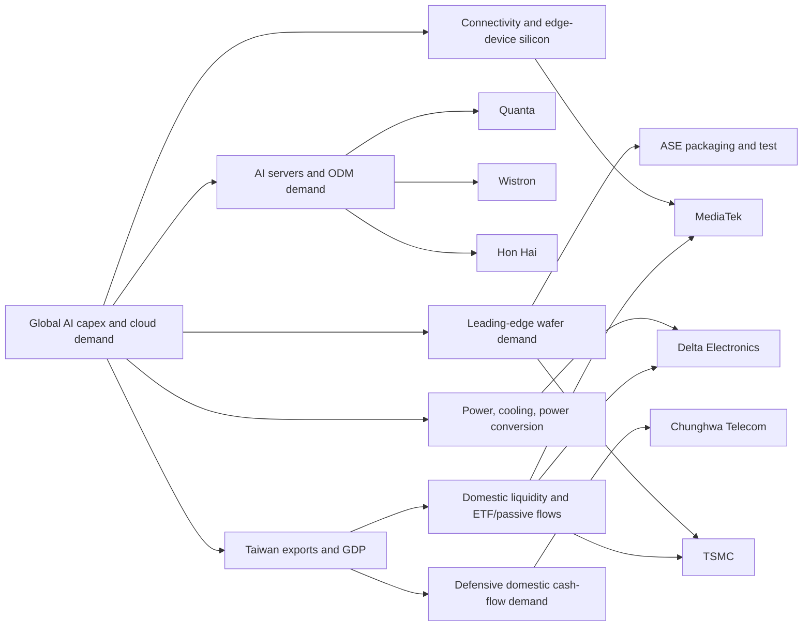

# Taiwan Investment Landscape and Core Equities

## Executive summary

Taiwan is currently one of the cleanest public-equity expressions of the global AI buildout, but it is also one of the most concentrated. The macro backdrop is unusually strong: Taiwan’s economy grew 8.68% in 2025, the central bank kept the benchmark discount rate at 2% in March 2026, the government raised its 2026 GDP forecast to 7.71% in February on AI-led export momentum, and preliminary first-quarter 2026 GDP growth then came in even hotter at 13.69% year over year. Export momentum has been equally forceful: March 2026 exports rose 61.8% year over year to a record US$80.18 billion, while March export orders jumped at the fastest pace in more than 16 years, led by electronic products and telecoms equipment. citeturn11search1turn11search9turn11search2turn11search11turn11search12

That macro strength feeds directly into Taiwan’s equity structure. At year-end 2025, TWSE-listed market capitalization reached NT$94.36 trillion across 1,063 listed companies, while semiconductors alone represented 52.22% of listed market capitalization. The top 30 companies accounted for 69.43% of total listed market cap, and TSMC alone represented roughly 42.6% of total TWSE market value by my calculation from the official Fact Book figures. Foreign investors held only 20.51% of listed shares by count at year-end 2025, but those holdings represented 47.42% of market value, underscoring how foreign capital is concentrated in Taiwan’s largest, highest-quality names. citeturn13view0turn14view0turn14view1turn17view3

That leads to a simple investment conclusion. If the objective is to own the Taiwanese names that are both critical to the island’s growth model and difficult to displace, the highest-conviction **core** bucket is **TSMC, Quanta, Hon Hai, and Chunghwa Telecom**. **Delta** is strategically important enough to deserve serious attention, but its current valuation looks stretched rather than safe. **ASE, MediaTek, and Wistron** remain important and investable, but they sit more naturally in a **watch** bucket because the reward-to-risk tradeoff is either more cyclical, more valuation-sensitive, or both. That view is an analytical inference based on the cited macro data, the exchange’s concentration statistics, current valuation lookbacks, and the company-level financial snapshots below. citeturn14view0turn14view1turn16view1turn34view0turn31view0turn31view3turn31view4turn31view5turn32view0turn31view6turn31view2

## Macro backdrop and market structure

Taiwan’s market is behaving like a leveraged claim on AI capex, cloud infrastructure, and advanced electronics exports. The central bank’s March 2026 decision to keep rates unchanged at 2% reflected strong growth and still-manageable inflation, but official minutes also flagged concern about a possible AI bubble and stock-market overheating. That is important for investors: the growth story is real, but the policy community itself is telling you that expectations may already be running ahead of fundamentals in parts of the market. citeturn11search1turn11search10

Market mechanics are deep enough for global capital, but the actual index is extremely top-heavy. In 2025, average daily TWSE trading value was NT$383.8 billion, substantially above 2023 levels and roughly in line with 2024, while the TAIEX closed 2025 at 28,963.60 after averaging 23,918.89 through the year. The FTSE TWSE Taiwan 50 index, which selects the 50 largest TWSE companies, was up 119.39% on a one-year total-return basis as of the latest cited page and had returned 247.26% over three years, which tells you that Taiwan’s practical investable beta has already repriced dramatically around AI. citeturn15view1turn15view2turn36view1

The sector concentration is not subtle. Official TWSE industry-cap data for 2025 show that semiconductors alone accounted for more than half the market, followed by finance and insurance, electronic parts and components, computer and peripheral equipment, and other electronics. In other words, Taiwan is not a generic EM or Asia ex-China market. It is a semiconductor-and-hardware market with a financial ballast. citeturn14view0

The table below uses official TWSE 2025 market-cap-by-industry data. citeturn14view0

| Sector | Share of TWSE market cap |
|---|---:|
| Semiconductor | 52.22% |
| Finance and Insurance | 9.68% |
| Electronic Parts and Components | 7.60% |
| Computer and Peripheral Equipment | 5.90% |
| Other Electronics | 5.23% |
| Communications and Internet | 3.05% |
| Shipping and Transportation | 1.81% |
| Electric Machinery | 1.46% |
| Optoelectronics | 1.33% |
| Plastic | 1.12% |
| All other sectors combined | 10.60% |

For current market leadership, the most useful snapshot is the live market-cap ranking. It differs somewhat from the official 2025 year-end TWSE ranking, but the broad picture is the same: TSMC dominates; MediaTek, Delta, Hon Hai, ASE, and Quanta form the next major technology tier; large financials and telcos remain important, but secondary, in index influence. citeturn35view0turn14view1

The table below compiles the current top-20 Taiwanese companies by market capitalization from the latest ranking page. citeturn35view0

| Rank | Company | Ticker | Current market cap |
|---|---|---|---:|
| 1 | TSMC | TSM / 2330.TW | $2.098T |
| 2 | MediaTek | 2454.TW | $196.00B |
| 3 | Delta Electronics | 2308.TW | $173.13B |
| 4 | Hon Hai | 2317.TW | $111.07B |
| 5 | ASE Group | ASX / 3711.TW | $76.37B |
| 6 | Unimicron | 3037.TW | $48.59B |
| 7 | UMC | UMC / 2303.TW | $45.71B |
| 8 | Accton | 2345.TW | $43.92B |
| 9 | Fubon Financial | 2881.TW | $41.34B |
| 10 | Yageo | 2327.TW | $41.19B |
| 11 | Quanta | 2382.TW | $38.75B |
| 12 | Cathay Financial | 2882.TW | $37.19B |
| 13 | CTBC Financial | 2891.TW | $36.06B |
| 14 | Chunghwa Telecom | CHT / 2412.TW | $33.88B |
| 15 | Wiwynn | 6669.TW | $32.66B |
| 16 | Nanya Technology | 2408.TW | $30.60B |
| 17 | Chroma ATE | 2360.TW | $30.59B |
| 18 | Yuanta Financial | 2885.TW | $23.36B |
| 19 | Global Unichip | 3443.TW | $21.91B |
| 20 | Nan Ya Plastics | 1303.TW | $21.87B |

## Sector map and return transmission

The cleanest way to think about Taiwan is to start at the top of the macro chain and work downward. AI capex, cloud buildout, and global electronics demand first hit **foundries and packaging**; then move through **servers, ODM/EMS, networking, and power/thermal**; then show up in the broader balance of exports, wages, and domestic financial flows. That transmission path is what makes Taiwan feel unusually coherent as an equity market when the cycle is working, and unusually fragile when it is not. The TWSE’s own sector valuation table also shows how different parts of the market are being priced: at year-end 2025, semiconductors traded at 26.24x P/E, computer and peripheral equipment at 19.11x, other electronics at 19.19x, finance and insurance at 14.39x, and communications and internet at 26.69x. citeturn16view1

The next two charts use current and lookback year-end P/E values from CompaniesMarketCap. They should be read as valuation **signposts**, not as official exchange series. The key message is straightforward: **Delta, ASE, and MediaTek have rerated harder than the more obvious “safe core” names like Quanta and Hon Hai**, while TSMC has rerated materially but still from a higher quality base. citeturn34view0turn31view0turn32view0turn31view6turn31view3turn31view4turn31view5turn31view2

```mermaid
xychart-beta
    title "Semiconductor valuation lookback"
    x-axis ["TSMC","MediaTek","ASE"]
    y-axis "P/E" 0 --> 60
    bar "Current" [38.3,56.3,49.9]
    bar "1Y lookback" [28.3,20.4,26.6]
    bar "3Y lookback" [19.3,19.2,18.6]
    bar "5Y lookback" [27.2,12.7,6.92]
```

```mermaid
xychart-beta
    title "Hardware and defensive valuation lookback"
    x-axis ["Hon Hai","Delta","Quanta","Wistron","CHT"]
    y-axis "P/E" 0 --> 120
    bar "Current" [17.7,117.0,17.4,18.0,27.4]
    bar "1Y lookback" [16.8,41.5,13.5,16.3,23.8]
    bar "3Y lookback" [9.59,23.5,20.2,22.8,20.9]
    bar "5Y lookback" [8.83,24.4,8.62,6.54,0]
```

One more concentration point matters for passive investors. The FTSE TWSE Taiwan 50 factsheet showed the **largest constituent at 61.15%** and the **top 10 holdings at 81.97%** as of April 30, 2026. That means any passive-flow discussion in Taiwan is, in practice, a discussion about TSMC first and the rest of the market second. citeturn12search1

## Core ticker due diligence

The table below is a compact comparison. “Lookback P/E” means the nearest visible year-end snapshot roughly 1, 3, and 5 years back in the available sources. Where the source set did not expose a figure cleanly, I mark it as unspecified rather than filling it with lower-confidence numbers. The ratings and 18–24 month return scenarios are **my analytical inferences** from the cited business trends, balance-sheet data, liquidity, and valuation lookbacks. citeturn34view0turn31view0turn32view0turn31view6turn31view3turn31view4turn31view2turn31view5turn22search1turn42search0turn24search10turn42search1turn42search21turn42search3turn41search31

| Ticker | Role in Taiwan thesis | P/E now | Lookback P/E | Avg daily volume | Balance sheet / cash-flow snapshot | Access from abroad | Final rating | Scenario return over 18–24 months |
|---|---|---:|---|---:|---|---|---|---|
| 2330.TW / TSM | Foundry and AI bottleneck | 38.3 | 28.3 / 19.3 / 27.2 | 36.7M | Net cash about NT$1.97T; FCF unspecified | Direct Taiwan line; NYSE ADR | **Core** | Base +12% to +20%; Bull +35% to +50%; Bear -20% to -30% |
| 2317.TW | EMS / AI server assembly | 17.7 | 16.8 / 9.59 / 8.83 | 84.6M | Net debt about NT$230B; levered FCF NT$37.19B | Direct Taiwan line; no ADR evident in source set | **Core** | Base +10% to +18%; Bull +30% to +40%; Bear -15% to -25% |
| 2308.TW | Power / thermal / power conversion | 117.0 | 41.5 / 23.5 / 24.4 | 11.7M | Net cash about NT$74.6B; EBITDA NT$126.23B | Direct Taiwan line | **Watch** | Base 0% to +10%; Bull +20% to +30%; Bear -25% to -35% |
| 3711.TW / ASX | Packaging, test, and electronics services | 49.9 | 26.6 / 18.6 / 6.92 | 24.6M | Net debt about NT$155B; cash/current financial assets NT$102B vs interest-bearing debt NT$257B | Direct Taiwan line; NYSE ADR ASX | **Watch** | Base +5% to +12%; Bull +25% to +35%; Bear -20% to -30% |
| 2382.TW | AI server ODM / enterprise hardware | 17.4 | 13.5 / 20.2 / 8.62 | 25.2M | Net debt about NT$223B | Direct Taiwan line | **Core** | Base +12% to +20%; Bull +35% to +45%; Bear -20% to -25% |
| 3231.TW | AI server and IT ODM | 18.0 | 16.3 / 22.8 / 6.54 | 45.2M | Cash/debt/FCF unspecified in source set | Direct Taiwan line | **Watch** | Base +8% to +15%; Bull +30% to +40%; Bear -20% to -30% |
| 2454.TW | Fabless edge/connectivity silicon | 56.3 | 20.4 / 19.2 / 12.7 | Unspecified | Net cash about NT$221.6B; EBITDA NT$118.04B | Direct Taiwan line | **Watch** | Base 0% to +10%; Bull +25% to +35%; Bear -25% to -35% |
| 2412.TW / CHT | Telecom and domestic digital infrastructure | 27.4 | 23.8 / 20.9 / unspecified | Unspecified | Net cash about NT$7.9B; 2025 EBITDA NT$88.77B; 2025 CFO NT$77.50B | Direct Taiwan line; NYSE ADR; telecom rules can be stricter | **Core** | Base +6% to +12% total return; Bull +15% to +20%; Bear -10% to -15% |

**TSMC 2330.TW / NYSE: TSM.** TSMC is the single most important listed company in Taiwan’s market and in the global AI hardware chain. Its TWSE profile confirms the pure-play foundry model, while the first-quarter 2026 company release showed revenue of US$35.9 billion, gross margin of 66.2%, operating margin of 58.1%, and net profit margin of 50.5%, followed by second-quarter guidance of US$39.0–40.2 billion and full-year commentary that was strong enough for Reuters to report a higher annual growth outlook and higher capex. Balance-sheet data in the source set show debt of about NT$1.06 trillion against cash and equivalents of about NT$3.04 trillion, implying a very large net-cash position, while current valuation is elevated at about 38.3x P/E and 19.3x EV/EBITDA versus a 2025 year-end P/E of 28.3 and a 2023 year-end P/E of 19.3. Foreign access is excellent through local shares or the ADR, but foreign holders should monitor the central-bank proposal that could limit how often foreign investors switch the currency elected for USD-denominated dividends. My rating is **Core** because the business quality is unmatched, but the upside case now depends more on sustained AI demand than on further multiple expansion. citeturn25search0turn26search0turn26search12turn38search0turn40search0turn34view0turn40search4turn22search1turn20news18

**Hon Hai 2317.TW.** Hon Hai remains the most liquid way to own Taiwan’s scale manufacturing and AI-server assembly story. The TWSE company profile describes its core business as computer systems plus connectors, cables, and precision molding, while Reuters reported AMD’s push to expand Taiwan capacity with Taiwanese partners including Hon Hai amid unexpectedly strong CPU and AI infrastructure demand. Market-data sources show very heavy trading liquidity, current P/E around 17.7–17.9x, total debt around NT$1.29–1.32 trillion, and Yahoo’s balance-sheet snippet showing net debt around NT$230 billion plus levered free cash flow of NT$37.19 billion. That combination makes Hon Hai more cyclical and lower-margin than TSMC, but also far less demanding on valuation. My rating is **Core**: it is not as structurally unassailable as TSMC, but it is too central to AI server manufacturing to ignore, and its multiple still looks closer to an industrial than to an AI glamour stock. citeturn25search1turn22news19turn31view0turn42search0turn41search0turn41search4turn41search20

**Delta Electronics 2308.TW.** Delta is one of the highest-quality names on the island because it sits at the intersection of data-center power, thermal management, industrial automation, EV power electronics, and energy infrastructure. Its official 2025 chairman’s statement reported revenue of NT$554.9 billion, gross profit margin of 34.3%, operating margin of 15.1%, and net profit margin of 10.8%, while market-data pages show EBITDA around NT$126.23 billion, cash around NT$151.17 billion, debt around NT$76.53 billion, and thus a net-cash balance sheet. The problem is valuation: current P/E is about 117x and current EV/EBITDA about 45x, far above both its 2025 year-end P/E of 41.5x and a cited 2021–2025 EV/EBITDA average around 17x. Delta is strategically excellent, but the stock now prices in a lot of future perfection. My rating is **Watch**, not because the business is weak, but because the stock no longer looks “safe” in the sense you described. citeturn24search13turn39search30turn40search2turn40search24turn32view0turn40search19turn24search10

**ASE 3711.TW / NYSE: ASX.** ASE is the most important packaging-and-test bridge between Taiwan’s foundry dominance and the finished semiconductor supply chain. Company and market-profile sources confirm the core business in semiconductor assembly, testing, and electronics manufacturing services; earnings-call snippets show year-end 2025 cash, cash equivalents, and current financial assets of about NT$102 billion versus total interest-bearing debt of about NT$257 billion; current market-data pages show roughly NT$670.9 billion of trailing revenue and about NT$47.25 billion of trailing net income. The issue, again, is valuation. ASE’s current P/E is roughly 49.9x, versus 26.6x at the end of 2025 and 18.6x at the end of 2023. My rating is **Watch**: strategically, ASE is extremely relevant, especially if advanced packaging remains the binding AI bottleneck, but the stock has already repriced a lot of that scenario. citeturn41search5turn41search25turn42search13turn31view6turn42search1

**Quanta 2382.TW.** Quanta is, in my view, the cleanest Taiwanese large-cap complement to TSMC for investors who want direct exposure to AI server volume without paying extreme multiples. Quanta’s own profile describes the business as manufacturing, processing, and selling laptop computers and telecommunication products across the United States, mainland China, the Netherlands, Germany, Japan, the United Kingdom, and other markets. Market-data sources show trailing revenue around NT$2.45 trillion, trailing net income about NT$76.68 billion, cash around NT$268.59 billion, debt around NT$492.04 billion, and average daily volume around 25 million shares. Current P/E is only about 17.4x, close to Hon Hai and far below Delta, ASE, or MediaTek, even though Quanta is one of the central AI server ODMs. My rating is **Core**. If I were building a Taiwan portfolio around “critical but not obviously overvalued” names, Quanta would rank very high. citeturn42search6turn41search30turn42search21turn41search6turn31view3

**Wistron 3231.TW.** Wistron offers a similar AI-server and IT-ODM angle to Quanta, but with somewhat more execution and margin risk and less obvious monopoly-like positioning. Yahoo’s company profile describes exposure across the United States, the United Kingdom, Germany, Japan, China, Mexico, and the Czech Republic, while Google Finance shows very strong liquidity, with average daily volume around 45.2 million shares. Valuation is not expensive on a current P/E basis at about 18.0x, but the historical pattern is more cyclical, moving from 6.54x in 2021 to 22.8x in 2023 and back to 16.3x at year-end 2025. My rating is **Watch**. I would not avoid it, but I would research order book durability, margin quality, and customer concentration much more carefully before treating it as a “too crucial to fail” core holding. citeturn42search11turn42search3turn31view4

**MediaTek 2454.TW.** MediaTek is the island’s most important fabless semiconductor champion after TSMC and sits on a different part of the value chain: connectivity, smart edge, platform silicon, and power-management. The TWSE company profile confirms the R&D, manufacturing, and sales scope across multimedia ICs, peripherals, consumer electronics, and special applications, while the first-quarter 2026 financial statement showed net sales of NT$149.15 billion and the investor-conference transcript highlighted continued Smart Edge and Power IC activity, with Power IC contributing 5% of first-quarter revenue. The balance sheet remains very strong, with cash around NT$235.29 billion against debt around NT$13.73 billion and EBITDA around NT$118.04 billion. The problem is that current P/E has rerated to around 56.3x from roughly 20.4x at end-2024 and 19.2x at end-2023. My rating is **Watch**: excellent company, but today it looks more like a priced-in winner than an easy one. citeturn25search2turn26search15turn26search11turn40search7turn24search17turn31view2

**Chunghwa Telecom 2412.TW / NYSE: CHT.** Chunghwa is the most obvious defensive core holding in Taiwan because it links domestic telecom cash flows with enterprise ICT, cloud, cybersecurity, and international connectivity. Its TWSE profile describes the company as Taiwan’s largest integrated telecom operator, and the first-quarter 2026 segment table showed external revenue of NT$36.73 billion in consumer, NT$18.81 billion in enterprise, NT$2.70 billion in international, and NT$1.75 billion in other operations. For full-year 2025, the company reported revenue of NT$236.11 billion, EBITDA of NT$88.77 billion, operating income of NT$48.55 billion, operating cash flow of NT$77.50 billion, and cash and equivalents of NT$37.09 billion; market-data sources show debt around NT$29.23 billion, leaving a modest net-cash position. The stock is not cheap versus its own history at roughly 27.4x P/E, but the business is resilient, domestic, cash generative, and much less hostage to AI-capex volatility than the hardware complex. My rating is **Core** for the defensive bucket. The one nuance is regulatory: Taiwan generally removed foreign-ownership limits in public companies, but the FSC states that sector-specific restrictions can still apply in telecommunications, so foreign investors should check their route and capacity before assuming unlimited access. citeturn25search3turn27search7turn41search31turn41search7turn31view5turn21view3

Beyond your flagged names, the most relevant additional top-20 Taiwan names for a second-pass research queue are **Wiwynn** for hyperscale server manufacturing, **Accton** for networking, **Unimicron** for ABF substrates and PCB leverage to AI packaging, **UMC** for mature-node foundry exposure, **Yageo** for passives, and **Global Unichip** for ASIC/design-service leverage to custom AI silicon. Taiwan’s financial heavyweights — **Fubon, Cathay, and CTBC** — matter for index balance and domestic liquidity, but they are not the clearest way to express the AI-led Taiwan thesis. citeturn35view0turn14view1

## Market access, ETFs, and passive flows

Taiwan is accessible to foreign investors, but not through the same channels investors use for mainland China. There is **no QFII/RQFII or Stock Connect framework** here. Instead, offshore foreign institutions and individuals use Taiwan’s own registration framework: foreign investors must register with the TWSE, obtain an investor ID, appoint a domestic agent or custodian, and then open a brokerage account for local trading. For offshore FINIs, TWSE states that inward and outward remittances are not limited; for onshore FINIs the annual inward/outward remittance cap is US$100 million, and for onshore foreign individuals it is US$10 million. Settlement is **T+2 DVP**, and since December 2023 TWSE’s foreign-investor gateway has allowed FX booking for T+2 settlement as a more flexible alternative to straightforward prefunding. citeturn19view1turn21view2turn19view2

Tax treatment is workable but should not be treated casually. TWSE’s 2025 investing guide says seller-side securities transaction tax on stocks is 0.3% of traded value, while ETFs are generally taxed at 0.1% on sale; non-resident dividend beneficiaries face **21% withholding tax**; and TWSE/FSC materials indicate that capital gains on securities are generally not taxed for individuals, while foreign enterprises without a fixed place of business in Taiwan are not required to pay income tax on securities-transaction gains under the cited rules. Taiwan also generally removed public-company foreign ownership limits in 2000, but the FSC explicitly says certain sectors — including telecommunications, shipping, and postal-related industries — can still have restrictions. For your core list, that matters mainly for **Chunghwa Telecom**, not for the broad industrial and tech names. citeturn19view1turn19view3turn19view4turn21view3turn20search1

For passive access, the most important domestic vehicle is **Yuanta/P-shares Taiwan Top 50 ETF (0050)**, which the TWSE reports had AUM of **NT$18,354.89 hundred million**, or roughly **NT$1.84 trillion**, on the cited page. The FTSE TWSE Taiwan 50 index page confirms that the benchmark selects the 50 largest TWSE names, and the FTSE-KRussell factsheet snippet showed the largest constituent at **61.15%** and the top 10 at **81.97%**. In the U.S., **iShares MSCI Taiwan ETF (EWT)** remains the standard single-country ETF route. Passive-flow sensitivity is therefore extreme: if Taiwan ETF assets keep growing — Reuters cited an industry expectation for total Taiwan fund assets to rise 36% to T$30 trillion over three years on ETF demand — the first-order beneficiary remains TSMC, followed by the rest of the hardware and semiconductor leaders. citeturn37search1turn36view1turn12search1turn37search0turn38search2

That concentration has already changed policy. In April 2026, Taiwan’s regulator raised the cap for active ETFs and local equity funds investing in a single stock from 10% to 25% for names exceeding 10% of TWSE market value, a rule change that in practice was about TSMC. The immediate market reaction was strong enough that Focus Taiwan reported TSMC’s move alone added roughly 840 points to the TAIEX on the day. This matters because it creates a structural domestic bid under the market’s dominant name, and because valuation gaps between local shares and ADRs can narrow when domestic passive and quasi-passive flows are allowed to chase the same company more directly. citeturn38search16turn12news31

## Stress tests, portfolio implications, and open questions

If U.S. rates stay higher for longer, Taiwan’s biggest risk is **multiple compression**, not immediate earnings collapse. The country can still print good export numbers, but the names most exposed to rerating risk are the ones where valuation has run far ahead of history — especially **Delta, ASE, and MediaTek**. By contrast, **Hon Hai and Quanta** are less duration-sensitive because their current P/E levels are still closer to industrial or hardware norms, while **Chunghwa Telecom** has the most defensive cash-flow profile in the group. That conclusion is an inference from the cited lookback multiples and cash-flow mix, rather than a separate official forecast. citeturn32view0turn31view6turn31view2turn31view0turn31view3turn31view5

If AI capex slows materially, the direct losers are obvious: **TSMC** through wafer demand and utilization, **ASE** through packaging and test, **Quanta/Wistron/Hon Hai** through server ODM and systems assembly, and **Delta** through data-center power and thermal demand. That macro chain is supported by Taiwan’s export data, TSMC’s guidance, AMD’s Taiwan supply-chain comments, and the fact that the market has already rerated Taiwan hardware and semiconductor names into a high-growth regime. **Chunghwa** is the natural relative shelter in that stress case. citeturn11search2turn11search11turn26search0turn26search12turn22news19turn39search30

A China demand shock hits the market in a more differentiated way. **MediaTek** is the name I would worry about most on demand mix, because its edge-device and connectivity franchise is more exposed to handset and consumer-electronics swings than Taiwan’s AI-infrastructure leaders. **Hon Hai, Quanta, and Wistron** would also feel a China demand shock through manufacturing footprint, end-market weakness, and possible working-capital stress. **TSMC** would not be immune, but its dependence on AI/HPC and leading-edge customers gives it a better chance of being cushioned by U.S. cloud demand. A genuine geopolitical escalation around Taiwan is the hardest stress case of all because it is non-linear: it would not behave like a normal earnings cycle, and it is exactly why Taiwan should trade with some persistent geopolitical discount even when fundamentals are excellent. Reuters has repeatedly flagged geopolitical and protectionist risk in reporting on Taiwan’s economic outlook, and the central bank minutes explicitly referenced bubble and geopolitical concerns. citeturn11search9turn11search11turn11search10

The practical portfolio implication is that Taiwan works best as a **barbell**. One side is the irreplaceable AI infrastructure core — **TSMC, Quanta, Hon Hai**. The other side is the defensive domestic-cash-flow stabilizer — **Chunghwa Telecom**. **Delta** deserves a place in the research core because it is strategically excellent, but I would want a better entry or more earnings delivery before upgrading it from watch to core. **ASE, Wistron, and MediaTek** are all investable, but they are better treated as cyclical or valuation-sensitive satellites than as “too crucial to fail” anchors. That is an investment judgment, not a mechanistic output, but it is the judgment most consistent with the source set reviewed here. citeturn26search12turn22news19turn42search21turn41search31turn32view0turn31view6turn31view4turn31view2

**Open questions and limitations.** I have deliberately left several fields as **unspecified** where the reviewed sources did not expose them cleanly in English snippets: current top-shareholder percentages for most of the eight core names, clean historical EV/EBITDA series for most names, and precise average-volume figures for MediaTek and Chunghwa. Where free-source data looked inconsistent across aggregators, I preferred not to force precision. The biggest follow-up items for a second-pass ticker drill-down would therefore be: current major-shareholder tables, cleaner segment/geography mix disclosures for Hon Hai and Wistron, and fully reconciled FCF / EV / EBITDA history for the non-U.S.-ADR names.