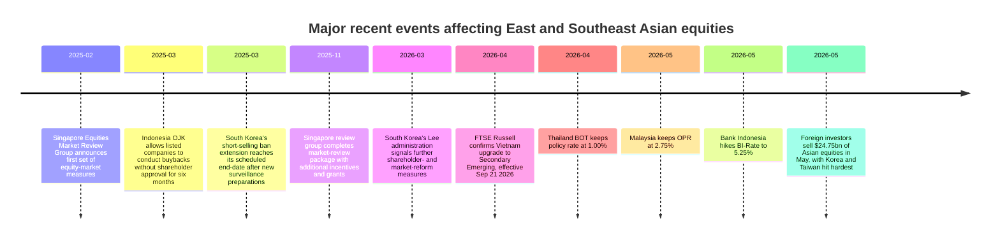

# Asian Equity Markets Across East and Southeast Asia

## Executive Summary

The clearest regional split is between **East Asia as a concentrated AI-and-export complex** and **Southeast Asia as a more value-, bank-, dividend-, and domestic-demand-driven group**. Taiwan and South Korea stand out for extraordinary recent benchmark performance, but both are also unusually concentrated in semiconductors and hardware. Japan looks more balanced by sector and has attracted large foreign inflows during the recent policy-normalization phase. In Southeast Asia, Singapore and Malaysia remain the cleanest large-cap dividend-and-financials stories, Indonesia is the cheapest but also the recent laggard, Thailand has rebounded on a narrow leadership set, the Philippines remains small and concentrated, and Vietnam is the region’s strongest structural reform story because of its confirmed FTSE Russell upgrade to secondary emerging market status effective September 2026. citeturn49view0turn49view1turn49view2turn49view3turn49view4turn49view5turn49view6turn41news30turn41news32

The biggest **cross-market risk over the last twelve months** has not been local recession risk so much as **external shock transmission**: higher U.S. yields, energy-price spikes tied to the Iran/Middle East conflict, and the knock-on effect on foreign portfolio flows. March 2026 produced the largest regional outflow from Asian equities since at least 2008, and May 2026 also saw heavy selling, with South Korea and Taiwan absorbing much of the stress. Japan was the notable exception, drawing very large foreign inflows in April. citeturn51search6turn51news35turn51search7turn51search0

On valuation, recent returns have **not** moved in lockstep with multiples. Taiwan is expensive on a forward basis and extremely concentrated; South Korea’s public proxy shows very large gains but still a low forward P/E because the rally has been skewed toward memory and export-tech leaders; Indonesia and the Philippines screen much cheaper but with weaker price momentum; Singapore and Malaysia sit in the middle with better yield support. citeturn49view0turn49view1turn49view2turn49view3turn49view4turn49view6

The policy and market-structure watchlist is also unusually important right now. South Korea’s post-ban short-selling regime and shareholder-reform agenda, Singapore’s equity-market revitalization effort, Indonesia’s buyback-rule easing, and Vietnam’s multi-year accessibility reforms tied to its index upgrade can all materially affect rerating potential independent of top-down macro. citeturn50search0turn50news38turn50search8turn50search1turn50search9turn50search6turn41news30turn41news32

## Comparative Snapshot

For cross-country comparison, the cleanest public dataset available was **recent MSCI country factsheets**, supplemented by Reuters and other market-data pages where public country factsheets were not retrievable in comparable form. That means the table below is analytically useful, but not perfectly apples-to-apples: some factsheets use **net**, some **gross**, and some **price** returns; Korea uses a public **large-cap proxy**; Japan’s performance line comes from a public MSCI factor-index factsheet that reproduces the parent MSCI Japan line; the latest Philippines sheet fetched was **March 31, 2026**; Vietnam uses local benchmark data because a comparable public MSCI PDF could not be retrieved. citeturn24search2turn49view0turn49view1turn49view2turn49view3turn49view4turn49view5turn49view6turn41search8turn41search0

The charts highlight the key style divide. East Asia’s tech-led markets dominate recent performance, especially South Korea and Taiwan, while Indonesia and the Philippines sit at the opposite end of the price-momentum spectrum. Forward P/E dispersion also matters: Taiwan is the priciest among the standardized public proxies, whereas South Korea, Indonesia, and the Philippines remain materially cheaper. citeturn24search2turn49view0turn49view1turn49view2turn49view3turn49view4turn49view5turn49view6

### Macro and policy snapshot

| Market | Growth signal | Inflation signal | Monetary stance | FX / external sensitivity |
|---|---|---|---|---|
| Japan | OECD/Reuters point to about **0.7% GDP growth in 2026**. | Inflation has remained above target; BOJ board commentary in May warned of possible overshoot from oil and war-linked cost pressures; a precise full-year 2026 inflation number was not cleanly retrieved. | BOJ short-term policy rate **0.75%**; markets are discussing further hikes. | Yen weakness and imported-energy inflation remain live policy concerns. |
| South Korea | **Unspecified** in the fetched official-English macro set. | **Unspecified** in the fetched official-English macro set. | BOK Base Rate **2.50%**. | KRW and Korean equities have been among the region’s most yield-sensitive assets; Korea absorbed the largest May 2026 foreign equity outflow in Asia. |
| Taiwan | DGBAS raised its **2026 GDP forecast to 7.71%**. | ADB’s latest retrieved update kept the **2026 inflation forecast at 1.5%**. | CBC discount rate **2.00%**. | FX trend was not cleanly normalized in the retrieved official source set; equity flows remain volatile. |
| Singapore | MTI lifted the **2026 growth forecast to 1%–3%**; MAS also noted Q1 2026 GDP fell **0.3% q/q saar** after strong prior momentum. | 2026 core and headline inflation forecasts were raised to **1.0%–2.0%**; March 2026 core inflation was **1.7% y/y**. | MAS **left FX settings unchanged** in April 2026; Singapore uses an exchange-rate regime rather than a single policy-rate target. | SGD is typically steadier than higher-beta regional FX, but earnings remain externally exposed via trade and manufacturing. |
| Malaysia | ADB said GDP should **grow moderately** in 2026–27. | ADB said inflation will likely **edge up** as domestic policy reforms feed through. | OPR **2.75%**. | FX trend not cleanly normalized in the retrieved public source set. |
| Indonesia | ADB said GDP grew **5.0% in 2025** and should **moderate slightly** ahead. | **Unspecified** in the retrieved comparable source set. | BI unexpectedly **hiked 50 bps to 5.25%** in May 2026. | Rupiah stability mattered enough to trigger a defensive hike; Indonesia held up better than peers during May regional equity outflows. |
| Thailand | ADB said GDP grew **2.4% in 2025** and the 2026 outlook is softer. | **Unspecified** in the retrieved comparable source set. | BOT policy rate **1.00%**. | High sensitivity to tourism, oil, and regional risk appetite. |
| Philippines | **Unspecified** in the retrieved comparable source set. | **Unspecified** in the retrieved comparable source set. | BSP Target RRP **4.5%**. | Smaller market, thinner depth, and vulnerable to regional foreign-flow shocks. |
| Vietnam | World Bank/Reuters expect **6.8% growth in 2026**, down from **8.0% in 2025**. | **Unspecified** in the retrieved 2026 comparable source set. | SBV benchmark/refinancing rate around **4.5%** based on SBV-sourced market-data pages. | Managed-FX framework reduces day-to-day variability, but trade and tariff risk remain material. |

Table note: growth and inflation reflect the most recent official or multilateral 2026 signal retrievable during this research pass; “unspecified” means no clean, recent, comparable figure was captured from the source set used here. citeturn53search6turn53news29turn44search1turn44search5turn52search2turn18search21turn45search4turn53search2turn53search5turn53search11turn53search14turn44search3turn42search4turn45search1turn12search2turn45search10turn45search15turn46search6turn46search0turn48search3turn48search0turn51news35

### Equity and valuation snapshot

| Market | Public comparison proxy | YTD | 1Y | 3Y ann. | 5Y ann. | Fwd P/E | P/B | Investable index size |
|---|---|---:|---:|---:|---:|---:|---:|---:|
| Japan† | MSCI Japan | 10.65% | 30.57% | 19.01% | 8.77% | 16.61x | 1.90x | Unspecified |
| South Korea* | MSCI Korea Large Cap | 63.48% | 211.31% | 40.96% | 13.34% | 6.76x | 2.66x | $1.84tn |
| Taiwan | MSCI Taiwan | 37.69% | 113.92% | 45.09% | 20.00% | 20.97x | 5.19x | $2.90tn |
| Singapore | MSCI Singapore | 2.12% | 22.05% | 21.01% | 9.56% | 15.46x | 1.99x | $352bn |
| Malaysia | MSCI Malaysia | 6.83% | 25.81% | 14.73% | 5.44% | 14.44x | 1.65x | $130bn |
| Indonesia | MSCI Indonesia | -27.85% | -25.30% | -19.19% | -8.44% | 10.09x | 1.85x | $84.7bn |
| Thailand | MSCI Thailand | 21.15% | 39.87% | 7.30% | 3.29% | 17.98x | 2.14x | $120bn |
| Philippines‡ | MSCI Philippines | -2.76% | -2.00% | -0.26% | -1.03% | 9.53x | 1.58x | $35.4bn |
| Vietnam§ | VNINDEX local benchmark | 5.19% | 41.88% | Unspecified | 47.48% total | Unspecified | Unspecified | Unspecified |

Table note: *Korea uses the latest public broad-market **large-cap** factsheet as a proxy for Korean large- and mid-cap investability. †Japan performance and valuation are taken from the parent **MSCI Japan** line reproduced in a public MSCI factor-index factsheet; Japan sector/top-holdings discussion below uses a sector-matched proxy. ‡Philippines data are from the latest public sheet retrieved, dated **March 31, 2026**. §Vietnam uses local benchmark data from public market-data pages; the 5-year number is a trailing total-change figure, not an annualized MSCI-style statistic. Comparable exchange-turnover data were not uniformly retrievable, so **investable index market cap** is used here as the cleaner cross-country scale proxy where available. citeturn24search2turn49view0turn49view1turn49view2turn49view3turn49view4turn49view5turn49view6turn30view0turn26view0turn26view1turn34view0turn34view1turn34view2turn41search8turn41search0

## East Asia

Japan’s equity case is the most balanced in the region. The publicly retrievable parent MSCI Japan line showed double-digit YTD performance and a forward P/E in the mid-teens, while a sector-matched broad-market proxy indicates a diversified structure led by **Industrials (23.2%)**, **Financials (19.4%)**, **Consumer Discretionary (15.9%)**, and **Information Technology (13.8%)** rather than a single-sector monoculture. Top names in that proxy included **Hitachi, Sumitomo Mitsui Financial, Tokyo Electron, SoftBank Group, Sony, Mizuho, Fast Retailing, Tokio Marine, Shin-Etsu Chemical, and Itochu**. This makes Japan less of a one-theme market than Korea or Taiwan. citeturn24search2turn28view1

Japan also stands out on foreign participation. Reuters reported foreigners bought a net **¥2.96 trillion** of Japanese stocks in one April 2026 week and another **¥2.38 trillion** the following week, a striking contrast with contemporaneous foreign selling elsewhere in Asia. The main macro caveat is that BOJ normalization is no longer theoretical: Reuters and OECD reporting point to a current policy rate of **0.75%**, further tightening debate, and inflation still exposed to imported-energy shocks. citeturn51search7turn51search0turn53news29turn53search6turn53search12

South Korea is the region’s most explosive but also most concentrated re-rating story. The public large-cap proxy shows **Information Technology at 70.2%**, with **Samsung Electronics** and **SK Hynix** alone accounting for roughly **63.9%** of index weight. That concentration explains both the extraordinary recent performance and the market’s sensitivity to global yields and AI-cycle sentiment. Importantly, despite the rally, the proxy’s forward P/E stayed low at **6.76x**, suggesting the market is still not broadly expensive in headline multiple terms. citeturn30view0turn49view3

Reform has mattered almost as much as earnings in Korea. The universal short-selling ban was extended through **March 30, 2025** to allow new electronic surveillance systems, global banks were later fined for short-selling breaches, and Reuters reported in March 2026 that President Lee’s administration was pushing additional stock-market reforms that helped fuel the rally. MSCI also said in mid-2025 that Korea’s short-selling accessibility had improved and no major issues remained. The flip side is that Korea has been the region’s most flow-sensitive market during de-risking episodes: Reuters/LSEG data showed the **largest May 2026 foreign equity outflows in Asia** hit Korea. citeturn50search0turn50news38turn50search8turn50search12turn51news35

Taiwan is an even more concentrated technology expression than Korea. The publicly retrievable MSCI Taiwan factsheet shows **Information Technology at 87.6%** of the index, with financials a distant second at **7.1%**. The same factsheet shows very strong recent returns and a rich **5.19x P/B**, reflecting not only earnings strength but also the market’s dependence on a narrow part of the global AI supply chain. The visible top-constituent list includes **Hon Hai, ASE Technology, Elite Material, Unimicron, Accton, Asia Vital Components, and UMC**, with the omitted top lines led by Taiwan’s flagship semiconductor complex. citeturn49view0turn26view2

Taiwan’s market, however, is not a one-way foreign-inflow story. Reuters noted that foreign investors sold a net **T$533.8 billion** of Taiwanese shares during 2025 even while the market rallied, and broader Asian flow data show Taiwan was among the hardest-hit markets during the March and May 2026 risk-off episodes. A more tactical Reuters item still showed foreigners as **net buyers in April 2026**, which underlines the point: Taiwan remains a global tactical allocation market rather than a purely domestic one. citeturn51search11turn51search6turn51news35turn51search8

## Southeast Asia

Singapore remains the region’s highest-quality financials-and-dividend market. The public MSCI Singapore factsheet shows **Financials at 58.5%** of the index, and the top three banks—**DBS, OCBC, and UOB**—together account for more than half of benchmark weight. The presence of **Sea**, **Singtel**, **Singapore Exchange**, **Sembcorp/engineering**, and property names adds some thematic breadth, but Singapore is still fundamentally a bank- and yield-led market. Its recent performance has been solid rather than spectacular, and valuation sits in the middle of the pack. citeturn26view0turn49view1

The major differentiator for Singapore is policy support for market depth rather than macro acceleration. MAS and SGX’s Equities Market Review Group announced a first package of measures in February 2025 and a broader completion package in November 2025, including incentives, grants, and continued streamlining aimed at improving listing competitiveness and domestic demand for equities. Reuters also noted that policy support helped reinforce Singapore’s market appeal to strategists in early 2025. citeturn50search1turn50search9turn50news39

Malaysia looks similar in style but with a lower-quality, more domestic profile. The MSCI Malaysia factsheet shows **Financials at 46.7%**, followed by **Utilities (13.5%)**, **Consumer Staples (9.3%)**, and **Industrials (9.0%)**. The market is heavily anchored by **Public Bank, Maybank, CIMB, Tenaga Nasional, Press Metal, Gamuda, IHH Healthcare, and Hong Leong Bank**. Returns have been respectable, forward P/E is moderate, and the dividend yield is one of the more attractive in the sample. Macro policy remains steady, with Bank Negara keeping the OPR at **2.75%** in May 2026. citeturn26view1turn49view2turn45search1turn45search5

Indonesia is the opposite of Taiwan and Korea: weak recent price performance, but cheap enough to interest value investors. The MSCI Indonesia factsheet showed the weakest recent profile in this group, but also a high dividend yield and low forward P/E. Sector leadership is classic Indonesia—**Financials at 51.0%**, then **Materials (14.2%)**, **Communication Services (9.5%)**, **Industrials (8.3%)**, and **Energy (7.6%)**—with **Bank Central Asia, Bank Rakyat Indonesia, Bank Mandiri, Telkom Indonesia, Astra International, and Amman Mineral** as the core large-cap drivers. citeturn34view0turn49view4

Indonesia is also the ASEAN market where policy has recently turned the most tactical. OJK allowed listed companies to buy back shares without shareholder approval for six months from **March 18, 2025** to damp volatility, and Bank Indonesia unexpectedly **hiked BI-Rate by 50 bps to 5.25%** in May 2026 to reinforce stability. That combination tells a clear story: valuation is attractive, but policymakers still see the need to defend market and currency conditions. Notably, Indonesia still managed to attract modest foreign inflows during some regional risk-off windows, unlike most of Asia. citeturn50search6turn45search10turn51news35turn51search6

Thailand’s public benchmark has a different internal structure than many investors expect because **Delta Electronics Thailand** alone gives the market a large **Information Technology weight of 25.2%**. Energy, communication services, financials, healthcare, and staples then fill out the rest of the book. That structure has supported a decent rebound in trailing returns, but it also means Thailand’s headline performance can overstate the breadth of the rally. The main large caps remain **Delta Electronics, AIS, PTT, Gulf Development, CP All, Airports of Thailand, PTTEP, Bangkok Dusit Medical Services, Siam Cement, and True**. citeturn34view1turn49view5

Macro policy in Thailand is easy, with the BOT holding the policy rate at **1.00%** in April 2026. More interestingly, Reuters/LSEG flow data showed Thailand among the few Asian markets still attracting modest foreign inflows in May 2026 even as broader regional selling intensified. That makes Thailand one of the better relative-defensive ASEAN markets in a high-oil/high-yield stress regime, despite its softer growth backdrop. citeturn45search15turn51news35

The Philippines remains the smallest and thinnest market in this sample. The investable MSCI proxy is only about **$35.4 billion**, and it is highly concentrated in a short list of names: **ICTSI** alone is about **33%**, followed by **BDO Unibank, SM Prime, Meralco, BPI, SM Investments, Metrobank, Ayala Corp, Ayala Land, and PLDT**. Sectorally, it is dominated by **Industrials (44.4%)**, **Financials (25.8%)**, and **Real Estate (13.3%)**. That concentration helps explain why valuation is cheap but performance has been relatively poor. citeturn34view2turn49view6

Vietnam is the most structurally important story in Southeast Asia even though the public cross-border data are less standardized. FTSE Russell confirmed in April 2026 that Vietnam would be upgraded to **secondary emerging market** status effective **September 21, 2026**. Reuters reported potential inflows of up to **$6 billion**, with roughly **$1.5 billion** in staged passive demand, while also noting that foreign investors had still sold **$1.2 billion** of Vietnamese equities in 2026 and **$5 billion** in 2025. The likely beneficiaries named in Reuters included **Vingroup, Masan Group, FPT Corp, and Hoa Phat**. citeturn41news30turn41news32turn50news36

That combination—near-term outflows, medium-term index inclusion, and still-improving market plumbing—is exactly why Vietnam is strategically important. Reuters highlighted reforms including the removal of pre-funding requirements and the push toward centralized clearing by **2027**. The local benchmark still showed strong trailing momentum on public market-data pages, and one recent HoSE session cited by VNDirect showed matched value around **VND24.9 trillion**, so liquidity is not negligible even though the market remains more operationally demanding than Singapore or Korea. citeturn41news32turn41search8turn41search0turn41search2turn39news24

## Market Access and Implementation

For portfolio construction, the most important implementation distinction is not simply “developed” versus “emerging,” but **depth, concentration, and foreign-access friction**. Japan, Taiwan, South Korea, and Singapore are already routine for international implementation, but they bring very different factor exposures: Japan is diversified; Taiwan and Korea are concentrated technology trades; Singapore is essentially a bank-and-yield market. In ASEAN, Malaysia is relatively straightforward, Indonesia and Thailand are more cyclical and flow-sensitive, while the Philippines and Vietnam require a larger liquidity haircut simply because market depth and breadth are lower. citeturn28view1turn30view0turn26view0turn26view1turn34view0turn34view1turn34view2turn41news32

For offshore investors, **country ETFs are generally the first line of access**, while ADR depth is much more uneven and tends to be meaningfully better in Japan and Taiwan than in most ASEAN markets. The practical implication is that benchmark exposure can often be obtained offshore, but country-specific alpha generation—especially in Indonesia, Thailand, the Philippines, and Vietnam—still benefits from direct local-market access, local custody setup, and explicit liquidity management. That is particularly true when foreign-flow shocks are large, because thinner ASEAN markets can gap more noticeably than Japan or Korea. citeturn51news35turn51search6turn34view0turn34view1turn34view2

Precise **trading hours, lunch breaks, settlement conventions, and short-selling availability** were not normalized in a single comparable public dataset during this research pass, so they should be checked directly with the relevant exchange, CSD, and broker before live execution. The highest-conviction operational conclusion from the evidence gathered here is narrower: **market-structure change matters most where it changes foreign replicability**. That is why South Korea’s post-ban short-selling system and Vietnam’s upgrade-linked plumbing reforms matter so much more to near-term positioning than small changes in local policy rates alone. citeturn50search0turn50news38turn50search12turn41news30turn41news32

## Timeline and Limitations

The timeline below captures the most market-relevant events and announcements from the last twelve months that most visibly changed either accessibility, policy stance, or foreign-flow behavior across the target markets. citeturn50search0turn50search1turn50search6turn50search8turn41news30turn41news32turn45search15turn45search5turn45search10turn51news35

### Open questions and limitations

A few caveats materially matter to interpretation. First, the public country return series used here are **not perfectly standardized**: MSCI factsheets mix net, gross, and price-return methodologies, Japan required a parent-index line reproduced in a public factor factsheet, Korea required a public large-cap proxy, the Philippines snapshot is March-end rather than April-end, and Vietnam relied on local benchmark pages plus Reuters and FTSE/LSEG reporting because a comparable public MSCI PDF was not retrievable. citeturn24search2turn49view3turn49view6turn41search8turn41news30

Second, **comparable turnover, trading-hours, and settlement tables were not uniformly available in the public source set fetched for this report**. Where that data was not cleanly comparable, I used investable index market cap, sector concentration, and actual foreign-flow reporting as the more rigorous cross-market proxy. Third, several macro fields are marked **unspecified** rather than guessed. That is deliberate: these markets can change quickly, and it is better to preserve analytical integrity than to overstate precision where the recent public data retrieved were incomplete. citeturn30view0turn26view0turn26view1turn34view0turn34view1turn34view2turn51news35