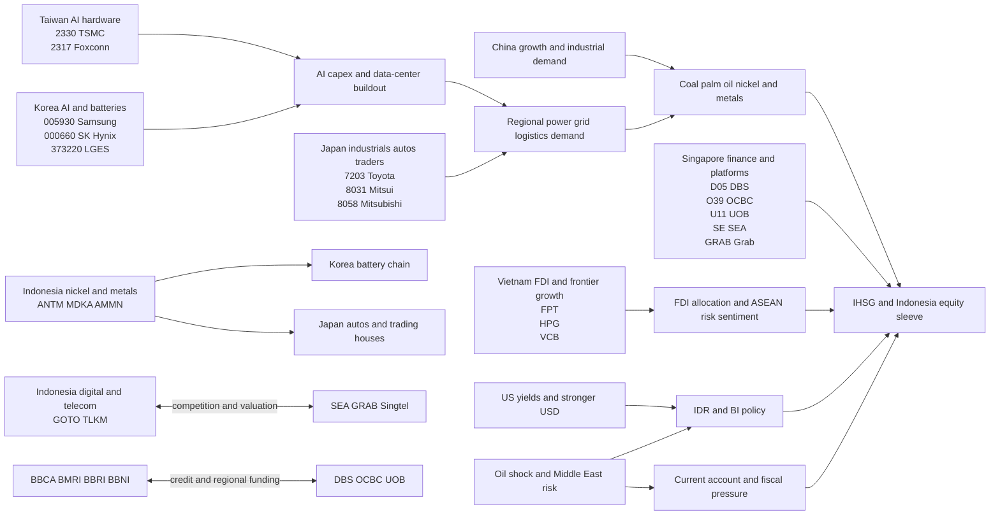

# Indonesia Equity and Currency Performance for an East Asia and ASEAN Portfolio

## Executive summary

Indonesia is the last meaningful gap in your East Asia plus ASEAN build, but it is **not** a simple “buy growth” market. The clean way to think about it is this: **Indonesia adds domestic banks, FX sensitivity, and commodity optionality** to a portfolio that already has heavy exposure to Taiwan and Korea’s AI hardware cycle, Japan’s broad developed-market industrials and finance, Singapore’s quality financials and infrastructure, and Vietnam’s frontier-growth/FDI story. It diversifies style and factor exposure, but it also imports a new set of risks: **rupiah weakness, higher oil sensitivity, policy intervention, low-free-float governance issues, and dependence on foreign risk appetite.** citeturn18news26turn17news29turn16search0turn16search2turn26search2turn31search0

The near-term macro picture is mixed rather than broken. Bank Indonesia unexpectedly **raised the 7-day reverse repo rate by 50 basis points to 5.25% on May 20, 2026**, its first hike in two years, to defend the rupiah after record lows. Inflation was still only **2.42% year-on-year in April**, so the tightening was mainly about currency stability rather than an inflation spiral. FX reserves fell to **$146.2 billion at end-April**, still covering roughly **5.8 months of imports and government external debt servicing**, but clearly down from late-2025 levels because BI has been intervening in FX markets. Indonesia’s **Q1 2026 current-account deficit widened to 1.09% of GDP**, which matters because it makes the rupiah more dependent on portfolio inflows when global rates rise. citeturn18news26turn18search0turn17news30turn18news27

The rupiah is the clearest warning signal. BI’s own JISDOR data show **USD/IDR at 17,743 on May 25, 2026**, versus **16,725 on January 5, 2026** in a Treasury-market note that cited BI’s daily fixing; Reuters reported the currency had fallen about **6% in 2026** and touched a record **17,745** before the May rate hike. BI attributed the weakness partly to dividend repatriation, foreign debt repayments, and other short-term dollar demand, while markets also worried about fiscal credibility, central-bank independence, higher oil prices, and a more interventionist state policy stance. citeturn14view0turn13search17turn13search8turn18news26turn17news29

Indonesian equities also need to be split into **headline IHSG** and **investable Indonesia**. The broader market has been hurt by concentrated ownership, “stock-frying” concerns, and index-provider scrutiny. Reuters reported that MSCI removed six Indonesian companies from its main index in May because of transparency and ownership-concentration concerns, and that IDX reforms could force roughly **$11 billion** of additional free float across about **267 listed companies**. In the liquid investable universe, though, the market is much cleaner and heavily concentrated in **banks plus Telkom and Astra**. The MSCI Indonesia Index had only **17 constituents** as of April 30, 2026; by simple arithmetic from the published weights, the **top five names were about 65%** of the index and the **top ten about 83%**. The iShares Indonesia ETF fact sheet shows a similar picture: **financials 38.7%** of the portfolio, with top holdings led by **BBCA, BBRI, BMRI, TLKM, and ASII**. citeturn16search0turn16search2turn16search14turn16news37turn26search2turn31search0

For portfolio construction, that means Indonesia should serve as a **controlled domestic-bank/commodity sleeve**, not a core allocation on the scale of Japan, Taiwan, or Singapore. My recommended allocation range is **1.5%–2.5%** of total portfolio for conservative positioning, **2.5%–4.0%** for balanced positioning, and **4.0%–6.0%** for aggressive positioning, with a **hard cap of 6%** until the rupiah stabilizes, the MSCI/FTSE market-structure overhang is fully resolved, and oil/rates stop pressuring the external account. Within that sleeve, the highest-quality route is to emphasize **BBCA, BMRI, BBRI, TLKM/TLK, and ASII**, while treating concentrated-ownership resource/conglomerate names as satellite or avoid names rather than core holdings. These recommendations are based on the macro and market structure described above; the precise weights and stop rules below are portfolio views rather than source-derived facts. citeturn18news26turn17news29turn16search0turn16search2turn26search2turn31search0

## Macro, policy, and FX backdrop

Indonesia’s immediate policy story is dominated by the rupiah. BI’s surprise **50 basis-point rate hike to 5.25%** on May 20 came even though inflation remained subdued at **2.42% in April**, which tells you the central bank’s priority was exchange-rate stabilization, not overheating. Reuters reported that BI also kept its 2026 growth forecast at **4.9%–5.7%**, implying that the central bank still sees the domestic economy as resilient enough to absorb some tightening. citeturn18news26

The problem is that Indonesia faces a cluster of external and domestic pressures at the same time. First, **higher U.S. yields** and broader global de-risking are bad for all higher-beta emerging markets. Second, the **Middle East oil shock** hurts Indonesia more than it helps, even though the country is a major exporter of coal and palm oil, because Indonesia is also an oil and LPG importer. Reuters reported that about **a quarter of Indonesia’s oil imports and 30% of LPG imports come from the Middle East**. Third, markets have become uneasy about fiscal and institutional credibility under President Prabowo’s more state-directed policy approach. citeturn17search1turn18news27turn16news37

Reserves are still ample, but the direction matters. Public reporting tied to BI data shows reserves falling from **$156.5 billion in December 2025** to **$146.2 billion in April 2026**, with BI attributing the decline to debt repayments and intervention to stabilize the rupiah. That does not imply an immediate balance-of-payments crisis; by BI-linked reporting, the reserve stock still covered about **5.8 months of imports and debt service**, well above traditional adequacy thresholds. But it does tell you the central bank is already spending real balance-sheet ammunition to prevent disorderly FX moves. citeturn18search16turn18search0turn18search23

The external account is no longer as supportive as it was during the strongest commodity-surplus period. Bank Indonesia reported a **Q1 2026 current-account deficit of $4.0 billion, or 1.09% of GDP**. In a low-oil, benign-rates environment, that size is manageable. In a world of high oil, high U.S. yields, and nervous foreign investors, it becomes much more important because it raises Indonesia’s dependence on continued capital inflows to finance the gap. citeturn17news30

Fiscal policy is the other key macro variable. The government has insisted that the **3% of GDP legal deficit cap** will remain intact, and parliament’s May 25 discussion on state-finance-law revisions was explicitly reported by Reuters as **not focused on changing the 3% deficit ceiling**. At the same time, the market has clearly worried that Prabowo’s large spending plans and the growth mandate could weaken fiscal discipline. By the end of April 2026, the state budget deficit was reported at **0.64% of GDP**, which is not alarming in isolation, but it came after an earlier acceleration in spending and against a backdrop of credit-rating outlook pressure. citeturn17news27turn17search1turn17search7turn17search9

A final macro twist is the government’s attempt to engineer more FX support through regulation. Indonesia has introduced **new export-earnings retention rules** that force natural-resource exporters to keep more proceeds at home, and Prabowo has also announced stronger state control over major commodity exports via **Danantara**. These measures may help short-term FX liquidity if exporters retain dollars locally, but they also increase policy and governance risk. S&P was reported warning that centralized export controls could hurt exports, revenues, and the balance of payments if implementation is clumsy. citeturn16news31turn18search22turn17news29turn17search25

The chart below shows the direction of travel in the rupiah using selected 2026 reference observations. It is not a full daily history, but it captures the important point: the currency weakness materially accelerated into May. citeturn13search17turn13search8turn14view0turn18news26

A compact macro dashboard is below.

| Indicator | Recent reading | Why it matters |
|---|---:|---|
| BI 7-day reverse repo rate | **5.25%** | BI is prioritizing FX defense over easier domestic conditions |
| Inflation | **2.42% YoY** in April 2026 | Inflation is contained; the main stress is FX, not prices |
| FX reserves | **$146.2bn** at end-April 2026 | Still adequate, but falling because of intervention and debt service |
| Current account | **-1.09% of GDP** in Q1 2026 | Makes IDR more sensitive to rising U.S. yields and oil |
| Budget deficit | **0.64% of GDP** as of April 30, 2026 | So far below the legal cap, but fiscal credibility remains central |
| 2026 growth view | **4.9%–5.7%** BI forecast | Growth is still around the 5% zone, but external stress is rising |
| USD/IDR | **17,743** on May 25, 2026 | Currency remains the key macro warning light |

The figures above come from Bank Indonesia, Reuters reporting on BI and the finance ministry, and BI-linked reserves data. citeturn18news26turn18search0turn17news30turn17news27turn17search7turn14view0

## Equity market structure, liquidity, and capital flows

The first thing to understand about Indonesia equities is that **headline market performance and investable portfolio performance can differ a lot** because of ownership concentration and free-float distortions. Reuters reported in January and February that investors were spooked by “stock-frying” issues, concentrated ownership, and the possibility that Indonesia could even be downgraded by MSCI from emerging to frontier if market-structure problems were not fixed. That concern was not hypothetical: in May, Reuters reported that MSCI removed six Indonesian companies from its main index because of transparency concerns and ownership concentration. FTSE Russell later echoed that direction. citeturn16news37turn16search2turn16search14turn16search0

That is why the best representation of what foreigners can actually own and trade is not the full IHSG membership list but the **investable large- and mid-cap core**. As of April 30, 2026, the **MSCI Indonesia Index** had only **17 constituents**, a **6.14% dividend yield**, **12.86x P/E**, **10.09x forward P/E**, and **1.85x P/BV**. Its top holdings were **Bank Central Asia 22.14%, BBRI 13.91%, Bank Mandiri 11.18%, Telkom Indonesia 9.50%, Astra International 8.25%, Amman Mineral 5.05%, BBNI 3.79%, GoTo 3.29%, Chandra Asri 3.13%, and Bumi Resources Minerals 3.12%**. By simple addition, the top five names were about **65%** of the index and the top ten about **83%**. citeturn26search2

The investable ETF complex tells a similar story, but with a larger number of names. The **iShares MSCI Indonesia ETF** fact sheet as of March 31, 2026 showed **82 holdings**, with top holdings again led by **BBCA, BBRI, BMRI, TLKM, and ASII**, and sector weights of **Financials 38.73%, Materials 15.71%, Energy 12.00%, Communication 9.50%, Consumer Staples 7.49%, and Industrials 6.07%**. The implication is important: for global investors, Indonesia is **not primarily an oil-and-miners market**. It is first a **banks market**, second a **materials/energy market**, and only then a broader domestic-consumption and infrastructure market. citeturn31search0

The sector picture below is therefore shown using the investable ETF proxy rather than a full IHSG all-share sector ledger. That is deliberate. For portfolio construction, this is closer to the Indonesia exposure you will actually end up buying. citeturn31search0turn26search2

The equity drawdown in 2026 has been severe. Reuters reported that Indonesia’s benchmark stock index had fallen sharply after the MSCI warning and that roughly **$120 billion** of market value was wiped out in the broader selloff. Meanwhile, Yahoo Finance’s late-May benchmark page for the IHSG showed the local index was down materially over both YTD and 1-year horizons. The point is not the exact vendor-by-vendor figure; the point is that Indonesia has badly lagged the region because of the combination of FX stress, oil risk, political concerns, and market-structure scrutiny. citeturn16search27turn23search0

Foreign flows explain part of the story. Reuters and BI-linked reporting indicate that **equities and government bonds both suffered outflows in Q1 2026**, while **SRBI**, Bank Indonesia’s rupiah securities, attracted foreign demand. One BI-governor update reported **foreign equity outflows of Rp26.06 trillion** and **government bond outflows of Rp25.10 trillion** in the January–March period, while another update said Indonesia had accumulated **$3.3 billion in portfolio inflows in January–April**, mainly because foreigners preferred SRBI over stocks and bonds. In other words, global money did **not** leave Indonesia altogether; it moved **up the capital structure and into central-bank paper**, which is a classic sign of caution rather than confidence. citeturn16search4turn16search25

The screenshot-style regional bar chart below is directional rather than perfectly apples-to-apples, because it uses commonly cited late-May benchmark pages from different providers. Even so, it makes the big point clearly: **Indonesia has been a major underperformer versus Korea, Taiwan, Japan, Singapore, and Vietnam.** citeturn23search0turn23search1turn23search28turn23search3turn22search20turn32search22

A practical way to think about liquidity and foreign ownership is shown below.

| Bucket | Names | Liquidity / foreignability read | Portfolio implication |
|---|---|---|---|
| Liquid institutional core | **BBCA, BBRI, BMRI, TLKM, ASII, BBNI** | Highest-quality, most natural foreign entry points; dominate investable Indonesia | Best core route for portfolio allocation |
| Cyclical commodity / materials satellites | **ANTM, MDKA, BRMS, BUMI** | Useful for metals/commodity exposure, but more cyclical and more policy-sensitive | Keep smaller; use as satellites rather than anchors |
| Governance / concentration risk names | **AMMN, DSSA, TPIA, BREN** | Ownership concentration and free-float scrutiny were central to MSCI/FTSE actions | Avoid as core holdings; position only if you are explicitly paid for governance risk |
| Digital / speculative ASEAN beta | **GOTO** | Higher valuation sensitivity, more flow-driven, more correlated with SEA/Grab sentiment | Small only; not a core Indonesia allocator |

The qualitative buckets above are a portfolio synthesis based on MSCI/EIDO holdings and Reuters reporting on governance and free-float concerns. citeturn26search2turn31search0turn16search0turn16search2

## Commodity, political, and external shock channels

Indonesia’s commodity mix is one of the main reasons to own the market, but it is also one of the main reasons to size the position carefully. The country is a **major global exporter of thermal coal and palm oil** and is home to the **world’s largest nickel reserves**. Those exposures can support exports, the fiscal base, and the rupiah when commodity prices are supportive. They also create concentration risk, because state policy can change quickly and because global pricing is heavily influenced by China, energy shocks, and the battery cycle. citeturn17news31turn18news28turn18news29

Coal, palm oil, and nickel are not equal from a portfolio perspective. **Coal** is important for export earnings and cash generation; **palm oil** matters for trade and rural cash flows; **nickel** is the most strategic because it links Indonesia directly into regional EV and battery supply chains. That is why Indonesian metals names are relevant to Korea and Japan in a way that most other ASEAN equities are not. But nickel is also the area where policy nationalism has been strongest, and where pricing can be hit by sudden changes in Chinese demand or Indonesian export rules. citeturn17news31turn18news28turn18news29

Oil is the opposite. Higher oil prices are broadly negative for Indonesia because they pressure the current account, the budget, and domestic fuel policy. Reuters explicitly tied the market’s worries in 2026 to the Middle East conflict and higher crude prices, and also noted Indonesia’s import dependence on Middle Eastern oil and LPG. Put simply: **Indonesia benefits from coal, palm, and nickel strength, but it still gets hurt by oil spikes.** That asymmetry is crucial for risk management. citeturn17search1turn18news27turn16news37

Politics and regulation are now part of the equity story in a much bigger way than they were a few years ago. Prabowo’s government is pushing a growth agenda with more direct state involvement, highlighted by the creation of **Danantara**, the export-earnings retention rules, and the announced state control over key commodity exports. These policies may be framed domestically as anti-leakage and pro-sovereignty, but from a portfolio perspective they raise questions about **legal predictability, private-sector margins, and the eventual treatment of minority investors**. Reuters also reported market concerns about **central-bank independence**, while ratings agencies shifted their outlook more negatively. citeturn17news29turn17news27turn18search22turn16news37

The biggest external shock channels for Indonesia are therefore straightforward:

| External shock | Indonesia transmission channel | Most affected local buckets |
|---|---|---|
| Higher U.S. yields / stronger dollar | FX pressure, foreign outflows, higher domestic rates | Banks, rupiah-sensitive domestic stocks, broad IHSG |
| Middle East oil shock | Worse current account and subsidies/import bill | IDR, transport, consumer, fiscal sentiment |
| China slowdown | Weaker demand for coal, metals, and industrial commodities | ANTM/MDKA/BUMI/UNTR-type exposures, trade-sensitive cyclicals |
| Global risk-off / EM de-rating | Equity outflows, more defensive foreign positioning in SRBI over equities | Entire equity sleeve, especially lower-liquidity names |
| Market-structure downgrade risk | Index-provider exclusions, forced passive selling, weaker sentiment | Concentrated-ownership names and the whole exchange multiple |

The macro logic in this table is derived from the official current-account, rate, reserve, and policy data as well as Reuters reporting on foreign flows, oil sensitivity, and market-structure concerns. citeturn17news30turn18news26turn18search0turn16search4turn16search25turn17search1turn16search0turn16search14

## Cross-market linkages to Taiwan, Korea, Japan, Singapore, and Vietnam

Indonesia’s value in your portfolio is not that it overlaps with Taiwan and Korea; it is that it adds **different factor exposures** while still connecting to the same regional ecosystem. Taiwan and Korea are still your main AI hardware sleeves. Indonesia is a **domestic bank plus commodity and FX sleeve**. The overlap is mostly through **global risk appetite, China demand, energy and materials inputs, and regional financing conditions**, not through direct foundry or memory leadership. This section is therefore best read as a **supply-chain-and-correlation map**, not a claim that Indonesia belongs in the same thematic bucket as Taiwan and Korea. citeturn25search1turn24search1turn26search2turn31search0

The most direct hard supply-chain linkage is to **Korean and Japanese battery and industrial ecosystems**. Indonesian nickel and related metals matter to EVs, batteries, and stainless steel. That creates a clear linkage from **ANTM/MDKA/AMMN-style Indonesian resource exposure** into **Korea’s LG Energy Solution and POSCO-type value chain** and into **Japan’s automakers and trading houses**. A second direct linkage is financing and trade intermediation through **Singapore**, where banks, logistics, commodity finance, and listed digital platforms all cross paths with Indonesia. Reuters’s and MSCI’s Singapore materials show an equity market dominated by DBS, OCBC, UOB, Sea, Singtel, SGX, and Keppel—exactly the kinds of names that finance, intermediate, or compete with Indonesian banks, telecoms, logistics, and digital platforms. citeturn17news31turn18news28turn18news29turn26search0turn26search2

Vietnam is different again. The Indonesia–Vietnam relationship is less about direct supply chain and more about **FDI competition, China-plus-one allocation, and frontier-growth correlation**. When investors like Southeast Asia manufacturing, both can work, but Vietnam is the purer manufacturing-relocation and export-platform story while Indonesia is the larger domestic-demand and resource-sovereignty story. That means they can coexist in a portfolio, but you should not expect them to respond identically to the same shock. citeturn26search1turn26search2

The map below summarizes the channels that matter most for your existing country sleeves.

The most practical way to translate the map is the following:

| Existing sleeve | Main linkage to Indonesia | Best Indonesia tickers / buckets |
|---|---|---|
| Taiwan | Mostly macro correlation through global tech sentiment and regional power/infrastructure demand rather than direct corporate supply chain | TLKM, ASII, selected commodity satellites |
| Korea | Direct nickel/battery linkage plus broad risk appetite | ANTM, MDKA, selected materials; secondarily banks if EM beta recovers |
| Japan | Direct links through autos, trading houses, LNG/coal/metals, and financing | ASII, TLKM, BBCA/BMRI, ANTM/UNTR |
| Singapore | Strongest cross-border financing, digital, logistics, and telecom link | BBCA/BMRI/BBRI, TLKM, GOTO, broad Indonesia ETF |
| Vietnam | FDI allocation rivalry and shared ASEAN/EM sentiment, but different domestic structures | Use both at moderate size rather than treating them as substitutes |

This table is a portfolio synthesis built on the Indonesia, Singapore, Vietnam, and broader macro materials above. citeturn26search0turn26search1turn26search2turn31search0turn17news31turn18news28

## Portfolio construction implications

Indonesia should play a **supporting but meaningful** role in your regional portfolio. It is not as structurally dominant as Taiwan in AI hardware, not as reform-sensitive as Korea, not as institutionally stable as Japan or Singapore, and not as pure a frontier-growth/FDI bet as Vietnam. Its value is that it adds **domestic financials, yield, resources, and ASEAN market depth**, but it comes with much more FX and policy risk than Singapore or Japan. That makes it useful, but only in measured size. The market structure also argues against an oversized country bet until the low-free-float and index-provider issues are fully behind it. citeturn26search2turn31search0turn16search0turn16search14turn16news37

### Scenario analysis

| Scenario | Probability style read | What happens | Triggers to watch |
|---|---|---|---|
| Bull | Lower probability, high upside | IDR stabilizes, BI’s hike works, oil moderates, MSCI/FTSE concerns clear, foreign money returns from SRBI into equities, banks and Telkom rerate | USD/IDR back below 17,000; reserves stabilize; no market downgrade; foreign net equity buying resumes |
| Base | Most likely | Currency remains fragile but orderly, BI stays tight, equities recover selectively through liquid banks/TLKM/ASII, commodity names remain stock-pickers’ market | USD/IDR trades wide but below 18,000; deficit stays below 3%; current account remains manageable; reforms continue |
| Bear | High-impact downside | Oil stays high, U.S. yields rise further, IDR breaks to new lows, foreign outflows accelerate, more passive/index exclusions or policy shocks hit valuations | USD/IDR above 18,000; reserves keep falling sharply; current account deteriorates; ratings/market-structure downgrades escalate |

The macro triggers in the scenario table are derived from BI’s rate move, reserve trends, current-account data, the fiscal-cap debate, and Reuters reporting on index-provider scrutiny and oil-linked shocks. citeturn18news26turn18search0turn17news30turn17news27turn16search0turn17search1

### Suggested portfolio role and allocation ranges

| Risk posture | Suggested Indonesia allocation | Hard cap | How to implement |
|---|---:|---:|---|
| Conservative | **1.5%–2.5%** | **3.5%** | Mainly BBCA/BMRI/TLKM or a small ETF sleeve |
| Balanced | **2.5%–4.0%** | **5.0%** | Core banks + TLKM + ASII, with a modest commodity satellite |
| Aggressive | **4.0%–6.0%** | **6.0%** | Core liquid names plus selected ANTM/CPIN/BBNI satellites |
| Anything above this | Not recommended for now | **6.0%** | The rupiah and policy regime do not justify a larger country weight yet |

My reason for capping the sleeve at 6% is simple: Indonesia still has too much **combined FX, oil, and policy risk** to justify a larger exposure in a portfolio that already owns multiple high-conviction Asia stories. That is an investment judgment based on the facts above rather than a source-derived number. citeturn18news26turn17search1turn16search0turn16news37

### Buy list and watch list

| Ticker | Company | Sector | Portfolio role | Suggested max weight |
|---|---|---|---|---:|
| **BBCA.JK** | Bank Central Asia | Financials | Highest-quality Indonesia core; private-bank quality and liquidity anchor | **1.2%** |
| **BMRI.JK** | Bank Mandiri | Financials | SOE bank with strong dividend/value-upside in a stabilized macro | **1.0%** |
| **BBRI.JK** | Bank Rakyat Indonesia | Financials | Domestic micro and retail-income proxy; higher cyclical beta than BBCA | **0.9%** |
| **TLKM.JK / TLK** | Telkom Indonesia | Communication | Defensive yield, domestic data demand, and cleaner USD-access route through ADR | **0.8%** |
| **ASII.JK** | Astra International | Industrials / Consumer | Autos, distribution, and commodity-services blend; good domestic-growth diversifier | **0.7%** |
| **BBNI.JK** | Bank Negara Indonesia | Financials | Secondary bank exposure if you want more value than BBCA/BMRI | **0.5%** |
| **CPIN.JK** | Charoen Pokphand Indonesia | Consumer staples | Better defensive-consumption balance inside Indonesia | **0.5%** |
| **ANTM.JK** | Aneka Tambang | Materials | Nickel and gold optionality; cleaner way to express battery/metal theme than low-float outliers | **0.4%** |
| **GOTO.JK** | GoTo Gojek Tokopedia | Tech / platform | Watch-list only unless digital beta is specifically desired | **0.25%** |
| **AMMN.JK / DSSA.JK / BREN.JK / TPIA.JK** | Various | Materials / Energy / Petrochem | Watch-list or avoid as core because of concentration/governance and index-provider scrutiny | **0%–0.25% each** |

The core names above are anchored in the published holdings of MSCI Indonesia and EIDO, while the caution on concentrated-ownership names follows Reuters reporting on MSCI/FTSE actions. citeturn26search2turn31search0turn16search0turn16search2

### Thesis-break conditions and stop rules

The thesis is no longer valid for an overweight Indonesia position if the following happen together: **USD/IDR remains above 18,000 for multiple weeks, reserves keep falling toward roughly $135 billion or below, the current account deteriorates materially beyond the recent Q1 pace, or the market suffers a formal downgrade/expanded exclusions from major index providers.** Those are the country-level conditions that would tell you the problem is structural rather than cyclical. citeturn14view0turn18search0turn17news30turn16search14

For implementation, I would use **two layers of discipline**. At the **country sleeve** level, I would review the position aggressively if IHSG breaks materially lower while USD/IDR is also making new highs; if both the index and the currency are failing together, cut exposure by **25%–50%** rather than waiting. At the **single-name** level, I would use tighter rules for core liquid names and wider rules for commodity satellites: roughly **12%–15% trailing stops** for **BBCA/BMRI/BBRI/TLKM/ASII**, and **18%–20%** for metals and other higher-beta names like **ANTM**. These are portfolio rules, not market conventions. 

### Hedges and implementation routes

Indonesia can be hedged three ways: **FX, equity beta, and commodity shock**.

For **FX**, the cleanest institutional hedge is an **offshore USD/IDR forward or NDF overlay** against any local-equity position. If you do not have access to FX overlays, the practical retail substitute is to own Indonesia through **USD-listed or USD-denominated vehicles** rather than fully unhedged local positions. The usable routes identified in public sources are **EIDO** in the U.S., **IDX** from VanEck in the U.S., and European UCITS products such as **HSBC MSCI Indonesia UCITS ETF (HIDR)**, **Amundi MSCI Indonesia UCITS ETF (INDO)**, and **Xtrackers MSCI Indonesia Swap UCITS ETF (XMID)**. citeturn21search20turn21search2turn21search17turn26search2

For **single-stock implementation**, the biggest exception to Indonesia’s thin ADR coverage is **Telkom Indonesia’s NYSE ADR, TLK**, which gives you a liquid USD-listed route to one of the country’s most investable large caps. Everything else is usually cleaner through a broker with direct **IDX** access or through ETFs. citeturn21search0turn21search21turn21search14

For **equity beta hedging**, the practical route is to **reduce the Indonesia sleeve or use country ETFs tactically** rather than relying on very specific local derivatives unless you already have institutional access. Given the market-structure issues, smaller position sizing is itself a valid hedge. For **commodity shock hedging**, the macro logic is straightforward even if implementation varies by broker: **oil hedges** protect the rupiah/current-account risk, while **nickel, coal, or palm hedges** are useful only if you are explicitly long the relevant Indonesian commodity names. The reason this matters is source-backed: oil is the commodity that tends to hurt Indonesia most, while coal/palm/nickel are the ones that can help. citeturn17search1turn17news31turn18news28

### Monitoring checklist

The Indonesia sleeve should be monitored more like a macro position than like a pure bottom-up stock basket. The most important weekly and monthly checkpoints are the following:

| What to track | Why it matters | Frequency |
|---|---|---|
| **USD/IDR and BI JISDOR** | Fastest real-time stress signal | Daily |
| **BI reserves** | Shows how much FX defense is being used | Monthly |
| **BI rate and policy language** | Tells you whether FX defense is escalating | Every BI meeting |
| **Foreign equity, bond, and SRBI flows** | Shows whether foreigners are de-risking or rotating back into risk | Weekly / monthly |
| **Current account and trade balance** | Core sustainability check for the rupiah | Quarterly / monthly |
| **Oil, coal, palm oil, and nickel prices** | Indonesia’s macro asymmetry runs through these prices | Daily / weekly |
| **MSCI / FTSE announcements** | Market-structure and passive-flow risk remains material | Event-driven |
| **Budget updates and deficit path** | Fiscal credibility is central to both FX and equities | Monthly |
| **Export-retention / Danantara implementation** | Key regulatory risk that can affect FX and corporate margins | Event-driven |

This monitoring list directly reflects the channels identified above in BI, Reuters, and market-structure reporting. citeturn14view0turn18search0turn18news26turn16search25turn16search4turn17news30turn17search1turn16search14turn17news27turn18search22

## Open questions and limitations

Two data limitations matter. First, fully current **IHSG all-share sector weights** and **company-by-company foreign ownership percentages** were not consistently available in open, machine-readable primary sources, so this report uses **MSCI Indonesia** and **EIDO** as the investable proxy for concentration and sector structure, and Reuters/IDX reform reporting for governance and free-float issues. Second, the regional comparison chart uses a mix of benchmark pages and index proxies from late May 2026, so it should be read as a **directional cross-market comparison**, not as a single-provider total-return study. Those limitations do not change the core conclusion: **Indonesia is investable, but only as a controlled bank-plus-FX-plus-commodity sleeve, not as a new core anchor for the portfolio.** citeturn26search2turn31search0turn16search0turn16search2turn23search0turn23search1turn23search28turn23search3turn22search20turn32search22