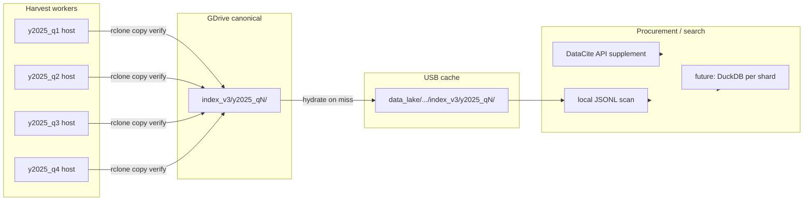
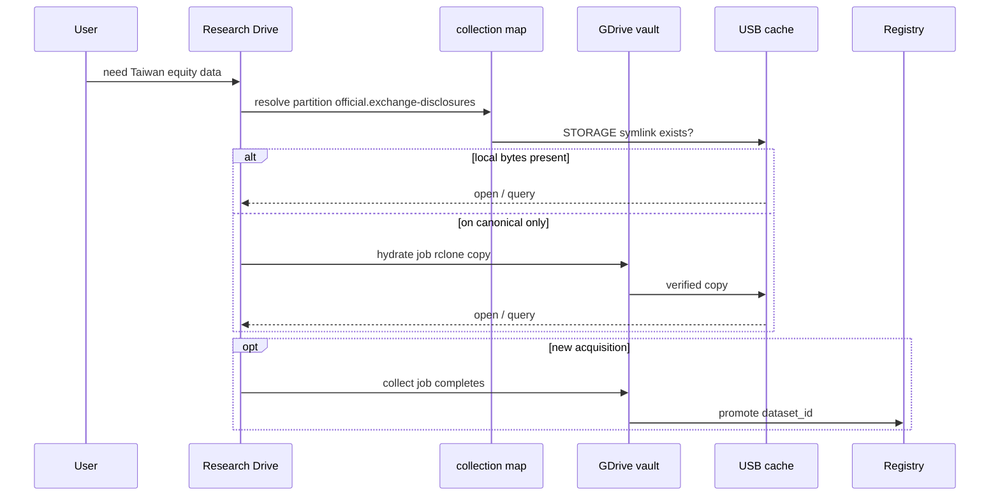

# Collection architecture

**Canonical map** for research data at scale: GDrive vault → partitioned collection tree → local hot/cache → registry → procurement.

Related: [`STORAGE_ARCHITECTURE.md`](STORAGE_ARCHITECTURE.md) (tiers), [`PROCUREMENT_PIPELINE.md`](PROCUREMENT_PIPELINE.md) (desk flows).

Config:
- `config/collection_partitions.json` — partition IDs, legacy/target paths
- `config/collection_scale.json` — DataCite shard rules, hydration, promotion
- `data_lake/collection/` — local navigation tree (`meta.json` per partition)

Regenerate tree:

```bash
python scripts/data_catalog/build_collection_directory.py --link-storage
python scripts/data_catalog/inventory_canonical_collection.py --quick --pretty
```

---

## 1. Three planes (do not confuse)

```text
┌─────────────────────────────────────────────────────────────────────────┐
│  CANONICAL VAULT (GDrive)                                               │
│  gdrive:Machine_Archive/.../Sharpe-Renaissance-data                     │
│  Source of truth. Job "done" = rclone copy + check.                     │
└───────────────────────────────┬─────────────────────────────────────────┘
                                │ hydrate (copy, never sync)
                                ▼
┌─────────────────────────────────────────────────────────────────────────┐
│  COLLECTION MAP (this repo)                                             │
│  data_lake/collection/{domain}/{partition}/                           │
│  meta.json + STORAGE symlinks — navigation, not a second copy           │
└───────────────────────────────┬─────────────────────────────────────────┘
                                │ symlink / du
                                ▼
┌─────────────────────────────────────────────────────────────────────────┐
│  PHYSICAL BYTES                                                         │
│  USB cache (bulk) + NVMe hot (desk) — legacy paths until migration      │
└───────────────────────────────┬─────────────────────────────────────────┘
                                │ promote
                                ▼
┌─────────────────────────────────────────────────────────────────────────┐
│  REGISTRY + PROCUREMENT                                                 │
│  config/research_query_registry.json + Research Drive chat              │
└─────────────────────────────────────────────────────────────────────────┘
```

---

## 2. Target GDrive layout (post-migration)

Legacy names stay on Drive until verified copy. **Target** tree:

```text
Sharpe-Renaissance-data/
└── collection/
    ├── markets/
    │   ├── equities-asia/
    │   ├── crypto-landscape/
    │   ├── crypto-coingecko/
    │   └── nft-opensea/
    ├── news/
    │   └── gdelt-asia/
    │       ├── raw/
    │       ├── normalized/
    │       ├── processed/
    │       └── derived/
    ├── official/
    │   ├── exchange-disclosures/
    │   └── macro-asia/
    ├── reference/
    │   ├── entity-mapping-asia/
    │   ├── sec-edgar/
    │   └── refinitiv-backfill/
    ├── social/
    │   └── reddit/
    ├── catalog/
    │   ├── datacite/
    │   │   └── harvest/
    │   │       └── index_v3/
    │   │           ├── y2025_q1/
    │   │           ├── y2025_q2/
    │   │           └── …
    │   └── curated/
    │       ├── curated/
    │       ├── full_index/
    │       └── watchdog/
    ├── acquired/
    │   └── procured/
    ├── derived/
    │   ├── research-panels/
    │   └── research-models/
    └── ops/
        └── pipeline-manifests/
```

**Legacy → target** (today’s Drive root folders):

| Legacy (on Drive now) | Target partition |
|----------------------|------------------|
| `news_shock_taxonomy` | `collection/news/gdelt-asia` |
| `dataset_catalog/datacite/index_v3` | `collection/catalog/datacite/harvest/index_v3` |
| `dataset_catalog/*` (curated) | `collection/catalog/curated` |
| `market_data` | `collection/markets/equities-asia` |
| `crypto_landscape` | `collection/markets/crypto-landscape` |
| `official_disclosures` | `collection/official/exchange-disclosures` |
| `official_macro_asia` | `collection/official/macro-asia` |
| `social_reddit` | `collection/social/reddit` |
| `research_panels` | `collection/derived/research-panels` |
| `research_models` | `collection/derived/research-models` |
| `manifests` | `collection/ops/pipeline-manifests` |

---

## 3. Domain reference

| Domain | What belongs here | Tier | Scale note |
|--------|-------------------|------|------------|
| **markets** | Prices, universes, crypto/NFT structure | cache | Per-asset-class subfolders |
| **news** | GDELT GKG, headlines, enrichment | cache | Monthly normalized shards; 100+ GiB |
| **official** | TWSE, macro baselines, filings | hot | Small, query-ready |
| **reference** | SEC tickers, entity maps, Refinitiv | hot/cache | Static or slow-growing |
| **social** | Reddit, future alt-text | hot | Moderate |
| **catalog** | DataCite harvest + curated indexes | cache | **Shard by time** (see §4) |
| **acquired** | DOI/chat/campaign downloads | hot | One folder per acquisition |
| **derived** | Panels, model artifacts | hot / canonical | Built from upstream |
| **ops** | Manifests, queue status | ops | Not research datasets |

Partition IDs: `{domain}.{slug}` — e.g. `news.gdelt-asia`, `catalog.datacite-harvest`.

---

## 4. DataCite at scale

DataCite is not one folder; it is a **sharded harvest lane**.



**Shard manifest:** `scripts/data_catalog/datacite_y2025_parallel_shards.list`  
**Local shard slots:** `data_lake/collection/catalog/datacite/harvest/shards/{shard}/meta.json`  
**Partition:** `catalog.datacite-harvest` → bytes at `data_lake/dataset_catalog/index_v3/{shard}/`

**Scaling rules** (`config/collection_scale.json`):

| Axis | Rule |
|------|------|
| Time | New shard per quarter: `y{YYYY}_q{N}` |
| Host | One windows_lab worker per active shard |
| Records | `target_records` in manifest; rebalancer splits overloaded shards |
| Completion | Checkpoint JSON in shard + `rclone check` vs canonical |
| Search | Layer 1: scan local JSONL; Layer 2: live API; Layer 3: FTS index on cache |

**Curated catalog** (`catalog.curated-index`) is separate from raw harvest: promotion tiers, watchdog, quarantine — do not mix with `index_v3` JSONL bulk.

---

## 5. GDELT / news at scale

Partition: `news.gdelt-asia` (replaces `news_shock_taxonomy`).

```text
news/gdelt-asia/
├── raw/              # incoming GKG pulls
├── normalized/       # monthly shards (gdelt_gkg_asia_bulk)
├── processed/        # scored, enrichment queues
├── derived/          # daily country panels, crypto overlay
└── config/           # lane configs (copied to Drive manifests/)
```

**~156 GiB** on canonical; USB typically holds a **partial cache**. Procurement should **hydrate** missing months from Drive, not re-fetch from GDELT unless explicitly requested.

---

## 6. End-to-end data lifecycle



**Procurement decision order (target behavior):**

1. Registry hit with local bytes → **query now**
2. Partition on canonical, cache miss → **hydrate**
3. Index miss → DataCite shard scan + API + acquisition pipeline
4. Explicit **refresh** → queue/collect job

---

## 7. Local directory (built on this machine)

```bash
data_lake/collection/
├── INDEX.json              # machine catalog
├── README.md
├── _index/
│   ├── partitions.json
│   ├── scale.json
│   └── manifest_latest.json
├── markets/ …
├── news/gdelt-asia/        # meta.json + STORAGE → legacy path
├── catalog/
│   ├── datacite/harvest/
│   │   └── shards/y2025_q1/meta.json
│   └── curated/
└── …
```

`STORAGE` symlinks point at **where bytes live today**; `meta.json` documents legacy and **target** Drive paths.

---

## 8. Migration checklist (when ready)

1. `rclone copy` legacy → `collection/...` (per partition, no `sync`)
2. `rclone check` one-way
3. Update `legacy_drive_path` → target in `collection_partitions.json` or add alias
4. Point new collectors at `target_drive_path` only
5. Compact legacy folder on Drive after cool-off

---

## 9. Code map

| Module | Role |
|--------|------|
| `config/collection_partitions.json` | Partition definitions |
| `config/collection_scale.json` | Shard + hydration policy |
| `scripts/data_catalog/build_collection_directory.py` | Scaffold `data_lake/collection/` |
| `scripts/data_catalog/inventory_canonical_collection.py` | Drive vs local manifest |
| `scripts/research_data_mcp/collection_resolve.py` | ID → path resolution |
| `scripts/research_data_mcp/storage_tiers.py` | Hot / cache / canonical tiers |

**Next wiring:** procurement `local_search` reads `collection_resolve` + manifest before queue collect.
