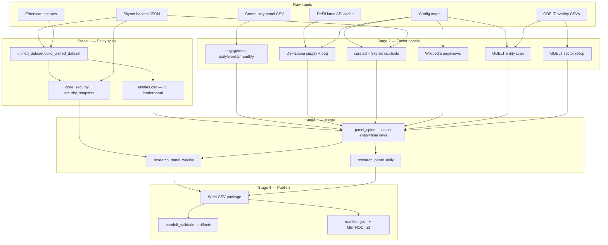

# Stablecoin trust ↔ engagement research dataset

Canonical documentation for the curated stablecoin panel used in trust/security vs community-growth research.  
**Published output:** `data/datasets/stablecoin_trust_engagement/latest/` (symlink to dated build).

**Professor / ChatGPT handoff:** [`docs/STABLECOIN_PROFESSOR_HANDOFF.md`](STABLECOIN_PROFESSOR_HANDOFF.md) · attention methods: `…/professor_simple/METHODS_ATTENTION_PROXY.md`.

## Package layout (one folder, two audiences)

```
latest/
  panel_weekly.csv          ← professor starts here
  panel_latest.csv
  entities.csv
  incidents.csv
  sector_shocks.csv
  security_events.csv
  README.md
  manifest.json
  lineage.json              ← pointers to Skynet harvest JSON, community CSV, configs
  panels/                   ← full merged research tables
  factors/                  ← per-source blocks + Skynet chain-level governance
  reference/                ← cross-section snapshots, entity map
  validation/               ← coverage, event studies, QA
```

**Design principle:** don't duplicate three copies of the same data. Root = curated handoff; subfolders = depth; `lineage.json` = where the true raw harvest lives.

---

## 1. What this is

An **analysis-ready panel dataset** — not raw API dumps. Each build produces documented CSV tables at daily, weekly, and monthly grains, plus cross-sectional snapshots and validation artifacts.

**Research framing (important):**

| Concept | How we measure it | Time dimension |
|--------|-------------------|----------------|
| **Trust / stress over time** | Peg deviation, supply outflows, curated incidents, GDELT news | Time series (daily/weekly) |
| **Code security / contract posture** | Skynet `governance_strength` → `code_security_score` | **Cross-section only** (harvest snapshot) |
| **Adoption / scale** | DeFiLlama circulating USD supply | Time series |
| **Community / attention** | Google Trends, Reddit, Twitter/holders (Skynet window), Wikipedia pageviews | Time series (sparse by source) |

> Do **not** treat `code_security_score` as a historical trust series. It is a control variable at Skynet harvest time. Trust dynamics over time come from market and attention proxies.

**Current build (v3):** 71 leaderboard entities · **18,673** entity-week rows · **2021-W24 → 2026-W26** (balanced grid). Partial terminal week `2026-W27` is quarantined in `panels/research_panel_weekly_full_history.csv` only.

---

## 2. Universe

**Primary analysis universe:** the **71 CertiK Skynet stablecoin leaderboard** entities (`in_skynet_leaderboard = true` in `entities.csv`).

`entity_id` equals the Skynet project slug (e.g. `tether`, `usd-coin`, `terrausd`).

**Entity resolution policy:** we do **not** infer entities via regex, slug guessing, or fuzzy name matching. Every join uses:

- Skynet slug as `entity_id`, or
- Explicit rows in config files (`stablecoin_defillama_map.json`, `stablecoin_wikipedia_articles.json`, `stablecoin_gdelt_aliases.json`, `stablecoin_curated_incidents.json`).

The wider **upstream** entity spine (`reference/entities.csv`, 164 rows) includes Etherscan-only tokens for identifier enrichment. **Root handoff `entities.csv` has 71 rows** (leaderboard only).

**Unmapped / thin coverage examples:**

| entity_id | Gap |
|-----------|-----|
| `baconcoin-token`, `ratio-stable-coin`, `rupiahtoken` | No DeFiLlama map |
| 52 / 71 coins | No Wikipedia article in config |
| 30 / 71 coins | No GDELT entity mention hits |

See `coverage_by_source.csv` in each published build for per-coin coverage.

---

## 3. What we have (output tables)

### Main analysis tables

| File | Grain | Rows (latest) | Purpose |
|------|-------|---------------|---------|
| **`panel_weekly.csv`** (root) | entity × week | 18,673 | **Professor handoff** — curated narrow columns only |
| **`research_panel_weekly.csv`** (`panels/`) | entity × week | 18,673 | **Full-width** regression panel — engagement + trust stress + adoption + sector shocks |
| `research_panel_weekly_full_history.csv` | entity × week | ~20k | Quarantine — includes pre-2021 peg spine junk |
| `research_panel_daily.csv` | entity × day | ~106,733 | Event studies, high-frequency peg/news |
| `research_panel_monthly.csv` | entity × month | ~4,272 | Slower community proxies |
| `research_panel_latest.csv` | entity | 71 | Cross-section summary indices |

### Factor blocks (same signals, split for clarity)

| File | Content |
|------|---------|
| `adoption_panel_weekly.csv` / `_daily.csv` | DeFiLlama supply USD, WoW/DoD growth |
| `trust_stress_panel_weekly.csv` / `_daily.csv` | Peg price, deviation, below-$0.99/$0.95 flags |
| `engagement_panel_weekly.csv` / `_daily.csv` / `_monthly.csv` | Trends, Reddit, Twitter, holders, `community_growth_index` |
| `gdelt_entity_panel_*.csv` | Entity-resolved news counts + tone |
| `gdelt_sector_panel_*.csv` | Sector-wide crypto/stablecoin news (broadcast) |
| `wikipedia_panel_*.csv` | English Wikipedia pageviews |
| `incident_panel_weekly.csv` | Weekly incident dummies rolled from `incidents.csv` |
| `github_security_activity_weekly.csv` | Public GitHub commit/release proxy (mapped repos only) |

### Reference / controls

| File | Content |
|------|---------|
| `entities.csv` | Identifiers, join method, source flags |
| `code_security_snapshot.csv` | Engineered governance score + per-flag columns |
| `security_snapshot.csv` | Broader Skynet + Etherscan cross-section |
| `defillama_entity_map.csv` | entity_id → DeFiLlama id |
| `github_repo_map.csv` | entity_id → public GitHub repo (explicit config + Skynet links) |
| `incidents.csv` | Discrete trust-shock events |

### Validation / handoff

| File | Content |
|------|---------|
| `coverage_by_source.csv` | Per-entity boolean coverage across sources |
| `validation_event_studies.csv` / `.md` | UST collapse + USDC/SVB windows |
| `validation_correlation_matrix.csv` | Sanity correlations among key weekly vars |
| `validation_missingness_handoff_top10.csv` | Gaps in root `panel_weekly.csv` |
| `validation_missingness_full_width_top10.csv` | Gaps in `panels/research_panel_weekly.csv` |
| `manifest.json` | Build metadata + row counts |
| `METHOD.md` | Short methods blurb (auto-generated) |
| `COVERAGE.md` | Column non-null rates (auto-generated) |

---

## 4. How we sourced each signal

All sources are **free / public**. No Dune, no paid market-data APIs.

### 4.1 CertiK Skynet (core spine)

| What | Source | Local path |
|------|--------|------------|
| Leaderboard universe (71) | Skynet stablecoin leaderboard API harvest | `stablecoin_skynet/data/harvest_20260622T132438Z/projects/*.json` |
| Governance / code flags | `governance_strength` per chain | Same harvest |
| Skynet scores (sparse) | `skynetScore` in project JSON | Same harvest |
| Security incidents (sparse) | `security_incidents` endpoint in harvest | Same harvest |
| Twitter followers / holders (short window) | Skynet token-holder endpoints | Same harvest → community panel |

**Code security score:** starts at 100 per chain, subtracts penalties (`mintFunction`, `honeypot`, `blacklist`, …), adds rewards (`openSource`, `ownershipRenounce`). Entity score = **worst chain** (conservative). Implemented in `stablecoin_skynet/code_security.py`.

### 4.2 Etherscan catalog (identifier enrichment)

| What | Source | Local path |
|------|--------|------------|
| Token names, symbols, holder counts | Etherscan stablecoin list scrape | `data_lake/spectator_engine/scrapes/` |

Joined to Skynet by **Ethereum mainnet address** (`ethereum_address` / `ethereum_address_alt` in `entities.csv`). **Canonical names prefer Skynet**; Etherscan titles like `NFT | ERC-1155 | Address: …` are flagged in `entities.csv` as `etherscan_join_suspect=true` — do not treat as stablecoin identity without manual review.

### 4.3 Community / attention panel

| Signal | Source | Notes |
|--------|--------|-------|
| `google_trends_index` | Google Trends | ~70/71 entities; daily in `community_attention_panel.csv` |
| `reddit_submissions` | Reddit search proxy | ~63/71; monthly granularity in source |
| `twitter_followers`, `holder_count` | Skynet harvest window | **Sparse** (~2–3% of weekly rows) |
| `community_growth_index` | Derived | Per-entity z-score average of available growth fields |

Local root: `stablecoin_skynet/data/community/`.

### 4.4 DeFiLlama (adoption + peg)

| API | Fields |
|-----|--------|
| `stablecoins.llama.fi/stablecoins` | Circulating supply USD |
| `stablecoins.llama.fi/stablecoinprices` | Peg price vs $1 |
| Per-coin detail endpoint | Historical supply when needed |

**Mapping:** `config/stablecoin_defillama_map.json` overrides + CoinGecko id / symbol match against DeFiLlama list (`stablecoin_skynet/defillama_panel.py`). **68/71** mapped in latest build.

Cache: `stablecoin_skynet/data/derived/defillama/`.

### 4.5 Incidents and security events (discrete trust shocks)

| Source | Method |
|--------|--------|
| **`config/stablecoin_curated_incidents.json`** | Hand-curated major depegs (UST, USDC/SVB, BUSD, DAI, …) |
| **`config/stablecoin_security_events.json`** | Dated security/legal/exploit events (5 events in reference file) |
| Skynet harvest | `security_incidents` when present on project JSON |

**Panel window note:** `security_events.csv` has **5** events, but only **4** populate `security_event_flag` in the weekly panel (`2021-W24+`). The Tether NYAG settlement (**2021-02-23**) predates the analysis window and is kept for reference only.

We **do not** fuzzy-match DeFiLlama hack names to entities (removed to avoid false positives).

Latest build: **14** incident rows in `incidents.csv` (curated).

### 4.6 GDELT news overlay

| Layer | Source | Resolution |
|-------|--------|------------|
| **Sector broadcast** | `daily_country_crypto_panel.csv` per overlay window | Global crypto/stablecoin news counts by day |
| **Entity-resolved** | `crypto_event_evidence.csv.gz` scanned with explicit phrase list | `config/stablecoin_gdelt_aliases.json` — literal substring phrases per `entity_id` |

Local root: `data_lake/news_shock_taxonomy/derived/gdelt_crypto_overlay/`.

**Caveat:** overlay is **Asia-news biased** (from upstream GDELT collection), not a full global corpus. **41/71** entities have at least one entity-resolved hit.

### 4.7 Wikipedia attention

| API | Mapping |
|-----|---------|
| Wikimedia REST pageviews | `config/stablecoin_wikipedia_articles.json` — **19** explicit entity_id → article title |

No automatic slug-to-title guessing. To add a coin, append a verified title to the config and rebuild.

### 4.8 GitHub public activity proxy (optional enrichment)

| What | Source | Coverage |
|------|--------|----------|
| Weekly commit / release counts | GitHub REST API | **~15 mapped repos** (explicit `config/stablecoin_github_repos.json` + Skynet `github` fields) |
| Security-keyword commits | Commit message keyword scan | Subset with active public repos |
| `github_activity_index` | Derived mean of commit/security/release counts | Sparse — only weeks with activity |

> **Label carefully:** GitHub variables measure **public development/security discussion activity**, not deployed contract security state. They do **not** replace Skynet `code_security_score` (cross-section snapshot). Centralized stables (USDT, USDC) may do security work off GitHub entirely.

Harvest (needs `GITHUB_TOKEN` or `GH_TOKEN` for rate limits):

```bash
GITHUB_TOKEN=... PYTHONPATH=. .venv/bin/python scripts/harvest_stablecoin_github_activity.py [--refresh]
PYTHONPATH=. .venv/bin/python scripts/build_stablecoin_research_dataset.py  # merges cached weekly panel
```

Columns land in `factors/github_security_activity_weekly.csv` and merge into `panels/research_panel_weekly.csv`. **Not** in root `panel_weekly.csv` (professor handoff stays trust/engagement focused).

---

## 5. How the pipeline runs

### Entry points

```bash
# Optional: refresh DeFiLlama / Wikipedia caches
PYTHONPATH=. .venv/bin/python scripts/harvest_stablecoin_external_sources.py [--refresh]

# Optional: refresh GitHub activity proxy (mapped repos only)
GITHUB_TOKEN=... PYTHONPATH=. .venv/bin/python scripts/harvest_stablecoin_github_activity.py [--refresh]

# Full publish (writes dated folder + updates latest/ symlink)
PYTHONPATH=. .venv/bin/python scripts/build_stablecoin_research_dataset.py [--no-gdelt] [--no-external] [--no-github]
```

### Pipeline flow



### Merge logic (weekly panel)

1. **Spine** (`panel_spine.build_weekly_spine`): union of all `(entity_id, week)` keys from engagement, DeFiLlama, GDELT, Wikipedia, and incidents — so rows exist even when a source is missing (left-join semantics).
2. **Engagement** merged onto spine first.
3. **`build_research_panel_weekly`** left-joins:
   - Cross-sectional security (replicated on every week)
   - GDELT entity weekly + sector weekly (sector is same for all entities on a given week)
   - Peg + supply weekly
   - Incident dummies
   - Wikipedia weekly

Daily panel follows the same pattern with `build_daily_spine`.

### Key code modules

| Module | Role |
|--------|------|
| `stablecoin_skynet/unified_dataset.py` | Skynet + Etherscan + community merge |
| `stablecoin_skynet/code_security.py` | Governance → `code_security_score` |
| `stablecoin_skynet/research_dataset.py` | Orchestrator + publish |
| `stablecoin_skynet/defillama_panel.py` | Supply / peg panels |
| `stablecoin_skynet/incidents_panel.py` | Curated + Skynet incidents |
| `stablecoin_skynet/gdelt_panel.py` | Entity scan + sector broadcast |
| `stablecoin_skynet/wikipedia_panel.py` | Pageview harvest |
| `stablecoin_skynet/panel_spine.py` | Time spine union |
| `stablecoin_skynet/handoff_validation.py` | Coverage, event studies, README |

---

## 6. Config files (manual curation)

| File | Purpose |
|------|---------|
| `config/stablecoin_defillama_map.json` | Manual DeFiLlama id overrides |
| `config/stablecoin_wikipedia_articles.json` | entity_id → Wikipedia article title |
| `config/stablecoin_gdelt_aliases.json` | entity_id → list of literal news phrases |
| `config/stablecoin_curated_incidents.json` | Major depeg / trust events |

To extend coverage for a new leaderboard coin: add rows to the relevant config(s), then rebuild. Do not rely on automatic entity inference.

---

## 7. Suggested analyses

1. **Event studies** — `validation_event_studies.csv` templates for UST (2022-W19) and USDC/SVB (2023-W10).
2. **Panel regressions** — `research_panel_weekly.csv`: trust stress (`peg_deviation_abs_max`, `depeg_dummy`) vs `supply_growth_wow_pct`, with `code_security_score` as cross-section control.
3. **Interaction** — `code_security_score × incident_count` (do coins with stronger governance flags behave differently?).
4. **Attention decomposition** — compare `wikipedia_pageviews_sum` and `google_trends_index_mean` around incidents vs adoption trends.

---

## 8. Known limitations

- **Code security:** snapshot only; 64/71 with `code_security_score`; Skynet headline scores sparse (9/71).
- **DeFiLlama:** 68/71 mapped; peg/supply history length varies by coin.
- **Wikipedia:** 19/71 mapped; English Wikipedia only.
- **GDELT:** Asia-biased corpus; entity mentions sparse for smaller stables.
- **Twitter / holders:** short Skynet collection window → mostly null in weekly panel.
- **Reddit:** monthly source aggregated to daily panel — interpret carefully.

---

## 9. Tests

```bash
PYTHONPATH=. .venv/bin/pytest tests/test_stablecoin_research_dataset.py -q
```

Covers code-security coverage, engagement rollups, GDELT scan on fixture, v3 build smoke, and publish package file list.
