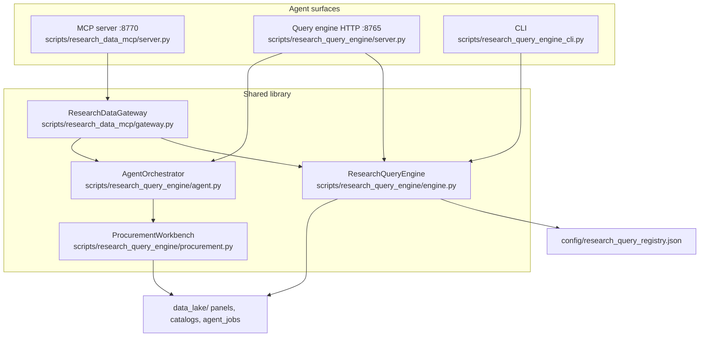
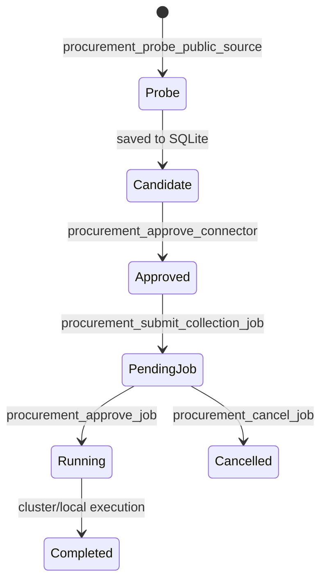

# Research Data MCP + Library Handoff

> **Superseded for architecture:** use [`../PROCUREMENT_PIPELINE.md`](../PROCUREMENT_PIPELINE.md) (canonical, maintained).  
> This file is kept as a 2026-06-10 sprint snapshot — do not extend it; update `PROCUREMENT_PIPELINE.md` instead.

**Date:** 2026-06-10  
**Scope:** MCP gateway, query engine library, search vs procurement workflows  
**Status:** Wired and tested (`tests/test_research_data_gateway.py`, `tests/test_research_query_engine_panels.py`)

---

## What this is

A **registry-driven research data library** with an **MCP agent gateway** on top. It answers two questions for every dataset:

```text
What exists?
Can we analyze it now without downloading?
```

The library separates **search** (discovery + query) from **procurement** (probe → approve → collect). Agents should query instant local panels before proposing new scrapes or downloads.

---

## Architecture



| Component | Role |
|---|---|
| **Registry** | Single catalogue of logical datasets, backends, grains, join keys, limitations |
| **ResearchQueryEngine** | Routes `dataset_id` → backend implementation |
| **ResearchDataGateway** | Unified facade for MCP: search, query, plan, procurement jobs |
| **AgentOrchestrator** | Approval-gated job execution (probe, http_manifest, registered pipelines) |
| **ProcurementWorkbench** | Bounded HTTP probe, connector SQLite store, collection plan builder |

**Important:** MCP is the complete agent-facing surface. HTTP `:8765` adds `/agent/chat` and REST job routes for the research-drive UI. Both share the same registry and agent job store.

---

## Start commands

### MCP (recommended for Cursor / Claude agents)

```bash
# stdio
scripts/run_research_data_mcp.sh

# HTTP streamable
RESEARCH_MCP_TRANSPORT=streamable-http \
RESEARCH_MCP_HOST=127.0.0.1 \
RESEARCH_MCP_PORT=8770 \
scripts/run_research_data_mcp.sh
# endpoint: http://127.0.0.1:8770/mcp
```

Client config template: `config/research_data_mcp.example.json`

### Library CLI (no MCP)

```bash
PYTHONPATH=scripts python3 scripts/research_query_engine_cli.py datasets
PYTHONPATH=scripts python3 scripts/research_query_engine_cli.py describe cross_asset_fused_primary_panel
PYTHONPATH=scripts python3 scripts/research_query_engine_cli.py query cross_asset_fused_primary_panel country=TWN limit=10
```

### HTTP query engine (UI / scripts)

```bash
scripts/run_research_query_engine.sh
# http://127.0.0.1:8765/health
# http://127.0.0.1:8765/datasets
# http://127.0.0.1:8765/query/cross_asset_fused_primary_panel?country=TWN&limit=10
```

### Tests

```bash
PYTHONPATH=. .venv/bin/pytest tests/test_research_data_gateway.py tests/test_research_query_engine_panels.py -q
```

---

## Lane 1: Data search

Use when the question is *“what do we already have?”* or *“can we query this now?”*

### Recommended agent flow

```text
1. research_library_overview()
2. research_plan_sources(q="your research question")
3. research_query_dataset(...) on instant_local hits
4. research_search_catalog(...) or datacite_search(...) for external complements
5. bigquery_dry_run → bigquery_read_query only if remote SQL is needed
```

### MCP search tools

| Tool | When to use |
|---|---|
| `research_library_overview` | First call — buckets all registry datasets by readiness |
| `research_list_datasets` | Browse/filter registry (`q`, `readiness`, `access_shape`) |
| `research_describe_dataset` | Inspect grain, join keys, backend, limitations before querying |
| `research_query_dataset` | Fetch rows from any registered dataset |
| `research_plan_sources` | Natural-language research question → ranked source plan |
| `research_search_catalog` | Search curated external metadata index |
| `research_ops_status` | Combined collection-queue + DataCite harvest snapshot |
| `collection_queue_status` | Local queue lock, latest task, recent status lines |
| `datacite_local_harvest_status` | DataCite lane checkpoints (`lane` optional) |

### DataCite live search (not registry-backed)

| Tool | Purpose |
|---|---|
| `datacite_search` | Paginated DOI metadata (`query`, `created`, `cursor`) |
| `datacite_get` | One DOI record |
| `datacite_scope` | Count records for year scope |
| `datacite_backfill_spec` | Plan checkpointed harvest — **does not execute** |

Pair `datacite_search` (remote) with `datacite_local_harvest_status` (local mirror state).

### BigQuery (guarded remote query)

Requires ADC: `gcloud auth application-default login` + `GOOGLE_CLOUD_PROJECT`.

| Tool | Purpose |
|---|---|
| `bigquery_status` | Dependency + credential check |
| `bigquery_list_datasets` / `bigquery_list_tables` / `bigquery_table_schema` | Discovery without row reads |
| `bigquery_dry_run` | Byte estimate |
| `bigquery_read_query` | Execute only with `confirm=EXECUTE_READ_ONLY` after dry-run |

Registry dataset `ethereum_usdt_transfers` wraps guarded BigQuery templates via the query engine (MCP BigQuery tools are the generic escape hatch).

---

## Lane 2: Data procurement

Use when the question is *“we need new data from a URL or connector.”*

### Procurement state machine



### MCP procurement tools

| Tool | Gate | Notes |
|---|---|---|
| `procurement_probe_public_source` | Public HTTP only | 2MB sample, robots check, file discovery; blocks private IPs |
| `procurement_list_connectors` | — | `candidate` vs `approved` connectors |
| `procurement_approve_connector` | Human review | Does **not** collect |
| `procurement_prepare_collection` | Approved connector | Returns plan JSON only |
| `procurement_submit_collection_job` | Approved connector | Creates `pending_approval` job |
| `procurement_list_jobs` | — | Job history |
| `procurement_get_job` | — | Plan, result, event log |
| `procurement_approve_job` | Explicit approval | Launches execution |
| `procurement_cancel_job` | Pending/queued only | — |

### Persistence

| Path | Contents |
|---|---|
| `data_lake/agent_jobs/procurement_connectors.sqlite3` | Probed connectors |
| `data_lake/agent_jobs/agent_jobs.sqlite3` | Collection jobs + events |
| `data_lake/agent_jobs/{job_id}/` | Per-job manifests and shard artifacts |

### Registered pipelines (allowlisted in `config/research_agent.json`)

| `pipeline_id` | Command |
|---|---|
| `coingecko_daily` | `scripts/run_coingecko_network_coordinator.sh` |
| `datacite_watchdog` | `scripts/data_catalog/datacite_cluster_watchdog.sh` |

`http_manifest` jobs dispatch to joined Windows cluster workers via `scripts/cluster_agent/remote_collect.py` when inventory is configured.

### Collection queue (scheduled local procurement — outside MCP execution)

MCP **monitors** but does not run the queue. Operator runs:

```bash
.venv/bin/python scripts/run_data_collection_queue.py
.venv/bin/python scripts/check_data_collection_queue.py
```

Task catalog: `config/data_collection_queue.json`  
Status: `data_lake/data_collection_queue/` (surfaced via `collection_queue_status`)

---

## Registry inventory (2026-06-10)

### Instant local — query immediately

| `dataset_id` | Grain | Pinned run / path | Use |
|---|---|---|---|
| `gdelt_asia_daily_country_panel` | country-day | `data_lake/news_shock_taxonomy/processed/` | Daily Asia news shock |
| `gdelt_high_priority_urls` | url-event | same root | High-priority article URLs |
| `cross_asset_fused_primary_panel` | country-week | `fused_20260610_v2` | News + crypto + macro fused panel |
| `ticker_week_country_broadcast_panel` | ticker-week | `ticker_20260610` | Phase 1: country shock → tickers |
| `ticker_week_entity_market_panel` | ticker-week | `ticker_20260610` | Phase 2: entity-resolved ticker shocks |
| `spk_v1_sepolia_runtime` | snapshot | `data_lake/spk_v1/` | SPK testnet runtime |
| `spk_v1_payment_ledger` | payment event | `data_lake/spk_v1/` | SPK payment ledger |
| `collection_queue_status` | ops | — | Queue monitor |
| `datacite_local_harvest_status` | ops | `data_lake/dataset_catalog/index_v3/` | Harvest lane monitor |

Override pinned run: pass `"run_id": "..."` in `params_json`.

### Metadata search — discover, do not analyze directly

| `dataset_id` | Purpose |
|---|---|
| `external_dataset_catalog_curated` | Default user-facing promoted index |
| `external_dataset_catalog` | Seed catalogue (HF, Zenodo, etc.) |
| `procurement_source_registry` | Source families and acquisition routes |

### Remote query — rate limits / billing guards

| `dataset_id` | Backend |
|---|---|
| `coingecko_simple_price` | Live CoinGecko API |
| `ethereum_usdt_transfers` | BigQuery templates + local RPC pilot |

### Virtual (engine-only, not a registry row)

| `dataset_id` | Purpose |
|---|---|
| `research_source_plan` | NL question → ranked candidates + access decisions |

Exposed in MCP as `research_plan_sources`.

---

## Worked examples

### A. Country-week news–market study (instant)

```text
research_library_overview()
research_query_dataset(
  "cross_asset_fused_primary_panel",
  '{"country":"TWN","start_date":"2024-01-01","limit":20}'
)
```

CLI equivalent:

```bash
PYTHONPATH=scripts python3 scripts/research_query_engine_cli.py \
  query cross_asset_fused_primary_panel country=TWN start_date=2024-01-01 limit=20
```

### B. Ticker entity shock study

```text
research_query_dataset(
  "ticker_week_entity_market_panel",
  '{"ticker":"2330.TW","limit":30}'
)
```

### C. New research topic — source planning

```text
research_plan_sources(
  q="asia equity news shock dispersion under crypto volatility",
  limit=30
)
```

Returns: `expanded_queries`, ranked rows with `promotion_tier`, `access_decision`, `scrape_or_download_needed`. Local instant panels are prioritized when the prompt matches.

### D. External dataset discovery

```text
research_search_catalog(q="stablecoin ethereum", limit=20)
datacite_search(query="stablecoin", created="2024", page_size=25)
datacite_local_harvest_status(lane="y2025")
```

### E. Acquire from unknown public URL

```text
procurement_probe_public_source(url="https://example.org/data/", name="Example open data")
procurement_list_connectors()
procurement_approve_connector(connector_id="src_...")
procurement_submit_collection_job(connector_id="src_...", limit=100)
procurement_approve_job(job_id="...")
procurement_get_job(job_id="...")
```

### F. Pre-flight before heavy jobs

```text
research_ops_status()
# or separately:
collection_queue_status()
datacite_local_harvest_status()
```

---

## Query parameter reference (`research_query_dataset`)

Common filters (backend-dependent):

| Param | Applies to |
|---|---|
| `country` / `countries` | GDELT, fused, ticker panels |
| `ticker` / `tickers` | Ticker panels |
| `start_date`, `end_date` | Time-series panels |
| `q` | Catalog / URL index text search |
| `limit` | All (capped by dataset `max_limit`) |
| `order_by`, `descending` | Tabular backends |
| `columns` | Parquet panels (projection) |
| `run_id` | Parquet panels (override default run) |
| `lane` | `datacite_local_harvest_status` |

Response shape:

```json
{
  "dataset_id": "...",
  "meta": { "panel_path": "...", "returned": 10, "params": {} },
  "rows": [ ... ]
}
```

---

## Safety and approval contract

| Rule | Enforcement |
|---|---|
| No private/loopback fetch targets | `assert_public_url` in procurement probe |
| No collection without connector approval | `collection_plan` raises if not `approved` |
| No job execution without explicit approve | Jobs start as `pending_approval` |
| BigQuery mutations blocked | SQL allowlist + dry-run byte cap |
| DataCite backfill is plan-only via MCP | `datacite_backfill_spec` never executes |
| Collection queue skips credentialed tasks | `run_data_collection_queue.py` policy |

Env vars (BigQuery):

| Variable | Default | Purpose |
|---|---|---|
| `RESEARCH_MCP_BIGQUERY_MAX_BYTES` | 10 GiB | Per-query soft cap |
| `RESEARCH_MCP_BIGQUERY_HARD_MAX_BYTES` | 100 GiB | Hard reject |
| `RESEARCH_MCP_BIGQUERY_MAX_ROWS` | 5000 | Result row cap |
| `GOOGLE_CLOUD_PROJECT` | — | Billing/quota project |

---

## How this connects to the wider platform

```text
GDELT / news shock pipelines  →  gdelt_* registry datasets + fused/ticker panels
DataCite cluster harvest      →  datacite_* MCP tools + index_v3 checkpoints
Collection queue              →  collection_queue_status + config/data_collection_queue.json
Research-drive UI             →  HTTP :8765 /query/* and /agent/*
Alpha / backtest pipelines    →  consume data_lake panels directly (not via MCP)
```

**Adding a new dataset to the library:**

1. Land artefact under `data_lake/...`
2. Add entry to `config/research_query_registry.json` with correct `backend`, `grain`, `join_keys`, `limitations`
3. If new backend type needed, implement handler in `engine.py`
4. Verify: `research_list_datasets` → `research_describe_dataset` → `research_query_dataset`
5. Add test in `tests/test_research_data_gateway.py` if non-trivial

---

## Known gaps / next steps

| Gap | Workaround |
|---|---|
| MCP and HTTP are separate processes | Run both if UI + agent needed; share registry file |
| Registry `default_run_id` is manual | Pass `run_id` in query params after new panel builds |
| Entity ticker panel limited to ~5 local GDELT windows | Restore normalized windows from GDrive; rebuild overlay |
| DataCite shards mostly on GDrive/cluster | `datacite_local_harvest_status` shows checkpoints; full files may be remote |
| `research_source_plan` uses keyword expansion, not embeddings | Good enough for routing; not semantic search |
| New collected data not auto-registered | Operator must add registry row |

---

## File map

```text
config/
  research_query_registry.json      # dataset catalogue (source of truth)
  research_data_mcp.example.json    # Cursor MCP client config
  research_agent.json               # allowlisted pipelines, cluster inventory
  data_collection_queue.json        # scheduled local collection tasks

scripts/
  research_data_mcp/
    gateway.py                      # ResearchDataGateway facade
    server.py                       # MCP tool definitions
  research_query_engine/
    engine.py                       # backend router + source planner
    agent.py                        # job orchestration
    procurement.py                  # probe + connector store
    ops_status.py                   # queue + DataCite lane status
    server.py                       # HTTP :8765
  research_query_engine_cli.py
  run_research_data_mcp.sh
  run_research_query_engine.sh
  run_data_collection_queue.py

docs/
  research_data_mcp.md              # MCP tool reference (shorter)
  research_query_engine.md          # engine + CLI reference
  research_handoffs/
    research_data_mcp_library_handoff_20260610.md   # this document

tests/
  test_research_data_gateway.py
  test_research_query_engine_panels.py

data_lake/
  research_panels/                  # fused + ticker parquet runs
  dataset_catalog/                  # curated index, DataCite index_v3
  agent_jobs/                       # connectors + jobs SQLite
  data_collection_queue/            # queue status artefacts
```

---

## Quick decision tree (paste into agent system prompt)

```text
Need data for a research question?
├─ Call research_library_overview + research_plan_sources
├─ Instant hit in plan?
│  └─ research_query_dataset (prefer local panels)
├─ Only metadata found?
│  ├─ research_search_catalog / datacite_search
│  └─ procurement_probe_public_source if specific URL
├─ Need SQL over public cloud tables?
│  └─ bigquery_status → dry_run → read_query(confirm=EXECUTE_READ_ONLY)
└─ Before launching collection
   └─ research_ops_status → approve connector → submit job → approve job
```

---

## Related handoffs

- `docs/research_handoffs/data_collection_queue_20260520.md` — queue runner details
- `docs/research_handoffs/dataset_collection_control_20260521.md` — collection control plane
- `docs/research_data_mcp.md` — condensed MCP tool list
- `docs/research_query_engine.md` — engine design notes
