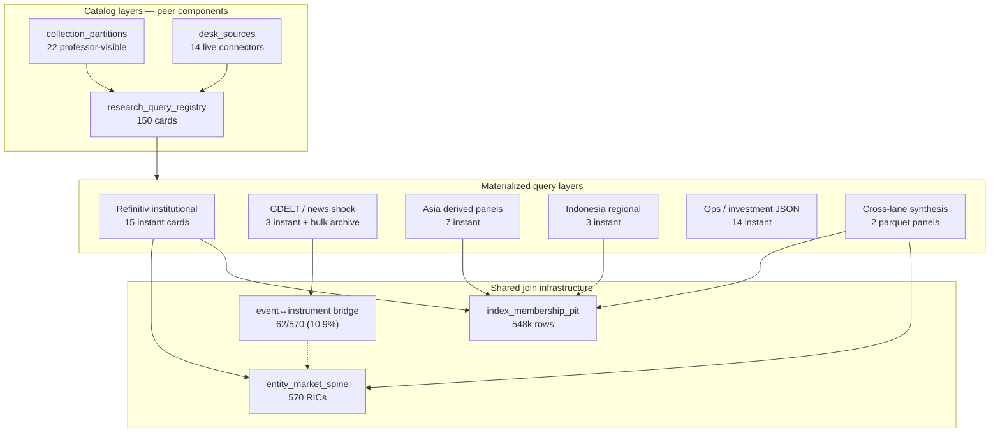

# Databank research coverage (axis view)

Generated: 2026-07-07T11:19:04+00:00

## Headline

- Registry: **158** datasets, **94** instant-query
- Event↔instrument bridge: **10.9%** of entity spine

## Registry families (equal weight)

- `web_scrape_catalog`: 61 registry · 29 instant
- `procured_catalog`: 36 registry · 25 instant
- `ops_metadata_other`: 27 registry · 12 instant
- `refinitiv_institutional`: 16 registry · 16 instant
- `asia_derived_panels`: 10 registry · 7 instant
- `indonesia_regional`: 3 registry · 3 instant
- `gdelt_news`: 2 registry · 2 instant
- `crypto_security`: 2 registry · 0 instant
- `live_api`: 1 registry · 0 instant

## Coverage heatmap (geography × capability)

Scores: **—** absent · **thin** metadata/short · **partial** · **strong** thick instant panel

| Geography | Prices | CtyNews | EntNews | Fund | Est/Rev | PIT | Risk | Join | Gov | Social | Chain | Avg |
|---|---|---|---|---|---|---|---|---|---|---|---|---|
| US | partial | thin | thin | partial | strong | strong | partial | thin | partial | thin | partial | 1.82 |
| Taiwan | partial | partial | thin | thin | partial | strong | thin | thin | partial | thin | thin | 1.55 |
| Indonesia | strong | partial | partial | partial | partial | strong | partial | partial | partial | partial | thin | 2.09 |
| Japan | partial | partial | thin | thin | partial | strong | thin | thin | thin | thin | thin | 1.45 |
| Korea | partial | partial | thin | thin | partial | strong | thin | thin | thin | thin | thin | 1.45 |
| HK_SG_ASEAN | partial | partial | thin | thin | partial | partial | thin | thin | thin | thin | thin | 1.36 |
| Asia_multi_13 | partial | strong | partial | thin | thin | partial | partial | partial | thin | thin | partial | 1.73 |
| Crypto_global | partial | partial | partial | — | — | — | partial | partial | thin | partial | strong | 1.45 |
| Macro_global | partial | partial | thin | — | — | — | thin | — | — | — | thin | 0.64 |

## Capability averages

- `daily_prices` ████████░░░░ 2.11/3
- `index_pit_survivorship` ████████░░░░ 2.11/3
- `country_news_shocks` ████████░░░░ 2.0/3
- `estimates_revisions` ████████░░░░ 1.56/3
- `risk_overlay` ████░░░░░░░░ 1.44/3
- `onchain_crypto` ████░░░░░░░░ 1.44/3
- `entity_news_shocks` ████░░░░░░░░ 1.33/3
- `entity_join_gdelt_ric` ████░░░░░░░░ 1.22/3
- `governance_regulatory` ████░░░░░░░░ 1.22/3
- `social_sentiment` ████░░░░░░░░ 1.11/3
- `fundamentals` ████░░░░░░░░ 1.0/3

## Time depth

| Source | Span | Entities | Note |
|---|---|---|---|
| Refinitiv estimate revisions | 2017-10-19 → 2026-07-06 | 222 | 222 RICs; US-heavy |
| Refinitiv index membership PIT | 2010-01-15 → 2026-06-15 | 6 | .SPX .JKSE .TWII .N225 .KS11 .STI |
| IDN FRY daily cross-section | 2019-07-16 00:00:00 → 2026-05-18 00:00:00 | 635 | 635 IDX yahoo symbols |
| Asia country-week news+market | 2018-01-05 00:00:00 → 2026-05-29 00:00:00 | 13 | 13 ISO3 countries |
| Cross-asset fused primary | 2018-01-05 00:00:00 → 2026-05-29 00:00:00 | 13 | 112 feature cols |
| Daily ticker entity shock (slice) | 2026-05-01 00:00:00 → 2026-05-25 00:00:00 | 455 | 25 trading days only |
| GDELT normalized bulk | 2015 → 2026 | — | ~165 GiB events/GKG; not all rolled to instant country CSV |

## Synthesis proxy catalog

### JKSE PIT universe × IDN microstructure × estimate revisions (`jkse_pit_idn_microstructure_revisions`) — **built**
- **Inputs:** refinitiv_index_membership_pit (.JKSE), idn_fry_daily_cross_section, refinitiv_estimate_revision_panel, refinitiv_entity_market_spine (country_code=ID)
- **Grain:** ric × as_of_month
- **Assumptions:** JKSE PIT membership defines investable IDX set at rebalance.; IDN FRY bandar/volume features proxy local informed-flow regime.; Refinitiv revisions for ID names reflect sell-side reaction to same regime.
- **Bias / ceiling:** RIC↔yahoo symbol map needed; no GDELT entity bridge required.

### PIT survivorship × estimate revision momentum factor (`pit_survivorship_revision_momentum`) — **built**
- **Inputs:** refinitiv_index_membership_pit, refinitiv_estimate_revision_panel, refinitiv_entity_market_spine
- **Grain:** index_ric × constituent_ric × as_of_month
- **Assumptions:** Revision momentum is a valid alpha signal within PIT-filtered universes.
- **Bias / ceiling:** Pure institutional lane; no event overlay.

### GDELT entity shock → analyst revision response (`gdelt_shock_to_estimate_revision`) — **recipe**
- **Inputs:** daily_ticker_entity_shock_panel (extend history), refinitiv_entity_market_spine, refinitiv_estimate_revision_panel, refinitiv_index_membership_pit
- **Grain:** ric × shock_event × window_day
- **Assumptions:** Entity bridge from GDELT to RIC is correct for the shocked name.; Analyst EPSMean revisions within [-5, +30] days proxy information absorption.; PIT index filter defines investable universe at shock date.
- **Bias / ceiling:** US bridge thin (10.9% of spine); short ticker-shock window today.

### Country-week macro shock → ticker return attribution (`country_shock_broadcast_returns`) — **partial**
- **Inputs:** asia_country_week_news_market_primary, idn_fry_daily_cross_section / yfinance panels, ticker_week_country_broadcast_panel
- **Grain:** ticker × week
- **Assumptions:** Country-level shock score loads on all liquid domestic equities equally (broadcast proxy).; Not name-specific attribution — use for macro beta, not single-name alpha.
- **Bias / ceiling:** Ticker-level entity panel only 25 days; broadcast panels need run_id refresh.

### Survivorship-correct event-study universe (`pit_event_study_universe`) — **ready**
- **Inputs:** refinitiv_index_membership_pit, any event panel with date + ric or index
- **Grain:** constituent_ric × event_date
- **Assumptions:** Index membership at month-end defines who was investable when the event fired.
- **Bias / ceiling:** Monthly PIT granularity; delistings between month-ends not captured intra-month.

### IDN bandar episode + GDELT regime → forward reward (`idn_fry_episode_outcome`) — **built**
- **Inputs:** idn_fry_episode_gdelt_features, idn_fry_daily_cross_section, idn_episode_reward_daily
- **Grain:** episode × horizon_day
- **Assumptions:** GDELT country dot acceleration around trigger proxies information/noise regime.; Bandar labels from broker-flow heuristics approximate informed-flow episodes.
- **Bias / ceiling:** 5734 episodes; IDX-specific, not portable.

### Cross-asset country risk factor panel (`cross_asset_country_risk_factor`) — **built**
- **Inputs:** cross_asset_fused_primary_panel
- **Grain:** country_iso3 × week
- **Assumptions:** Fused news, equity, FX, rates, and crypto columns share a common weekly calendar.; Factors are comparable across the 13-country Asia set.
- **Bias / ceiling:** No US/EU; macro cols are proxy not official national accounts.

### Estimate revision momentum factor (`estimate_revision_momentum`) — **built**
- **Inputs:** refinitiv_estimate_revision_panel
- **Grain:** ric × date
- **Assumptions:** Δ EPSMean is a slow-moving analyst sentiment proxy.
- **Bias / ceiling:** US-dominated sample; sparse Asia names.

### US short-interest + vol risk overlay (`us_si_risk_overlay`) — **built**
- **Inputs:** refinitiv_us_risk_overlay, refinitiv_rescued_us_risk_desktop
- **Grain:** ric × date
- **Assumptions:** SI% and vol skew proxy crowding and tail risk for US equities in sample.
- **Bias / ceiling:** Rescued desktop merge; not full StarMine entitlement.

### Stablecoin trust ↔ engagement multi-source synthesis (`stablecoin_trust_engagement`) — **profile_defined**
- **Inputs:** skynet_stablecoin_harvest, etherscan scrapes, defillama maps, gdelt_crypto_overlay, github/wikipedia/incident configs
- **Grain:** entity_id × week
- **Assumptions:** Security score + on-chain adoption + attention proxies jointly measure trust vs hype.
- **Bias / ceiling:** Skynet/Etherscan join gaps; GDELT entity coverage uneven per coin.

### Index constituent × country-week shock (broadcast, no entity bridge) (`pit_constituent_country_shock`) — **recipe**
- **Inputs:** refinitiv_index_membership_pit, asia_country_week_news_market_primary, entity_market_spine (country_code only)
- **Grain:** constituent_ric × week
- **Assumptions:** All index members in a country share the country shock (weaker than entity join).; Uses fused country-week panel (news + market), not GDELT bulk directly.
- **Bias / ceiling:** Ecological fallacy for single-name events; good for macro index hedging studies.

### SEC filing date → short-horizon return drift (`sec_filing_drift_proxy`) — **metadata_only**
- **Inputs:** sec_edgar index (metadata), yfinance / alpha price panel
- **Grain:** cik × filing_date
- **Assumptions:** Filing publication date is the information event (ignores leak/anticipation).
- **Bias / ceiling:** No PIT link at scale; US only; metadata not instant panel.

### BigQuery USDT flow → crypto liquidity regime (`bigquery_usdt_liquidity_regime`) — **live_query**
- **Inputs:** desk BigQuery ADC, coingecko prices
- **Grain:** day
- **Assumptions:** Stablecoin mint/burn aggregates signal crypto liquidity conditions.
- **Bias / ceiling:** Not materialized in registry instant layer; query cost + cache discipline.

### Expand GDELT↔RIC bridge via ticker/name fuzzy match (`expand_entity_spine_fuzzy`) — **recipe**
- **Inputs:** entity_market_spine, gdelt entity master, ticker_entity_aliases_v2
- **Grain:** ric × gdelt_entity_id
- **Assumptions:** Same ticker in same country maps to same economic entity (false positives possible).
- **Bias / ceiling:** Current bridge 10.9%; US SPX needs this most.

## Top gaps

- Event-source ↔ market-instrument bridge is thin (10.9% of spine); not a GDELT-only problem.
- Instant-query center of gravity is Refinitiv institutional (15/39 cards), not GDELT (3/39).
- US entity-linked event coverage lags Asia despite strong estimate/PIT lanes.
- Ticker entity shock panel is a 25-day slice — not yet a longitudinal series.
- 104 registry cards are metadata/search — coverage score counts instant panels only.
